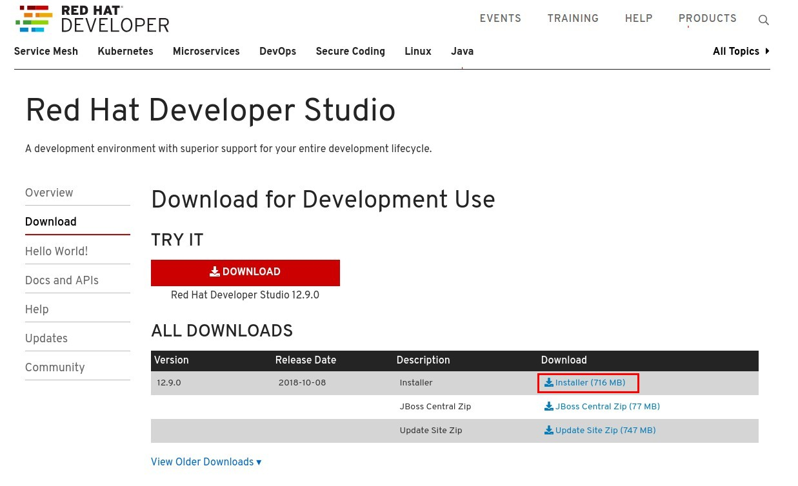
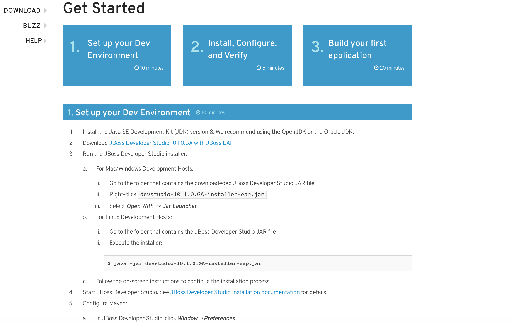

:scrollbar:
:data-uri:
:toc2:

== Agile Integration for the Enterprise- Setup Lab

In this lab, you set up the environment for the labs in this course.

.Goals
* Set up the developer tools on your desktop
* Authenticate the OpenShift client with the OpenShift Container Platform master API
* Install and use the OpenShift command line interface (CLI)

.Prerequisites
* An open broadband Internet connection
* A terminal client, such as PuTTy for Microsoft Windows
* A current browser, such as Google Chrome or Mozilla Firefox
* OPENTLC credentials
* Enough disk space to install Red Hat Developer Studio, Red Hat Fuse, Red Hat AMQ and other programming tools (Maven, OpenShift CLI, Java).
+
[IMPORTANT]
Make sure that the Internet connection is free of corporate proxies or other network rules that prevent access to remote servers on the Internet.

:numbered:

== Install Required Software

In this lab, you create Red Hat Fuse on OpenShift applications, using Red Hat JBoss Developer Studio and OpenShift CLI tools on the desktop, and deploy them to an OpenShift project.

. Install the software listed here on your local machine:

* link:http://www.oracle.com/technetwork/java/javase/downloads/index.html[Java SE^] (version 1.8)
* link:http://maven.apache.org[Apache Maven^] (version 3.3.9+)
* link:https://git-scm.com/downloads[Git^] (latest version)
* link:https://access.redhat.com/downloads/content/290/ver=3.9/rhel---7/3.9.25/x86_64/product-software[OpenShift CLI client^] (version 3.11)
* (Optional) link:https://www.soapui.org/downloads/soapui.html[SoapUI^] (latest version)

== Install Red Hat Developer Studio

Red Hat Developer Studio is an integrated development environment (IDE) that combines both tooling and runtime components, including Eclipse plug-ins, best-of-breed open source tools, and the Red Hat(R) JBoss(R) Enterprise Application Platform (JBoss EAP).

To complete the labs in the course, you must have Red Hat Developer Studio installed in your local development environment. You use Red Hat Developer Studio to design Apache Camel routes.

=== Install Red Hat Developer Studio 12.9.0

. Using your browser, navigate to the product page for link:https://developers.redhat.com/products/devstudio/[Red Hat Developer Studio^].

. On the left side, click *Download*.
* Note that the latest release of Red Hat Developer Studio is highlighted near the top of the page.

. Click *Installer* to download the installer for version 12.9.0 of Red Hat Developer Studio:
+

. Proceed to log in.
* The download begins shortly after you log in.

. Follow the onscreen instructions to install Red Hat Developer Studio, substituting the name of the JAR file with the one you downloaded:
+

+
[NOTE]
The installation guide is also available on the link:https://access.redhat.com/documentation/en-us/red_hat_developer_studio/12.9/[Red Hat Developer Studio Product Documentation^] page, where you can select the version you are using.

=== Install Red Hat Developer Studio Integration Stack Plug-ins

Red Hat Developer Studio includes a variety of plug-ins for Eclipse. You use the following Red Hat Developer Studio plug-ins to complete the labs in the Red Hat OPEN middleware courses:

* *Integration Stack*: The Integration Stack suite of plug-ins is particularly important when using Red Hat(R) Fuse and Red Hat(R) AMQ. The Integration Stack is not included with Red Hat Developer Studio and must be manually installed.

* *EGit*: JBoss Developer Studio includes the Eclipse EGit plug-in, which provides Git project support. No additional installation is required. Git is an open source version control system, providing developers with fast, versatile access to their application code's entire revision history.

* *M2E*: Red Hat Developer Studio includes the Eclipse M2E plug-in, which provides support for Apache Maven projects. No additional installation is required. The M2E plug-in enables you to edit a Maven project’s `pom.xml` and run a Maven build from the IDE.

You can select the plug-in installation during the Red Hat Developer Studio installation process, or you can select these from the welcome page.

== Obtain Course Lab Assets

This course comes with a variety of lab assets that are version controlled in GitHub. In this section, you clone or update the lab assets on your desktop so that they are available locally for use in the course's other labs.

=== Clone Lab Project from Git

. In a terminal shell, create a directory named `ai_labs` and navigate to it:
+
[source,text]
-----
$ mkdir ai_labs
$ cd ai_labs
-----

. Import the lab assets from GitHub:
+
[source,text]
-----
$ git clone https://gitlab.com/redhatsummitlabs/agile-integration-for-the-enterprise.git
$ cd agile-integration-for-the-enterprise
-----
+
[NOTE]
This is the `labs` root folder. The absolute path to this folder is referred to as `$AI_EXERCISE_HOME` in the instructions.

*Congratulations, you have completed this lab.*
