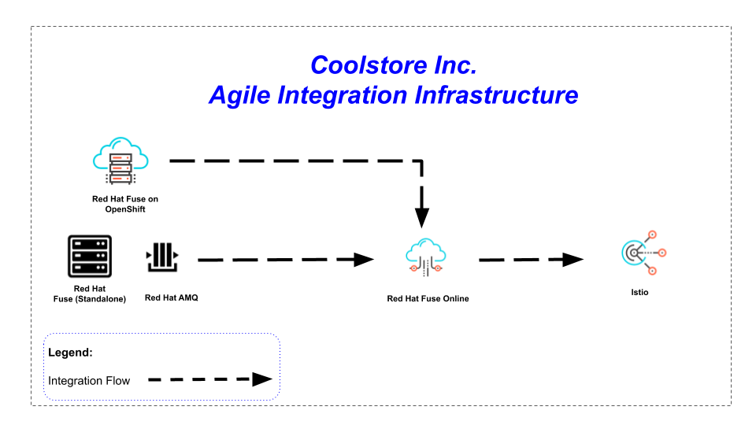
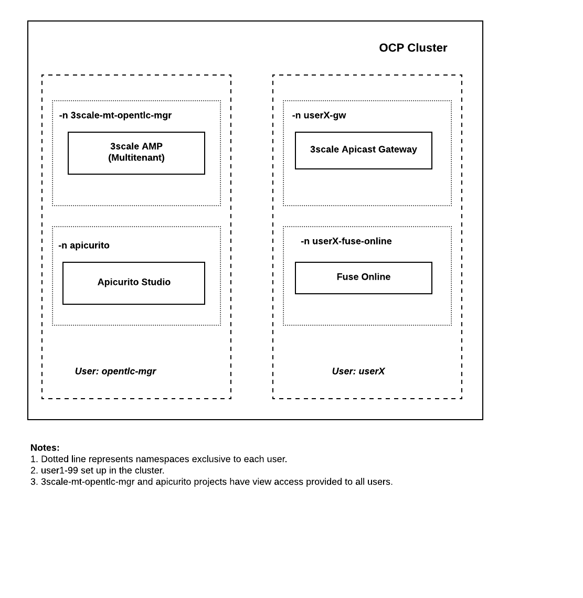

:scrollbar:
:data-uri:
:toc2:

= Agile Integration for the Enterprise - Overview Lab

In this lab, review the business use case for this Agile Enterprise technical workshop. Next, proceed to set up the environment for the labs in this course.

.Business Use Case

_Coolstore Inc._ is an ambitious e-commerce company that market quality consumer products on their portal. The company has bold plans in transforming itself into an link:https://www.cio.com/article/3269444/the-characteristics-of-an-agile-enterprise.html[*Agile Enterprise*]. At the link:https://www.redhat.com/en/services/consulting/open-innovation-labs[*Red Hat Open Innovation Labs*] in Boston, _Coolstore Inc._ attended a link:https://www.redhat.com/en/services/consulting#GatedFormContainer[*discovery workshop*] organized by link:https://www.redhat.com/en/services/consulting[*Red Hat Consulting*], and documented their business priorities into a discovery paper.
The business priorities are simply: to improve _Coolstore Inc._ end-customer satisfaction levels, which will lead to increased sales and revenue.

_Coolstore Inc._'s key takeway from the discovery workshop was appreciating the compelling value proposition of the link:https://www.redhat.com/en/topics/integration[*Red Hat Enterprise Integration strategy*] in helping enterprises become agile, which was clearly demonstrated by link:https://www.redhat.com/en/services/consulting[*Red Hat Consulting*].
As a result, the C-suite of _Coolstore Inc._ is firmly committed in adopting link:https://www.redhat.com/en/technologies[*Red Hat technologies*] as the fundamental infrastructure for their Agile Enterprise.

_Coolstore Inc_ insist on the highest availability and performance service level agreements (SLA) for their new Agile Integration infrastructure. That is why their technical staff has tested and chosen link:https://www.openshift.com/products/container-platform/[*Red OpenShift Container Platform*] to host and workload manage their containerized applications. Thanks to its reliability, scalability and performance, the product met the stringent SLAs set by _Coolstore Inc_. After all, link:https://www.openshift.com/products/container-platform/[*Red OpenShift Container Platform*] is powered by link:https://kubernetes.io/[*Kubernetes*] technology.

With the help of Red Hat, _Coolstore Inc._ has developed the following roadmap to achieving Enterprise Agility:

* Design Apache Camel routes, deployed on link:https://www.redhat.com/en/technologies/jboss-middleware/fuse[*Red Hat Fuse*] that consume JSON records from link:https://www.redhat.com/en/technologies/jboss-middleware/amq[*Red Hat AMQ*]
* Use the multicast EIP pattern to distribute the messages to the services
* Design the CXF web service using JAX-WS annotations to consume from SOAP backend service
* Consume data from the backend REST service
* Aggregate the messages received using the aggregation EIP pattern
* Save the aggregated message in an SQL database using the Spring SQL Camel component
* Use the Red Hat Fuse Tooling in Red Hat CodeReady Studio to create a *wsdl2rest* mapping
* Transform legacy SOAP-based services to more modern REST-based services using the *wsdl2rest* mapping
* Create a REST API layer on top of the Customer SOAP service
* Design an Apache Camel route that exposes REST API consuming JSON
* Implement JSON-based customer account record processing, with link:https://access.redhat.com/documentation/en-us/red_hat_fuse/7.2/html/fuse_on_openshift_guide/[*Fuse on OpenShift*] as the production environment
* Data enrichment and aggregation using REST services, to create customer account records stored in a database
* Design a hybrid-cloud-based integration solution, using link:https://www.openshift.com/products/fuse[*Fuse Online*], that consumes JSON records from link:https://www.redhat.com/en/technologies/jboss-middleware/amq[*Red Hat AMQ*]
* Implement a REST-service interface for the cloud-based integration solution
* Enable service discovery in the cloud-based integration solution
* Integrate the cloud-based integration solution with a new API Management layer, built using link:https://developers.redhat.com/products/3scale/overview/[*3scale API Management*]
* Secure and manage API traffic routed to the integration solution through the link:https://developers.redhat.com/products/3scale/overview/[*3scale API Management*] Gateway
* Create Application Plan & Application in link:https://developers.redhat.com/products/3scale/overview/[*3scale API Management*]
* Deploy and test the solution end-to-end

As a second phase of their roadmap, _Coolstore Inc._ has plans to:

* Create an link:https://access.redhat.com/documentation/en-us/red_hat_amq/7.2/html/using_amq_streams_on_openshift_container_platform/[*Apache Kafka*] deployment using an Apache Kafka cluster operator
* Create an link:https://access.redhat.com/documentation/en-us/red_hat_amq/7.2/html/using_amq_streams_on_openshift_container_platform/[*Apache Kafka*] publisher and consumer for message delivery and retrieval
* Create an link:https://access.redhat.com/documentation/en-us/red_hat_amq/7.2/html/using_amq_streams_on_openshift_container_platform/[*Apache Kafka*] Connect deployment
* With a File connector and link:https://access.redhat.com/documentation/en-us/red_hat_amq/7.2/html/using_amq_streams_on_openshift_container_platform/[*Apache Kafka*] Connect, implement a publishing mechanism for customer account records
* Enhance existing _Coolstore Inc._ portal using new Spring Boot applications, generated using link:https://launch.openshift.io[*Red Hat Developer Launcher*]
* Enable data persistence capabilities in the Spring Boot applications using Spring Data and JPA
* Deploy and test the Spring Boot applications on link:https://www.redhat.com/en/technologies/cloud-computing/openshift/application-runtimes[*Red Hat OpenShift Application Runtimes*]

[NOTE]
As a trusted Enterprise Integration consultant contracted by _Coolstore Inc._, your responsibility is to implement all the steps and milestones of the Agile Enterprise roadmap and fulfill the business requirements of _Coolstore Inc._ You are expected to deliver a comprehensive Enterpise Integration solution at the conclusion of this technical workshop, *based on the architecture diagram shown below.*

.Lab Goals
* Examine the developer tools on your local workstation
* Authenticate the OpenShift client with the OpenShift Container Platform master API
* Use the OpenShift command line interface (CLI)

.Lab Prerequisites
* An open broadband Internet connection
* A terminal client, such as PuTTy for Microsoft Windows
* A current browser, such as Google Chrome or Mozilla Firefox
* OPENTLC credentials
+
[IMPORTANT]
Make sure that the Internet connection is free of corporate proxies or other network rules that prevent access to remote servers on the Internet.

////
.Deployment

The following diagram shows the high level deployment topology in the OpenShift Container Platform cluster used in the lab.

.Deployment Topology

////

:numbered:

:scrollbar:
:data-uri:
:imagesdir: images
:toc2:

== Introduction

This lab shows the set up of Red Hat OpenShift Container Platform cluster, common projects and applications necessary for running the *Advanced Agile Integration lab*.

.Goal

* Access the lab OpenShift Container Platform cluster with your assigned student account to be used for the lab

////
== Deployment Architecture

The following diagram shows the high level deployment topology in the OpenShift Container Platform cluster.

.Deployment Topology
image::AI_Advanced_Deployment_dDagram.png[]
////

////
=== OpenShift Container Platform Cluster:

. Lab-specific cluster
. Seeded with user1-100 identities
. Ansible Playbook and scripts for automated deployment.
+
.Environment Variables:
|=======================
  | Variable | Value | Remarks
  | REGION | TBD | GUID of the server to be provided.
  | OCP_DOMAIN |  $REGION.openshift.opentlc.com |
  | PROJECT_NAME_3SCALE | 3scale-mt-opentlc-mgr | Project for deploying multi-tenant Red Hat 3scale API Management (User: opentlc-mgr)
  | PROJECT_NAME_API | apicurito | Project for deploying common instance of Apicurito Studio (User: opentlc-mgr)
  | PROJECT_NAME_IGNITE | userX-fuse-online | Project for each user's individual Red Hat Fuse Online instance
|=======================
+
NOTE: Cluster Quota for secrets and service accounts needs to be configured based on the number of projects running in the cluster. A rough estimate is calculated by the following formula: 9 x number of Projects + any custom secrets.

=== Application Deployments

The following applications need to be deployed to the OpenShift Container Platform cluster. Login as `opentlc-mgr` (user with admin access) to deploy.

==== Red Hat 3scale (Multi-tenant):

. Multi-tenant environment
. Each user gets own tenant for setting up APIs & dev Portal
. Integrate Dev Portal for SSO with OpenShift identity
. Template with multi-tenant deployment & creating tenants.
////

== Student Software

. The following software have been installed on your local workstation:

* link:http://www.oracle.com/technetwork/java/javase/downloads/index.html[Java SE^] (version 1.8)
* link:http://maven.apache.org[Apache Maven^] (version 3.3.9+)
* link:https://git-scm.com/downloads[Git^] (latest version)
* link:https://access.redhat.com/downloads/content/290/ver=3.9/rhel---7/3.9.25/x86_64/product-software[OpenShift CLI client^] (version 3.11)
* link:https://www.soapui.org/downloads/soapui.html[SoapUI^] (latest version)

== Login to OpenShift Container Platform

. Login to OpenShift Container Platform as user 'userX' with the provided password.
+
----
$ oc login https://${OPENSHIFT_MASTER} -u user1
----

. When prompted for a password, enter: `r3dh4t1!`

== Explore Red Hat CodeReady Studio

Red Hat CodeReady Studio is an integrated development environment (IDE) that combines both tooling and runtime components, including Eclipse plug-ins, best-of-breed open source tools, and the Red Hat(R) JBoss(R) Enterprise Application Platform (JBoss EAP).

You will use Red Hat CodeReady Studio in the lab to develop Java code and to design Apache Camel routes.

=== Examine Red Hat CodeReady Studio Integration Stack Plug-ins

Red Hat CodeReady Studio includes a variety of plug-ins for Eclipse. You use the following Red Hat CodeReady Studio plug-ins to complete the labs in the Red Hat OPEN middleware courses:

* *Integration Stack*: The Integration Stack suite of plug-ins is particularly important when using Red Hat(R) Fuse and Red Hat(R) AMQ. The Integration Stack is included with Red Hat CodeReady Studio.

* *EGit*: Red Hat CodeReady Studio includes the Eclipse EGit plug-in, which provides Git project support. No additional installation is required. Git is an open source version control system, providing developers with fast, versatile access to their application code's entire revision history.

* *M2E*: Red Hat CodeReady Studio includes the Eclipse M2E plug-in, which provides support for Apache Maven projects. No additional installation is required. The M2E plug-in enables you to edit a Maven project’s `pom.xml` and run a Maven build from the IDE.

== Obtain Course Lab Assets

This course comes with a variety of lab assets that are version controlled in GitHub. In this section, you clone or update the lab assets on your desktop so that they are available locally for use in the course's other labs.

=== Examine Lab Assets Project

. In a terminal shell, perform the following commands:
+
[source,text]
-----
$ cd $HOME
$ git clone https://gitlab.com/redhatsummitlabs/agile-integration-for-the-enterprise.git
$ cd agile-integration-for-the-enterprise
$ git checkout development
$ cd code
-----
+
[NOTE]
`$HOME/agile-integration-for-the-enterprise` is the root folder containing lab assets and lab sheets. The absolute path to this folder is referred to as `$AI_EXERCISE_HOME` in the instructions.
The subdirectory named `$AI_EXERCISE_HOME/code` contains the lab assets used in the individual labs.

*Congratulations, you have completed this lab.*
