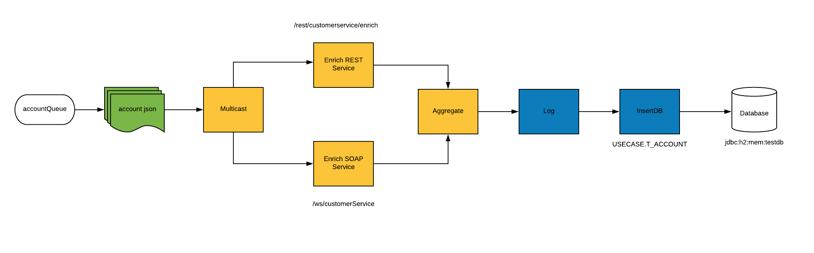

:scrollbar:
:data-uri:
:toc2:
:linkattrs:

= Lab 2. Agile Integration for Developers

_Coolstore Inc._ desires the ability to use a variety of services in order for them to integrate with different systems within their organization. These services range from REST and SOAP based web services, messaging, along with relational databases. They have created a number of applications that not only implement these protocols, but connect to existing enterprise services.

Their goal is to expand the scalability of these services and simplify the integration with their existing enterprise services by using the OpenShift Container Platform to simpifty their needs.

In this lab, you will take the role of a developer to deploy multiple micrososervices based applications which make use of Apache Camel to process account records in JSON format and store the results in a relational database. By leveraging enrichment and aggregation integration patterns, the properties of the account records is enhanced to produce a more complete representation of an account.

.Goals
* Design Apache Camel routes that consume JSON records from Red Hat AMQ
* Use the multicast EIP pattern to distribute the messages to the services
* Design the CXF web service using JAX-WS annotations to consume from SOAP backend service
* Consume from the backend REST service
* Aggregate the messages received using the aggregation EIP pattern
* Save the aggregated message in an SQL database using the Spring SQL component
* Migrate a legacy web services application
+

:numbered:

== Import the Projects into Red Hat CodeReady Studio

Each of the applications within this lab are link:https://maven.apache.org/[Maven] based Java applications. The first step is to import the projects into Red Hat CodeReady Studio.

. Start the Red Hat CodeReady Studio application

. In Red Hat CodeReady Studio, import the projects for this lab.
.. Select: *File > Import ...*
.. Select: *Maven > Existing Maven Projects*
+

. Click *Next*

. For the *Root Directory*, click the *Browse...*

. Navigate to the directory: `$AI_EXERCISE_HOME/labs/lab02`

. Click *Open*

. Import each of these projects in success.
.. 01_rest-cxfrs-service
.. 02_soap-cxfws-service
.. 03_amq-enrich-persist-lab
.. 04_legacy-rest-soap-wrapper
+
[NOTE]
Navigate into the folder of the project you intend to import, check the box next to the `pom.xml` file, and click *Finish* to begin the import process for that project. Repeat until all projects are imported.
+
//image::images/lab-02/import-selected-projects.png[]
. Click *Finish*
+
NOTE: During the initial import, there is delay while the Maven artifacts are downloaded and the project are built.

. After a successful import, you will see the projects in the Project Explorer panel.

image::images/lab-02/the-projects.png[]

This lab is broken down into multiple submodules, separated by each microservice that will be deployed. With the projects imported into CodeReady Studio, proceed to the first microservice which is a REST based application to enrich content.

[.text-center]
image:images/icons/icon-previous.png[align=left, width=128, link=1_Overview_Lab.adoc]  image:images/icons/icon-next.png[align="right"width=128, link=2a_REST_Enrich_Application.adoc]
