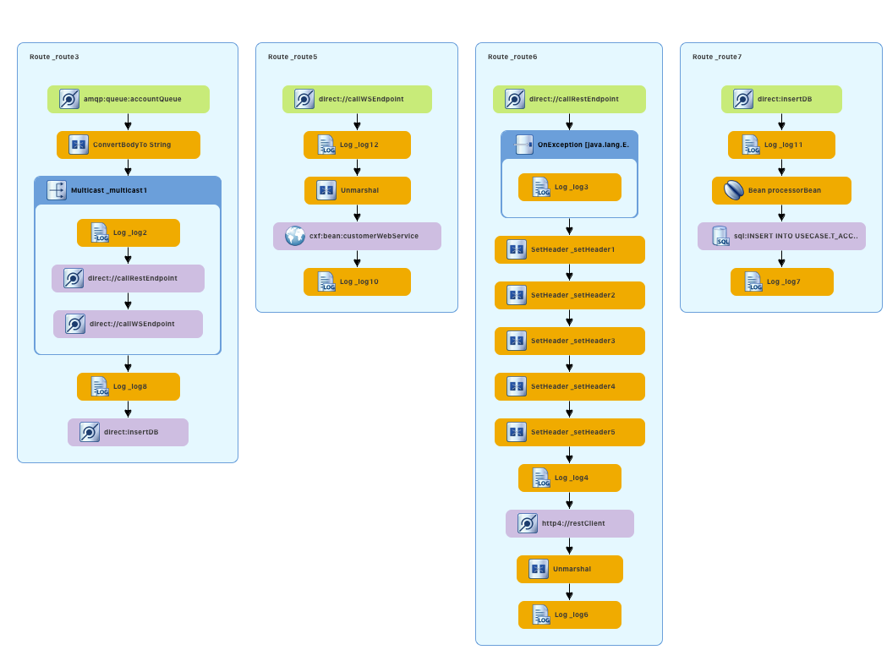

:scrollbar:
:data-uri:
:toc2:
:linkattrs:

= Enrich Content and Aggregate Data - Lab

In this lab, you develop routes that process the account records in JSON format, and through enrichment and aggregation create a more complete account record. The resulting record is stored in a database.

.Goals
* Design Apache Camel routes that consume JSON records from Red Hat AMQ
* Use the multicast EIP pattern to distribute the messages to the services
* Design the CXF web service using JAX-WS annotations to consume from SOAP backend service
* Consume from the backend REST service
* Aggregate the messages received using the aggregation EIP pattern
* Save the aggregated message in an SQL database using the Spring SQL component
+
image::images/lab-02/Fuse_Exp_Usecase_Mod2.png[width="100%"]

:numbered:

== Import the Projects into Red Hat CodeReady Studio

. Start the Red Hat CodeReady Studio application

. In Red Hat CodeReady Studio, import the projects for this lab.
.. Select: *File > Import ...*
.. Select: *Maven > Existing Maven Projects*
+
image::images/lab-02/import_maven_projects.png[]

. Click *Next*

. For the *Root Directory*, click the *Browse...*

. Navigate to the directory: `$AI_EXERCISE_HOME/code/fuse/`

. Click *Open*

. Select the following projects
.. soap-cxfws-service
.. rest-cxfrs-service
.. amq-enrich-persist-lab
+

. Click *Finish*
+
NOTE: During the initial import, there is a small delay while the Maven artifacts are downloaded and the project are built. This could take 1-2 minutes.

. After a successful import, you will see the projects in the Project Explorer panel.

== Explore the REST Enrich Microservice

A REST microservice is used as a backend service for this solution. The REST service is provided in the project *rest-cxfrs-service*.

The REST service enriches the Account record.

. Expand the project *rest-cxfrs-service*

. Expand the node: *src/main/java*

. Expand the project: *com.redhat.gpte.training.springboot_cxfrs_rest*

. Open the class: `CustomerRest.java`

. This class consists of the interface for `CustomerRest` REST service:
+
----
package com.redhat.gpte.training.springboot_cxfrs_rest;

import org.globex.Account;

import javax.ws.rs.*;

@Path("/customerservice")
public interface CustomerRest {

    @POST @Path("/enrich") @Consumes("application/json") @Produces("application/json")
    Account enrich(Account customer);

}
----

. Open the class: `CustomerRestImpl.java`
+
----
package com.redhat.gpte.training.springboot_cxfrs_rest;

import org.globex.Account;
import org.globex.Company;

import io.swagger.annotations.Api;

@Api("/customerservice")
public class CustomerRestImpl implements CustomerRest {

    private static final String NA_REGION = "NORTH_AMERICA";
    private static final String SA_REGION = "SOUTH_AMERICA";
    private static final String WE_REGION = "WEST_AMERICA";
    private static final String EAST_REGION = "EAST_AMERICA";

    @Override public Account enrich(Account account) {
        Company company = account.getCompany();
        String region = company.getGeo();
        switch (region) {
        case "NA":
            company.setGeo(NA_REGION); break;
        case "SA":
            company.setGeo(SA_REGION); break;
        case "WA":
            company.setGeo(WE_REGION); break;
        case "EA":
            company.setGeo(EAST_REGION); break;
        }
        account.setCompany(company);
        return account;
    }
}
----

* The implementation class contains logic to enrich the `Account` POJO as follows:
** Based on the `geo` field of the `company` object, a Java enumerator maps region codes to regions
** `{"NA, SA, WA, EA"}` corresponds to `{"NORTH_AMERICA, SOUTH_AMERICA, WEST_AMERICA, EAST_AMERICA"}`
** The enriched `Account` object is returned by the `enrich()` method

. Open the class `SampleRestApplication.java`.

. To expose the REST service within Spring, the CXF component's `rsServer` is annotated with `@Bean`. 
+
----
package com.redhat.gpte.training.springboot_cxfrs_rest;

import java.util.Arrays;

import org.apache.cxf.Bus;
import org.apache.cxf.endpoint.Server;
import org.apache.cxf.jaxrs.JAXRSServerFactoryBean;
import org.apache.cxf.jaxrs.swagger.Swagger2Feature;
import org.codehaus.jackson.jaxrs.JacksonJsonProvider;
import org.springframework.beans.factory.annotation.Autowired;
import org.springframework.boot.SpringApplication;
import org.springframework.boot.autoconfigure.SpringBootApplication;
import org.springframework.context.annotation.Bean;

@SpringBootApplication
public class SampleRestApplication {

    @Autowired
    private Bus bus;

    public static void main(String[] args) {
        SpringApplication.run(SampleRestApplication.class, args);
    }
 
    @Bean
    public Server rsServer() {
        // setup CXF-RS
        JAXRSServerFactoryBean endpoint = new JAXRSServerFactoryBean();
        endpoint.setBus(bus);
        endpoint.setProvider(new JacksonJsonProvider());
        endpoint.setServiceBeans(Arrays.<Object>asList(new CustomerRestImpl()));
        endpoint.setAddress("/");
        endpoint.setFeatures(Arrays.asList(new Swagger2Feature()));
        return endpoint.create();
    }
}
----

. Check the Spring Boot config file in `src/main/resources/application.properties`. Notice the configuration for *cxf.path* and *server.port*.
+
----
cxf.path=/rest
server.port=8080
...
----

=== Run the REST service

. Open a terminal window.

. Navigate to the project directory with the following command:
+
----
$ cd $AI_EXERCISE_HOME/code/fuse/rest-cxfrs-service
----

. To run the REST service locally, run the following Apache Maven command :
+
----
$ mvn clean spring-boot:run -Dfabric8.skip
----

. Once the app has started, you will eventually see the following:
+
----
....
2019-04-29 21:21:40.537  INFO 20470 --- [           main] b.c.e.u.UndertowEmbeddedServletContainer : Undertow started on port(s) 8081 (http)
2019-04-29 21:21:40.541  INFO 20470 --- [           main] o.s.c.support.DefaultLifecycleProcessor  : Starting beans in phase 0
2019-04-29 21:21:40.594  INFO 20470 --- [           main] b.c.e.u.UndertowEmbeddedServletContainer : Undertow started on port(s) 8080 (http)
2019-04-29 21:21:40.598  INFO 20470 --- [           main] c.r.g.t.s.SampleRestApplication          : Started SampleRestApplication in 5.09 seconds (JVM running for 81.461)
----

. Make note of the log message: *Started SampleRestApplication in x.yy seconds*

. The REST service should be running on port 8080, and can be accessed through URL: link:http://localhost:8080/rest/customerservice/enrich[http://localhost:8080/rest/customerservice/enrich]

. Open a new terminal window

. Try a sample request to the REST endpoint. Type the following command:
+
----
curl -k http://localhost:8080/rest/customerservice/enrich -X POST  -d '{"company":{"name":"Rotobots","geo":"NA","active":true},"contact":{"firstName":"Bill","lastName":"Smith","streetAddr":"100 N Park Ave.","city":"Phoenix","state":"AZ","zip":"85017","phone":"602-555-1100"}}' -H 'content-type: application/json'
----

. The response should be as follows:
+
----
{"clientId":0,"salesRepresentative":null,"company":{"name":"Rotobots","geo":"NORTH_AMERICA","active":true},"contact":{"firstName":"Bill","lastName":"Smith","streetAddr":"100 N Park Ave.","city":"Phoenix","state":"AZ","zip":"85017","phone":"602-555-1100"}}
----
+
NOTE: Notice that the content is enriched, and the GEO is replaced by the correct location. We passed in `"geo":"NA"` and the response correctly is enriched with `"geo":"NORTH_AMERICA"`
=== Deploy to OpenShift Container Platform

. Your account includes an OpenShift project for the services. The project is named *business-services*.

. Switch to the *business-services* project.
+
----
$ oc project business-services
----

. To deploy the application to OpenShift Container Platform, execute the following Maven command:
+
----
$ mvn fabric8:deploy
----

NOTE: The deployment process can take 5-10 minutes.

. Monitor the deployment of the rest-cxfrs-service:
+
----
$ oc get pods -w
----

. Wait until you see `READY 1/1` for `rest-cxfrs-service-x-xyz`. Press `<CTRL+C>` once the services are `Running`.
+
----
NAME                          READY     STATUS      RESTARTS   AGE
rest-cxfrs-service-1-6vnwx       1/1       Running     0          2m
rest-cxfrs-service-s2i-1-build   0/1       Completed   0          3m
----

. Test the rest-cxfrs-service.
.. Retrieve the URL of the rest-cxfrs-service application:
+
----
$ export REST_CXFRS_URL=http://$(oc get route rest-cxfrs-service -o template --template='{{.spec.host}}')
----

.. Send a request to the rest-cxfrs-service
+
----
curl -k ${REST_CXFRS_URL}/enrich -X POST  -d '{"company":{"name":"Rotobots","geo":"NA","active":true},"contact":{"firstName":"Bill","lastName":"Smith","streetAddr":"100 N Park Ave.","city":"Phoenix","state":"AZ","zip":"85017","phone":"602-555-1100"}}' -H 'content-type: application/json'
----

.. The response should be as follows:
+
----
{"clientId":0,"salesRepresentative":null,"company":{"name":"Rotobots","geo":"NORTH_AMERICA","active":true},"contact":{"firstName":"Bill","lastName":"Smith","streetAddr":"100 N Park Ave.","city":"Phoenix","state":"AZ","zip":"85017","phone":"602-555-1100"}}
----

== Inspect the SOAP Web Service

A SOAP Web Service is provided as part of the assets for this lab. This service is developed using CXF-RS, and deployed on Apache Karaf. The service is running on Red Hat Fuse. This service is available in the project *soap-cxfws-service*.

=== View the SOAP Implementation Code

. Expand the project *soap-cxfws-service*

. Expand the node: *src/main/java*

. Expand the project: *org.fuse.usecase.service*

. Open the class: `CustomerWS.java`

. A service is defined in the `CustomerWS` interface using the `@Webservice` annotation

. This exposes an operation to update the received `Account` object:
+
----
package org.fuse.usecase.service;

import org.globex.Account;
import org.globex.CorporateAccount;

@WebService
public interface CustomerWS {

    CorporateAccount updateAccount(Account account);

}
----

. Open the class: `CustomerWSImpl.java`

. This implementation class handles updating an account that is passed in. 

. Review the code in the `updateAccount` method
+
----
    @WebResult(name = "CorporateAccount")
    @SOAPBinding(parameterStyle = SOAPBinding.ParameterStyle.BARE)
    public CorporateAccount updateAccount(Account account) {
        CorporateAccount ca = new CorporateAccount();
        ca.setId(genRandom());
        ca.setSalesContact(getRandomSales(sales));
        ca.setCompany(account.getCompany());
        ca.setContact(account.getContact());
        return ca;
    }
----

. Based on the `Account` POJO received, it creates a `CorporateAccount` POJO containing the same fields as `Account`, plus these additional fields:

* `id`: (int) Set as a random value using 1 to 100 as the range
* `salesContact`: (String) Randomly populated using a list of contacts

=== View the Camel Route

. Open the file: src/main/resources/META-INF/spring/camel-context.xml

. This will show you the design view of the Camel route.
+
image::images/lab-02/customer-ws-camel-context.png[]

. Click the *Source* tab to see the actual source code for the Camel route.
+
----
<beans xmlns="http://www.springframework.org/schema/beans"
    xmlns:cxf="http://camel.apache.org/schema/cxf"
    xmlns:osgi="http://www.springframework.org/schema/osgi"
    xmlns:xsi="http://www.w3.org/2001/XMLSchema-instance" xsi:schemaLocation="        http://www.springframework.org/schema/beans        http://www.springframework.org/schema/beans/spring-beans.xsd        http://www.springframework.org/schema/osgi        http://www.springframework.org/schema/osgi/spring-osgi.xsd                 http://camel.apache.org/schema/spring        http://camel.apache.org/schema/spring/camel-spring.xsd  http://camel.apache.org/schema/cxf  http://camel.apache.org/schema/cxf/camel-cxf.xsd">
    <bean class="org.fuse.usecase.service.CustomerWSImpl" id="customerWSImplBean"/>
    <cxf:cxfEndpoint address="http://0.0.0.0:8080/ws/customerService"
        id="customerWebService" loggingFeatureEnabled="true" serviceClass="org.fuse.usecase.service.CustomerWS"/>
    <camelContext id="_camelContext1" xmlns="http://camel.apache.org/schema/spring">
        <!-- WebService -->
        <route id="_route1">
            <from id="_from1" uri="cxf:bean:customerWebService"/>
            <bean id="_bean1" method="updateAccount" ref="customerWSImplBean"/>
        </route>
    </camelContext>
</beans>
----

. Uses an Apache Camel CXF endpoint bean to configure the service and create it using these parameters:

* `id`: `customerWebService`
* `address`: `http://localhost:8080/ws/customerService`
* `serviceClass`: `org.fuse.usecase.service.CustomerWS`
* `loggingFeatureEnabled`: `true`

=== Run the SOAP service

. Open a terminal window.

. Navigate to the project directory with the following command:
+
----
$ cd $AI_EXERCISE_HOME/code/fuse/soap-cxfws-service
----

. To run the SOAP service locally, run the following Apache Maven command :
+
----
$ mvn clean camel:run -Dfabric8.skip
----

. Once the app has started, you will eventually see the following:
+
----
...
org.apache.camel.spring.Main.main() INFO [org.apache.camel.spring.SpringCamelContext] - Route: _route1 started and consuming from: Endpoint[cxf://bean:customerWebService]
org.apache.camel.spring.Main.main() INFO [org.apache.camel.spring.SpringCamelContext] - Total 1 routes, of which 1 are started.
org.apache.camel.spring.Main.main() INFO [org.apache.camel.spring.SpringCamelContext] - Apache Camel 2.17.0.redhat-630224 (CamelContext: _camelContext1) started in 1.761 seconds
----

. The Camel CXF service is running on port 8080. You can view the WSDL in a browser at: link:http://localhost:8080/ws/customerService?wsdl[http://localhost:8080/ws/customerService?wsdl]

=== Test the SOAP Service

In this section, we will test the SOAP service using the *SOAP UI* application. SOAP UI is already installed on your computer. SoapUI is an open-source web service testing application. More details available at: https://www.soapui.org/.

. To test the SOAP service, launch the SOAP UI application. 

. In SOAP UI, create a new project. Select *File > New SOAP Project*

. In the dialog, enter the following values:
.. Project Name: `customer-service`
.. Initial WSDL: `http://localhost:8080/ws/customerService?wsdl`
.. Create Request: (check the box)
+

. Click *OK*

. You will see your new project.
+

. Expand the nodes for: *customer-service > CustomerWSServiceSoapBinding > updateAccount*

. Double-click the node: *Request 1*

. Make note of the *request* window
+
image::images/lab-02/request-window.png[]

. Paste the following text request into the *request* window:
+
----
<soapenv:Envelope xmlns:soapenv="http://schemas.xmlsoap.org/soap/envelope/" xmlns:ser="http://service.usecase.fuse.org/">
   <soapenv:Header/>
   <soapenv:Body>
      <ser:updateAccount>
         <!--Optional:-->
         <arg0>
            <clientId>0</clientId>
            <!--Optional:-->
            <company>
               <active>true</active>
               <!--Optional:-->
               <geo>NA</geo>
               <!--Optional:-->
               <name>Bill Smith</name>
            </company>
            <!--Optional:-->
            <contact>
               <!--Optional:-->
               <city>Baltimore</city>
               <!--Optional:-->
               <firstName>Satya</firstName>
               <!--Optional:-->
               <lastName>Jayanti</lastName>
               <!--Optional:-->
               <phone>143-222-2344</phone>
               <!--Optional:-->
               <state>MD</state>
               <!--Optional:-->
               <streetAddr>1077 America Ave.</streetAddr>
               <!--Optional:-->
               <zip>11751</zip>
            </contact>
            <!--Optional:-->
            <salesRepresentative>?</salesRepresentative>
         </arg0>
      </ser:updateAccount>
   </soapenv:Body>
</soapenv:Envelope>
----

. Send the request by clicking the green arrow in the top-left corner to the *Request 1* window.
+

. The response should be as follows:
+
----
<soap:Envelope xmlns:soap="http://schemas.xmlsoap.org/soap/envelope/">
   <soap:Body>
      <ns2:updateAccountResponse xmlns:ns2="http://service.usecase.fuse.org/">
         <return>
            <company>
               <active>true</active>
               <geo>NA</geo>
               <name>Bill Smith</name>
            </company>
            <contact>
               <city>Baltimore</city>
               <firstName>Satya</firstName>
               <lastName>Jayanti</lastName>
               <phone>143-222-2344</phone>
               <state>MD</state>
               <streetAddr>1077 America Ave.</streetAddr>
               <zip>11751</zip>
            </contact>
            <id>44</id>
            <salesContact>Nandan Joshi</salesContact>
         </return>
      </ns2:updateAccountResponse>
   </soap:Body>
</soap:Envelope>
----
+
NOTE: Notice that the account is updated with the sales contact details: *<salesContact>*.

=== Deploy to OpenShift Container Platform

. To deploy the application to OpenShift Container Platform, execute the following Maven command:
+
----
$ mvn fabric8:deploy
----

NOTE: The deployment process can take 5-10 minutes.

. Monitor the deployment of the soap-cxfws-service:
+
----
$ oc get pods -w
----

. Wait until you see `READY 1/1` for `soap-cxfws-service-x-xyz`. Press `<CTRL+C>` once the services are `Running`.
+
----
NAME                          READY     STATUS      RESTARTS   AGE
soap-cxfws-service-1-6vnwx       1/1       Running     0          2m
soap-cxfws-service-s2i-1-build   0/1       Completed   0          3m
----

. Test the soap-cxfws-service.
.. Retrieve the URL of the soap-cxfws-service application:
+
----
$ export SOAP_CXFWS_URL=http://$(oc get route soap-cxfws-service -o template --template='{{.spec.host}}')
----

.. Display the URL of the service:
+
----
$ echo $SOAP_CXFWS_URL
----

.. In SOAP UI, update the URL for the service. Replace: `http://localhost:8080` with the value of the _SOAP_CXFWS_URL_ from the previous command.

.. Click the green button to send a request to the soap-cxfws-service

.. The response should be as follows:
+
----
<soap:Envelope xmlns:soap="http://schemas.xmlsoap.org/soap/envelope/">
   <soap:Body>
      <ns2:updateAccountResponse xmlns:ns2="http://service.usecase.fuse.org/">
         <return>
            <company>
               <active>true</active>
               <geo>NA</geo>
               <name>Bill Smith</name>
            </company>
            <contact>
               <city>Baltimore</city>
               <firstName>Satya</firstName>
               <lastName>Jayanti</lastName>
               <phone>143-222-2344</phone>
               <state>MD</state>
               <streetAddr>1077 America Ave.</streetAddr>
               <zip>11751</zip>
            </contact>
            <id>44</id>
            <salesContact>Nandan Joshi</salesContact>
         </return>
      </ns2:updateAccountResponse>
   </soap:Body>
</soap:Envelope>
----

== Test the Integration Module

Now you will be testing the Camel routes that (1) enrich the Account data with the 2 backend services, (2) aggregate the responses, and finally (3) persist the data into a database table. You will be completing the code for this section in the project *amq-enrich-persist-lab*.

=== Camel Route and H2 Database Integration

. Expand the project *amq-enrich-persist-lab*

. Expand the node: *src/main/resources/spring*

. Open the file: `camel-context.xml`

. You will see the Design view of the Camel routes
+

. The Camel route with id: *Route_route7* updates the records in an embedded H2 database, running on localhost.

. Click the *Source* tab to view the source code for the routes.

. Near the bottom of the file is the code for *route7*
+
----
        <!-- Insert Records -->
        <route id="_route7">
            <from id="_from7" uri="direct:insertDB"/>
            <log id="_log11" message=">> Before Insert : ${body}"/>
            <bean id="_bean3" method="defineNamedParameters" ref="processorBean"/>
            <to id="_to9" uri="sql:INSERT INTO USECASE.T_ACCOUNT(CLIENT_ID,SALES_CONTACT,COMPANY_NAME,COMPANY_GEO,COMPANY_ACTIVE,CONTACT_FIRST_NAME,CONTACT_LAST_NAME,CONTACT_ADDRESS,CONTACT_CITY,CONTACT_STATE,CONTACT_ZIP,CONTACT_PHONE,CREATION_DATE,CREATION_USER)                          VALUES                          (:#CLIENT_ID,:#SALES_CONTACT,:#COMPANY_NAME,:#COMPANY_GEO,:#COMPANY_ACTIVE,:#CONTACT_FIRST_NAME,:#CONTACT_LAST_NAME,:#CONTACT_ADDRESS,:#CONTACT_CITY,:#CONTACT_STATE,:#CONTACT_ZIP,:#CONTACT_PHONE,:#CREATION_DATE,:#CREATION_USER);"/>
            <log id="_log7" message=">>> Results : ${body}"/>
        </route>

----

. Inspect the configuration details in the `pom.xml` and `src/main/resources/application-dev.properties` files.

. Inspect a SQL script for creating the USECASE schema and the table required is provided in the `src/main/resources/schema.sql` file.

////
You can access the H2 console by opening the URL: link:http://localhost:8080/h2-console[http://localhost:8080/h2-console]. Please enter the JDBC URL as *jdbc:h2:mem:testdb* and log in.

NOTE: The console will be available only after the routes are started. As the database is embedded, it does not persist data once the route is shut down.
////

=== Consuming JSON from a Message Queue 

. Analyze the Camel route with id: *_route3* that consumes the JSON objects and starts from the *accountQueue*.
+
----
        <route id="_route3">
            <from id="_from3" uri="amqp:queue:accountQueue"/>
            <convertBodyTo id="_convertBodyTo1" type="String"/>
            <multicast id="_multicast1" parallelProcessing="true" strategyRef="reconcileData">
                <log id="_log2" loggingLevel="INFO" message="inside multicast"/>
                <to id="_to4" uri="direct://callRestEndpoint"/>
                <to id="_to5" uri="direct://callWSEndpoint"/>
            </multicast>
            <log id="_log8" loggingLevel="INFO" message="after multicast : ${body}"/>
            <to id="_to6" uri="direct:insertDB"/>
        </route>

----
.. @TODO: Note the AMQP configuration and queues based on the previous lab.

.. Note the how the message content is converted to a string, and how unmarshalling from JSON content to a POJO is done using the `<unmarshal>` processor.
* JSON library: `jackson`
* `unmarshalTypeName` attribute: `org.globex.Account`
* The result is used to multicast the exchange to the REST and web service endpoints.
+
IMPORTANT: It is a best practice not to multicast data in parallel. To simplify the legibility of the code, a direct endpoint (`callRestEndpoint`) is used to call the REST service and a different direct endpoint (`callWSEndpoint`) to call the web service service.

=== Define the REST Direct Routes

. To call the backend services, two Camel routes were created: one starting with `direct:callRestEndpoint` and the other with `direct:callWSEndpoint`.

* To correctly invoke the declared REST service, a HTTP producer component is used and make sure the following `{header,value}` pairs are specified:

** `Content-Type=application/json`
** `Accept=application/json`
** `CamelHttpMethod=POST`
** `CamelCxfRsUsingHttpAPI=True`

=== The Web Service Direct Route

. Note the direct web service route that starts with the `direct://callWSEndpoint` endpoint and calls the web service using the Camel CXF Producer.

=== The Aggregation Strategy

. From the results collected by the two services, analyse how the content is aggregated in the `multicast` processor to reconcile the information received from the `CorporateAccount` POJO with the `Account` POJO.

* This new `Account` POJO contains the aggregated result that is sent to another Apache Camel route to insert the row into the database.
+
NOTE: The aggregation strategy must be developed within the `AccountAggregator` class.

=== The Aggregated Data into the H2 Database

. Analyze the Apache Camel route that inserts the `Account` information into the `T_ACCOUNT` table of the `ACCOUNT` database.
..  The Spring SQL component in the route uses a SQL query to insert the `Account` record within the `option` parameter of the SQL endpoint.
* Method: `defineNamedParameters(Account account)`

.. The named parameters are defined using a `Map<String, Object>` created within a bean that is called by the route to set the body, before calling the SQL endpoint.
* Bean: `ProcessorBean.class`

. After calling the SQL endpoint, add a log message processor to display the contents of the received body.

=== Using a JUnit Test

. Analyze the JUnit test case that validates the `jackson` ObjectMapper can read the string content of the JSON `Account` message and generate an `Account` object.
* JUnit test class: `JacksonCompanyTest`

. Note the two assert conditions: one to check that the object is not null, and the other to verify that the name of the company is equal to "Robocops".

==== Build and Test the Integration Project

. Change working directory to `$AI_EXERCISE_HOME/code/fuse/amq-enrich-persist-lab/`.

. On the command line, run the following command in a terminal:
+
----
$ mvn spring-boot:run -Dfabric8.skip
----

* You will see output similar to the following:
+
----
{CONTACT_STATE=NC, SALES_CONTACT=Guillaume Nodet, CREATION_USER=fuse_usecase, CREATION_DATE=2015-12-11 18:18:01.55, CONTACT_PHONE=600-555-7000, CONTACT_CITY=Raleigh, CONTACT_ADDRESS=1101 Smith St., COMPANY_NAME=MountainBikers, COMPANY_ACTIVE=true, CLIENT_ID=46, CONTACT_LAST_NAME=Jungle, CONTACT_ZIP=27519, COMPANY_GEO=SOUTH_AMERICA, CONTACT_FIRST_NAME=George}
----
+
NOTE: Expect to see differences for `CREATION_DATE`, `SALES_CONTACT`, and `CLIENT_ID` because they are generated values.

. Check the database to ensure the records are populated correctly in the T_ACCOUNT table.

==== Deploy the Camel Integration Project to OpenShift Container Platform

Finally, you deploy the integration project to OpenShift Container Platform, using the PostgreSQL database and schema set up earlier, instead of using the embedded H2 database.

. Change the server.port to 8080.
+
[NOTE] The configuration details are found in the `application.properties` and `deployment.yml` files.
+
. In a terminal window, switch project in OpenShift Container Platform:
+
----
$ oc project business-services-user$seq
----
+
. In a terminal window, navigate to the project's root folder and run:
+
----
$ mvn fabric8:deploy -Popenshift
----

. Check that the pod *amq-enrich-persist-lab* starts up successfuly.

. Check that the all four Camel routes run successfully, consuming all 3 messages from accountQueue, and writing to the database.

. Check the PostgreSQL database, on OpenShift Container Platform, to ensure the records are populated correctly in the T_ACCOUNT table.

=== Update SOAP Wrapper Project and Deploy to OpenShift Container Platform

Now, you develop a Camel route to migrate legacy SOAP services to provide a REST API wrapper using Camel.

SOAP-based services are plentiful in many enterprise solutions and are slowly being replaced by RESTful services to simplify their use. A new wizard is available in the latest version of Red Hat Fuse Tooling to help you make the transition with Apache Camel’s Rest DSL. This lab shows how to use the new wizard to transition from older SOAP-based services to more modern REST-based services.

.Goals in this section
* Create REST API for the Customer SOAP service from previous lab.
* Design Apache Camel route that exposes REST API consuming JSON.
* Use the Red Hat Fuse Tooling in Red Hat Developer Studio to create *wsdl2rest* mapping.
* Deploy and test the solution.

==== Import the *legacy-soap-rest-wrapper* Project into CodeReady Studio

. Using the same method you used in the previous lab, import the `legacy-soap-rest-wrapper` project into your CodeReady Studio workspace. Using the Wizard, you will find 1 project:

* legacy-soap-rest-wrapper

*This project contains the Legacy SOAP Wrapper REST service that will route and transform REST service requests and responses to and from the existing backend SOAP service.*

The SOAP Web Service *soap-cxfws-service* which you have earlier deployed, is used as the backend SOAP service for this part of the lab. This service is developed using CXF-WS, and deployed on Karaf. The service is running on Red Hat Fuse 6.3. Make sure the SOAP service is deployed to OpenShift Container Platform and the WSDL is accessible at the URL: link:http://$soap-cxfws-service-route/ws/customerService?wsdl[http://$soap-cxfws-service-route/ws/customerService?wsdl].

==== Create the Camel Route for SOAP service migration

. Right-click the *legacy-soap-rest-wrapper* in the Red Hat Fuse Integration perspective and select *New->Camel Rest DSL from WSDL*, or click *File->New->Other…, Red Hat Fuse->Camel Rest DSL from WSDL*.
. Provide the URL to soap-cxfws-service WSDL and ensure the *legacy-soap-rest-wrapper* project is selected:
+
image::images/legacy-soap-wsdl-import.png[]

. Click *Next*.
. Keep the default values of fields unchanged and click *Finish*.
+
image::images/legacy-soap-wsdl-import-2.png[]

. Now you should see the Java classes and the Spring context XML *rest-springboot-context.xml*.
+
image::images/legacy-soap-wsdl-import-3.png[]

. Inspect the Camel route and notice that the solution is code-complete and ready to run.

==== Update existing Camel Route in *legacy-soap-rest-wrapper* Project [OPTIONAL]

This section is an option to completing the previous section on *Create the Camel Route for SOAP service migration*.

. Locate the `$AI_EXERCISE_HOME/code/fuse/legacy-soap-rest-wrapper/src/main/data/` directory.

. Using your favorite code editor, open the *rest-springboot-context.xml* file. This is the file that contains the Camel routes that will activate the Legacy SOAP Wrapper Rest service.

. Inspect the `UpdateAccount` Camel route.

. Locate the tag `<to id="_to1" uri="cxf:`. This Camel processor makes a call to the SOAP web service hosted on OpenShift Container Platform.

. In a terminal window, obtain the route information for the `soap-cxfws-service` hosted on OpenShift Container Platform:
+
----
$ oc get routes -n business-services | grep soap-cxfws-service
NAME                 HOST/PORT                                                              PATH     SERVICES   PORT      TERMINATION             WILDCARD
soap-cxfws-service   soap-cxfws-service-soap-service.userY.apps.redhatsummit.opentlc.com             soap-cxfws-service   8080                    None
soap-default         soap-default-soap-service.userY.apps.redhatsummit.opentlc.com                   soap-cxfws-service   8181                    None
soap-service         soap-service-soap-service.userY.apps.redhatsummit.opentlc.com                   soap-cxfws-service   8080                    None
----
+
. From the results, copy the hostname for the `soap-service` Kubernetes service. In the example shown, that hostname is `soap-service-soap-service.userY.apps.redhatsummit.opentlc.com `

. Return to your favorite code editor, and focus on the `UpdateAccount` Camel route. Update the SOAP service hostname appended to the value of the `uri` parameter of the tag `<to id="_to1" uri="cxf:`.

. Make the such that the SOAP service URI call now contains the correct hostname for the SOAP service hosted on OpenShift Container Platform:
+
----
        <route id="updateAccount">
            <from id="_from1" uri="direct:updateAccount"/>
            <log id="_log1" loggingLevel="INFO" message="updateAccount"/>
            <to id="_to1" uri="cxf://http://soap-service-soap-service.userY.apps.redhatsummit.opentlc.com/ws/customerService?serviceClass=org.fuse.usecase.service.CustomerWS&amp;defaultOperationName=updateAccount"/>
            <setHeader headerName="Content-Type" id="_setHeader1">
                <constant>application/json</constant>
            </setHeader>
            <setBody id="_setBody1">
                <simple>${body[0]}</simple>
            </setBody>
        </route>
----
+
. Save your changes.

==== Run the Legacy SOAP Wrapper REST service

. To run the Legacy SOAP Wrapper REST service locally, run the following Maven command from the `$AI_EXERCISE_HOME/code/fuse/legacy-soap-rest-wrapper/` directory:
+
----
$ mvn spring-boot:run -Dfabric8.skip
----
+
. The Camel service, that has just launched, should be running on port 8080, and can be accessed through URL: link:http://localhost:8080/api/jaxrs/account[http://localhost:8080/api/jaxrs/account].
. Send a test request to the Legacy SOAP Wrapper REST service and check if the backend service is invoked correctly:
+
----
$ curl -k http://localhost:8080/api/jaxrs/account -X PUT  -d '{"company":{"name":"Rotobots","geo":"NA","active":true},"contact":{"firstName":"Bill","lastName":"Smith","streetAddr":"100 N Park Ave.","city":"Phoenix","state":"AZ","zip":"85017","phone":"602-555-1100"}}' -H 'content-type: application/json'
----

. The response should be as below:
+
----
{"company":{"active":true,"geo":"NA","name":"Rotobots"},"contact":{"city":"Phoenix","firstName":"Bill","lastName":"Smith","phone":"602-555-1100","state":"AZ","streetAddr":"100 N Park Ave.","zip":"85017"},"id":33,"salesContact":"Bernard Tison"}
----
+
. From the test results, validate that the data currently in the PostgreSQL database was retrieved successfully via the Legacy SOAP Wrapper Rest service .
+
. BONUS CHALLENGE: Create additional lines of test data in the PostgreSQL database on OpenShift Container Platform. Then, send the previous REST service request to the local Legacy SOAP Wrapper REST service again. Observe that your latest test data appears in the service response.

==== Deploy to OpenShift Container Platform

. To deploy the application to OpenShift Container Platform, execute the following Maven command from the terminal:
+
----
$ mvn fabric8:deploy
----

. Check that the project is deployed successfully. A Kubernetes pod for the deployment *legacy-soap-rest-wrapper* should be started.

. Take note of the route name of the *legacy-soap-rest-wrapper* service, which is now exposed to external traffic:
+
----
$ oc get routes -n business-services | grep legacy-soap
NAME                       HOST/PORT                                                                       PATH      SERVICES                   PORT      TERMINATION   WILDCARD
legacy-soap-rest-wrapper   legacy-soap-rest-wrapper-legacy-soap.apps.cluster-490c.sandbox693.opentlc.com             legacy-soap-rest-wrapper   8080                    None
----
+
. Repeat the SOAP service test by updating the CURL command, replacing the hostname with the OpenShift service route name for the *legacy-soap-rest-wrapper* hosted on OpenShift Container Platform:
+
----
$ curl -k http://legacy-soap-rest-wrapper-legacy-soap.apps.cluster-490c.sandbox693.opentlc.com/api/jaxrs/account -X PUT  -d '{"company":{"name":"Rotobots","geo":"NA","active":true},"contact":{"firstName":"Bill","lastName":"Smith","streetAddr":"100 N Park Ave.","city":"Phoenix","state":"AZ","zip":"85017","phone":"602-555-1100"}}' -H 'content-type: application/json'
----
+
. Validate that the same REST response was received, as in the previous test.

Congratulations, you have completed this lab.
