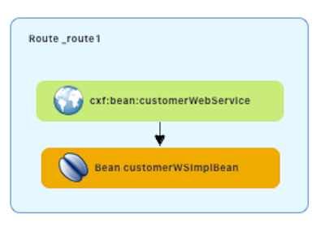
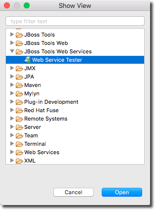
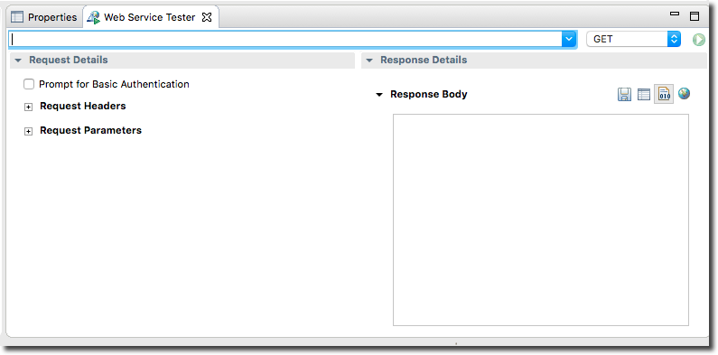
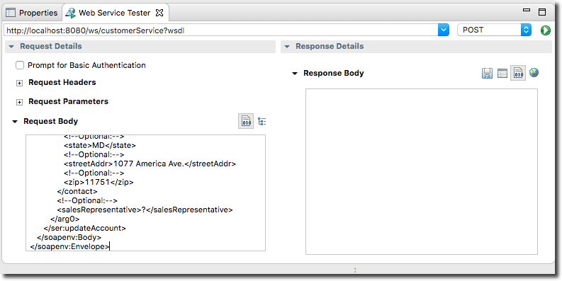
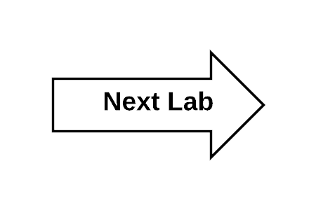

:scrollbar:
:data-uri:
:toc2:
:linkattrs:

= Lab 2b. SOAP Web Application

A SOAP Web Service is also provided as part of the assets for this lab. Red Hat Fuse supports multiple container runtimes including link:JBoss Enterprise Application Platform (EAP)[https://www.redhat.com/en/technologies/jboss-middleware/application-platform], Spring Boot, and link:https://karaf.apache.org/[Apache Karaf]. This service is developed using link:http://cxf.apache.org/docs/jax-rs.html[CXF-RS], and deployed on a Apache Karaf container

This service is found in the Maven project *soap-cxfws-service*.

=== View the SOAP Implementation Code

. Expand the project *soap-cxfws-service*

. Expand the node: *src/main/java*

. Expand the package: *com.redhat.labs.agileintegration.service*

. Open the file: `CustomerWS.java`

. A service is defined in the `CustomerWS` interface using the `@Webservice` annotation

. This exposes an operation to update the received `Account` object:
+
----
package com.redhat.labs.agileintegration.service;

import org.globex.Account;
import org.globex.CorporateAccount;

@WebService
public interface CustomerWS {

    CorporateAccount updateAccount(Account account);

}
----

. Open the class: `CustomerWSImpl.java`

. This implementation class handles updating an account that is passed in. 

. Review the code in the `updateAccount` method
+
----
    @WebResult(name = "CorporateAccount")
    @SOAPBinding(parameterStyle = SOAPBinding.ParameterStyle.BARE)
    public CorporateAccount updateAccount(Account account) {
        CorporateAccount ca = new CorporateAccount();
        ca.setId(genRandom());
        ca.setSalesContact(getRandomSales(sales));
        ca.setCompany(account.getCompany());
        ca.setContact(account.getContact());
        return ca;
    }
----

. Based on the `Account` POJO received, it creates a `CorporateAccount` POJO containing the same fields as `Account`, plus these additional fields:

* `id`: (int) Set as a random value using 1 to 100 as the range
* `salesContact`: (String) Randomly populated using a list of contacts

=== View the Camel Route

The primary integration logic is contained in Camel routes. Routes can be defined either declaratively using a Java DSL or Spring based XML. This application is using the Spring XML approach. Review the contents of the Spring XML based camel context.

. Open the file: `src/main/resources/META-INF/spring/camel-context.xml`

. This will show you the design view of the Camel route.
+

. Click the *Source* tab to see the actual source code for the Camel route.
+
----
<beans xmlns="http://www.springframework.org/schema/beans"
    xmlns:cxf="http://camel.apache.org/schema/cxf"
    xmlns:osgi="http://www.springframework.org/schema/osgi"
    xmlns:xsi="http://www.w3.org/2001/XMLSchema-instance" xsi:schemaLocation="        http://www.springframework.org/schema/beans        http://www.springframework.org/schema/beans/spring-beans.xsd        http://www.springframework.org/schema/osgi        http://www.springframework.org/schema/osgi/spring-osgi.xsd                 http://camel.apache.org/schema/spring        http://camel.apache.org/schema/spring/camel-spring.xsd  http://camel.apache.org/schema/cxf  http://camel.apache.org/schema/cxf/camel-cxf.xsd">
    <bean class="com.redhat.labs.agileintegration.service.CustomerWSImpl" id="customerWSImplBean"/>
    <cxf:cxfEndpoint address="http://0.0.0.0:8080/ws/customerService"
        id="customerWebService" loggingFeatureEnabled="true" serviceClass="com.redhat.labs.agileintegration.service.CustomerWS"/>
    <camelContext id="_camelContext1" xmlns="http://camel.apache.org/schema/spring">
        <!-- WebService -->
        <route id="_route1">
            <from id="_from1" uri="cxf:bean:customerWebService"/>
            <bean id="_bean1" method="updateAccount" ref="customerWSImplBean"/>
        </route>
    </camelContext>
</beans>
----

. Uses an Apache Camel CXF endpoint bean to configure the service and create it using these parameters:

* `id`: `customerWebService`
* `address`: `http://localhost:8080/ws/customerService`
* `serviceClass`: `com.redhat.labs.agileintegration.service.CustomerWS`
* `loggingFeatureEnabled`: `true`

=== Run the SOAP service Locally

. Open a terminal window.

. Navigate to the project directory with the following command:
+
----
$ cd $AI_EXERCISE_HOME/labs/lab02/02_soap-cxfws-service
----

. To run the SOAP service locally, run the following Apache Maven command :
+
----
$ mvn clean camel:run -Dfabric8.skip
----

. Once the app has started, you will eventually see the following:
+
----
...
org.apache.camel.spring.Main.main() INFO [org.apache.camel.spring.SpringCamelContext] - Route: _route1 started and consuming from: Endpoint[cxf://bean:customerWebService]
org.apache.camel.spring.Main.main() INFO [org.apache.camel.spring.SpringCamelContext] - Total 1 routes, of which 1 are started.
org.apache.camel.spring.Main.main() INFO [org.apache.camel.spring.SpringCamelContext] - Apache Camel 2.17.0.redhat-630224 (CamelContext: _camelContext1) started in 1.761 seconds
----

. The Camel CXF service is running on port 8080. You can view the WSDL in a browser at: link:http://localhost:8080/ws/customerService?wsdl[http://localhost:8080/ws/customerService?wsdl]

=== Test the SOAP Service

In this section, we will test the SOAP web service using the an inclued Web Service Tester within CodeReady Studio. The web service tester is only one of many included tools available within the product.

. To test the SOAP service, open the Web Service Tester View. 
.. Select *Window > Show View > Other*. 
.. Select *JBoss Tools Web Services > Web Service Tester*. 
+

+
. A new window will appear on the bottom portion of the window. 
+

. In the empty textbox, enter the following value for the location of the WSDL file: `http://localhost:8080/ws/customerService`
. Change the request type to `POST
. Paste the following text request into the *Request Body* textbox:
+
----
<soapenv:Envelope xmlns:soapenv="http://schemas.xmlsoap.org/soap/envelope/" xmlns:ser="http://service.agileintegration.labs.redhat.com/">
   <soapenv:Header/>
   <soapenv:Body>
      <ser:updateAccount>
         <!--Optional:-->
         <arg0>
            <clientId>0</clientId>
            <!--Optional:-->
            <company>
               <active>true</active>
               <!--Optional:-->
               <geo>NA</geo>
               <!--Optional:-->
               <name>Bill Smith</name>
            </company>
            <!--Optional:-->
            <contact>
               <!--Optional:-->
               <city>Baltimore</city>
               <!--Optional:-->
               <firstName>Satya</firstName>
               <!--Optional:-->
               <lastName>Jayanti</lastName>
               <!--Optional:-->
               <phone>143-222-2344</phone>
               <!--Optional:-->
               <state>MD</state>
               <!--Optional:-->
               <streetAddr>1077 America Ave.</streetAddr>
               <!--Optional:-->
               <zip>11751</zip>
            </contact>
            <!--Optional:-->
            <salesRepresentative>?</salesRepresentative>
         </arg0>
      </ser:updateAccount>
   </soapenv:Body>
</soapenv:Envelope>
----
+

. Send the request by clicking the green arrow in the top-right corner of the view next to the _POST_ requst type.

. The response should be as follows and is displayed in the _Response Body_ textbox:
+
----
<soap:Envelope xmlns:soap="http://schemas.xmlsoap.org/soap/envelope/">
   <soap:Body>
      <ns2:updateAccountResponse xmlns:ns2="http://service.agileintegration.labs.redhat.com/">
         <return>
            <company>
               <active>true</active>
               <geo>NA</geo>
               <name>Bill Smith</name>
            </company>
            <contact>
               <city>Baltimore</city>
               <firstName>Satya</firstName>
               <lastName>Jayanti</lastName>
               <phone>143-222-2344</phone>
               <state>MD</state>
               <streetAddr>1077 America Ave.</streetAddr>
               <zip>11751</zip>
            </contact>
            <id>44</id>
            <salesContact>Nandan Joshi</salesContact>
         </return>
      </ns2:updateAccountResponse>
   </soap:Body>
</soap:Envelope>
----
+
NOTE: Notice that the account is updated with the sales contact details: *<salesContact>*.

=== Deploy to OpenShift Container Platform

. To deploy the application to the OpenShift Container Platform, execute the following Maven command:
+
----
$ mvn clean fabric8:deploy
----

NOTE: The deployment process can take 5-10 minutes.

. Monitor the deployment of the soap-cxfws-service:
+
----
$ oc get pods -w -n business-services
----

. Wait until you see `READY 1/1` for `soap-cxfws-service-x-xyz`. Press `<CTRL+C>` once the services are `Running`.
+
----
NAME                          READY     STATUS      RESTARTS   AGE
soap-cxfws-service-1-6vnwx       1/1       Running     0          2m
soap-cxfws-service-s2i-1-build   0/1       Completed   0          3m
----

. Test the soap-cxfws-service.
.. Retrieve the URL of the soap-cxfws-service application:
+
----
$ export SOAP_CXFWS_URL=http://$(oc get route soap-cxfws-service -o template --template='{{.spec.host}}' -n business-services)
----

.. Display the URL of the service:
+
----
$ echo $SOAP_CXFWS_URL
----

.. In the Web Service Tester within CodeReady Studio, update the URL for the service. Replace: `http://localhost:8080` with the value of the _SOAP_CXFWS_URL_ from the previous command.

.. Click the green button to send a request to the soap-cxfws-service

.. The response should be as follows:
+
----
<soap:Envelope xmlns:soap="http://schemas.xmlsoap.org/soap/envelope/">
   <soap:Body>
      <ns2:updateAccountResponse xmlns:ns2="http://service.agileintegration.labs.redhat.com/">
         <return>
            <company>
               <active>true</active>
               <geo>NA</geo>
               <name>Bill Smith</name>
            </company>
            <contact>
               <city>Baltimore</city>
               <firstName>Satya</firstName>
               <lastName>Jayanti</lastName>
               <phone>143-222-2344</phone>
               <state>MD</state>
               <streetAddr>1077 America Ave.</streetAddr>
               <zip>11751</zip>
            </contact>
            <id>43</id>
            <salesContact>Guillaume Nodet</salesContact>
         </return>
      </ns2:updateAccountResponse>
   </soap:Body>
</soap:Envelope>
----

NOTE: The `<salesContact>` is randomly generated. Your output may be slightly different from above.

*You have successfully deployed and tested the SOAP web service!*

[.text-center]
  