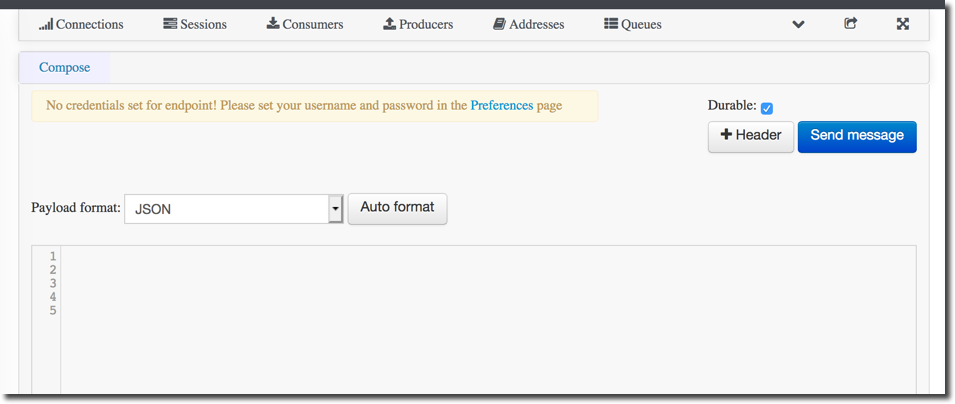

:scrollbar:
:data-uri:
:toc2:
:linkattrs:

= Lab 2c. Integration Application

Now, with the REST and SOAP services deployed, a third application will be deployed to (1) enrich the Account data with the 2 backend services, (2) aggregate the responses, and finally (3) persist the data into a relational database table. You will be completing the code for this section in the Maven project *amq-enrich-persist-lab*.

=== Camel Route and Database Integration

. Expand the project *amq-enrich-persist-lab*

. Expand the node: *src/main/resources/spring*

. Open the file: `camel-context.xml`

. You will see the Design view of the Camel routes
+
image::images/lab-02/amq-enrich-routes.png[]

. The Camel route with id: *Route_route7* updates the records in a relational database.

. Click the *Source* tab to view the source code for the routes.

. Near the bottom of the file is the code for *route7*
+
----
        <!-- Insert Records -->
        <route id="_route7">
            <from id="_from7" uri="direct:insertDB"/>
            <log id="_log11" message=">> Before Insert : ${body}"/>
            <bean id="_bean3" method="defineNamedParameters" ref="processorBean"/>
            <to id="_to9" uri="sql:INSERT INTO USECASE.T_ACCOUNT(CLIENT_ID,SALES_CONTACT,COMPANY_NAME,COMPANY_GEO,COMPANY_ACTIVE,CONTACT_FIRST_NAME,CONTACT_LAST_NAME,CONTACT_ADDRESS,CONTACT_CITY,CONTACT_STATE,CONTACT_ZIP,CONTACT_PHONE,CREATION_DATE,CREATION_USER)                          VALUES                          (:#CLIENT_ID,:#SALES_CONTACT,:#COMPANY_NAME,:#COMPANY_GEO,:#COMPANY_ACTIVE,:#CONTACT_FIRST_NAME,:#CONTACT_LAST_NAME,:#CONTACT_ADDRESS,:#CONTACT_CITY,:#CONTACT_STATE,:#CONTACT_ZIP,:#CONTACT_PHONE,:#CREATION_DATE,:#CREATION_USER);"/>
            <log id="_log7" message=">>> Results : ${body}"/>
        </route>

----

=== Consuming JSON from a Message Queue

. Analyze the Camel route with id: *_route3* that consumes the JSON objects and starts from the *accountQueue*.
+
----
        <route id="_route3">
            <from id="_from3" uri="amqp:queue:accountQueue"/>
            <convertBodyTo id="_convertBodyTo1" type="String"/>
            <multicast id="_multicast1" parallelProcessing="true" strategyRef="reconcileData">
                <log id="_log2" loggingLevel="INFO" message="inside multicast"/>
                <to id="_to4" uri="direct://callRestEndpoint"/>
                <to id="_to5" uri="direct://callWSEndpoint"/>
            </multicast>
            <log id="_log8" loggingLevel="INFO" message="after multicast : ${body}"/>
            <to id="_to6" uri="direct:insertDB"/>
        </route>

----
.. The AMQP Camel component reads messages from a queue called _accountQueue_. The connection details are contained within two locations
... A spring boot configuration file called *application.properties* within the *src/main/resources* folder.
... As environment variables  defined in the _deployment.yml_ descriptor  within the file located at *src/main/fabric8/deployment.yml* file. This can be located by expanding the *src* folder in the project explorer view.
.. Note the how the message content is converted to a string, and how unmarshalling from JSON content to a POJO is done using the `<unmarshal>` processor.
* JSON library: `jackson`
* `unmarshalTypeName` attribute: `org.globex.Account`
* The result is used to multicast the exchange to the REST and web service endpoints.
+
IMPORTANT: It is a best practice not to multicast data in parallel. To simplify the legibility of the code, a link:https://camel.apache.org/direct.html[direct] endpoint (`callRestEndpoint`) is used to call the REST service and a different direct endpoint (`callWSEndpoint`) to call the web service service.

===  The REST Direct Routes

. To call the backend services, two Camel routes were created: one starting with `direct:callRestEndpoint` and the other with `direct:callWSEndpoint`.

* To correctly invoke the declared REST service, a link:https://camel.apache.org/http.html[HTTP producer] component is used and make sure the following `{header,value}` pairs are specified:

** `Content-Type=application/json`
** `Accept=application/json`
** `CamelHttpMethod=POST`
** `CamelCxfRsUsingHttpAPI=True`

These are defined using the `<setHeader>` tag and defining link:https://camel.apache.org/constant.html[constant] values.

=== The Web Service Direct Route

. Note the direct web service route that starts with the `direct://callWSEndpoint` endpoint and calls the web service using the link:https://camel.apache.org/cxf.html[Camel CXF Producer].

=== The Aggregation Strategy

. Camel allows you to link:https://camel.apache.org/aggregator2.html[aggregate] the results from multiple sources. From the results collected by the two services, analyse how the content is aggregated in the `multicast` processor to reconcile the information received from the `CorporateAccount` POJO with the `Account` POJO.

* The aggregation strategy is defined in the `AccountAggregator` class within the *com.redhat.labs.agileintegration.businesslogic* package.
* This new `Account` POJO contains the aggregated result that is sent to another Apache Camel route to insert the row into the database.

=== The Aggregated Data into the Relational Database

The results of this integration is stored in a relational database.

. Analyze the Apache Camel route that inserts the `Account` information into the `T_ACCOUNT` table of the `ACCOUNT` database.
..  The link:http://camel.apache.org/sql-component.html[Spring SQL component] in the route uses a SQL query to insert the `Account` record within the `option` parameter of the SQL endpoint.
* Method: `defineNamedParameters(Account account)`

.. The named parameters are defined using a `Map<String, Object>` created within a bean that is called by the route to set the body, before calling the SQL endpoint.
* Bean: `ProcessorBean.class`

. After calling the SQL endpoint, add a log message processor to display the contents of the received body.

==== Deploy the Camel Integration Project to OpenShift Container Platform

In this section you will deploy the integration project to OpenShift Container Platform, using the PostgreSQL database in the _enterprise-services_ project

. In a terminal window, navigate to the project's root folder:
+
----
$ cd $AI_EXERCISE_HOME/labs/lab02/03_amq-enrich-persist-lab
----

. Build and deploy the application into OpenShift
+
----
$ mvn fabric8:deploy -Popenshift
----

NOTE: The deployment process can take 5-10 minutes.

. Monitor the deployment of the amq-enrich-persist-lab:
+
----
$ oc get pods -w -n business-services
----

. Wait until you see `READY 1/1` for `amq-enrich-persist-lab-x-xyz`. Press `<CTRL+C>` once the services are `Running`.
+
----
NAME                          READY     STATUS      RESTARTS   AGE
amq-enrich-persist-lab-1-6vnwx       1/1       Running     0          2m
amq-enrich-persist-lab-s2i-1-build   0/1       Completed   0          3m
----

. Use the following command to *tail* the log of the AMQ broker pod, for inspection:
+
----
oc logs -f <pod name> -n business-services
----
+
NOTE: Be sure to update the *<pod name>* with the name of your *amq-enrich-persist-lab-a-xyz* pod

. Check in the pod log, that all four Camel routes started successfully.

* You should see the following output. Make note of the logs referring to the *routeXYZ started and consuming*
+
----
...

03:08:16.871 [main] INFO o.a.camel.spring.SpringCamelContext - Route: _route1 started and consuming from: amqp://queue:accountQueue 03:08:16.873 [main] INFO o.a.camel.spring.SpringCamelContext - Route: _route2 started and consuming from: direct://callWSEndpoint 03:08:16.873 [main] INFO o.a.camel.spring.SpringCamelContext - Route: _route3 started and consuming from: direct://callRestEndpoint 03:08:16.874 [main] INFO o.a.camel.spring.SpringCamelContext - Route: _route4 started and consuming from: direct://insertDB 03:08:16.874 [main] INFO o.a.camel.spring.SpringCamelContext - Total 4 routes, of which 4 are started

...
----

====

. Check the PostgreSQL database, on OpenShift Container Platform, to ensure that no records currently exist in the T_ACCOUNT table.

* A customer record will be created in the PostgreSQL database by the Camel routes in the next section of the lab.

.. Access the PostgreSQL database pod
+
----
$  oc -n enterprise-services rsh $(oc get pods -n enterprise-services -l name=postgresql -o name)
----

.. Log into the database
+
----
sh-4.2$ PGPASSWORD=$POSTGRESQL_PASSWORD psql -h postgresql $POSTGRESQL_DATABASE $POSTGRESQL_USER
----

* You will see the following output
+
----
psql (10.6)
Type "help" for help.

sampledb=#
----

.. Query the database to ensure the records are populated correctly in the T_ACCOUNT table.
+
----
SELECT client_id, contact_first_name, contact_last_name, creation_date, creation_user FROM USECASE.T_ACCOUNT;
----

* You should see an output indicating no entries exist.

. Exit the PostgreSQL database pod:
+
----
sampledb-# \q
sh-4.2$ exit
----

==== Send Test Messages to the Message Broker

. Retrieve the URL of the AMQ Message Broker. In a terminal window, type the following:
+
----
$ export AMQ_BROKER_URL=http://$(oc get route console -n enterprise-services -o template --template='{{.spec.host}}' -n enterprise-services)
----

. Display the URL for the AMQ Broker
+
----
$ echo $AMQ_BROKER_URL
----

. In a web browser, visit the location of `$AMQ_BROKER_URL`
* You should see the following page
+
image:images/lab-02/amq-landing-page.png[]

. Click the link for *Management Console*
* This will show the login page of the Management Console

. Enter the following credentials:
.. Username: *admin*
.. Password: *admin*
+
image:images/lab-02/amq-login-page.png[width="90%"]

. This will show the main welcome page.
+
image:images/lab-02/amq-welcome-page.png[width="90%"]

. In the top navigation bar, click *Artemis*
+
image:images/lab-02/click-artemis.png[]

. In the center navigation bar, click *Queues*
+
image:images/lab-02/click-queues.png[]

. In the list of queues, expand the *Name* column

. Select the queue named *accountQueue* and click it's *attributes* link
+
image:images/lab-02/click-attributes.png[]

. In top-right, click the drop-down arrow and select *Send*
+
image:images/lab-02/click-send.png[]

. This will open the screen to send a message
+

. Entering the following JSON data for the message:
+
----
{
   "company":{
      "name":"Rotobots",
      "geo":"NA",
      "active":true
   },
   "contact":{
      "firstName":"Bill",
      "lastName":"Smith",
      "streetAddr":"100 N Park Ave.",
      "city":"Phoenix",
      "state":"AZ",
      "zip":"85017",
      "phone":"602-555-1100"
   }
}
----

. Keep all of the other defaults and click *Send Message*.

. Switch back to the terminal window displaying the log of the AMQ broker pod.

* You should see logs regarding the processing of the message. At the end, you will see the following logs
+
----
...
20:24:53.091 [default-workqueue-1] INFO  _route2 - >> WebService Response : 42, Guillaume Nodet, NA, Bill, Smith
20:24:53.093 [Camel (MyCamel) thread #1 - JmsConsumer[accountQueue]] INFO  _route1 - after multicast : org.globex.Account@47b7f7a4
20:24:53.093 [Camel (MyCamel) thread #1 - JmsConsumer[accountQueue]] INFO  _route4 - >> Before Insert : org.globex.Account@47b7f7a4
20:24:53.104 [Camel (MyCamel) thread #1 - JmsConsumer[accountQueue]] INFO  _route4 - >>> Results : {CONTACT_STATE=AZ, SALES_CONTACT=Guillaume Nodet, CREATION_USER=fuse_usecase, CREATION_DATE=2019-05-06 20:24:53.094, CONTACT_PHONE=602-555-1100, CONTACT_CITY=Phoenix, CONTACT_ADDRESS=100 N Park Ave., COMPANY_NAME=Rotobots, COMPANY_ACTIVE=true, CLIENT_ID=42, CONTACT_LAST_NAME=Smith, CONTACT_ZIP=85017, COMPANY_GEO=NORTH_AMERICA, CONTACT_FIRST_NAME=Bill}
----

. Check the PostgreSQL database, on OpenShift Container Platform, to ensure the records are populated correctly in the T_ACCOUNT table.

.. Access the PostgreSQL database pod
+
----
$  oc -n enterprise-services rsh $(oc get pods -n enterprise-services -l name=postgresql -o name)
----

.. Log into the database
+
----
sh-4.2$ PGPASSWORD=$POSTGRESQL_PASSWORD psql -h postgresql $POSTGRESQL_DATABASE $POSTGRESQL_USER
----

* You will see the following output
+
----
psql (10.6)
Type "help" for help.

sampledb=#
----

.. Query the database to ensure the records are populated correctly in the T_ACCOUNT table.
+
----
SELECT client_id, contact_first_name, contact_last_name, creation_date, creation_user FROM USECASE.T_ACCOUNT;
----

* You should see the following output:
+
----
 client_id | contact_first_name | contact_last_name |      creation_date      | creation_user
-----------+--------------------+-------------------+-------------------------+---------------
        42 | Bill               | Smith             | 2019-05-06 20:24:53.094 | fuse_usecase
(1 row)
----
+
. Exit the PostgreSQL database pod:
+
----
sampledb-# \q
sh-4.2$ exit
----

*You have successfully deployed and tested the Integration application!*

[.text-center]
image:images/icons/icon-previous.png[align=left, width=128, link=2b_SOAP_Web_Application.adoc] image:images/icons/icon-home.png[align="center",width=128, link=README.adoc] image:images/icons/icon-next.png[align="right"width=128, link=2d_Legacy_Application.adoc]
