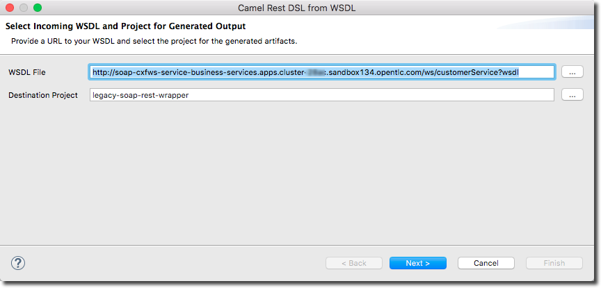
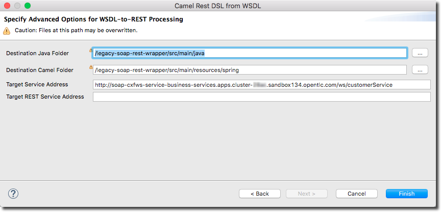
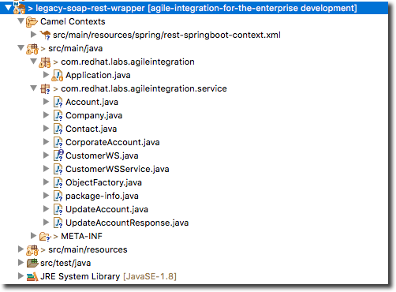

:scrollbar:
:data-uri:
:toc2:
:linkattrs:

= Lab 2d. Legacy Application Wrapper

Now, you develop a Camel route to migrate legacy SOAP services to provide a REST API wrapper using Camel.

SOAP-based services are plentiful in many enterprise solutions and are slowly being replaced by RESTful services to simplify their use. A new wizard is available in the latest version of Red Hat Fuse Tooling to help you make the transition with Apache Camel’s Rest DSL. This lab shows how to use the new wizard to transition from older SOAP-based services to more modern REST-based services.

.Goals in this section
* Create REST API for the Customer SOAP service from previous lab.
* Design Apache Camel route that exposes REST API consuming JSON.
* Use the Red Hat Fuse Tooling in Red Hat Developer Studio to create *wsdl2rest* mapping.
* Deploy and test the solution.

==== Access the legacy-soap-rest-wrapper Project in CodeReady Studio

. Expand the project *legacy-soap-rest-wrapper*

*This project contains the Legacy SOAP Wrapper REST service that will route and transform REST service requests and responses to and from the existing backend SOAP service.*

The SOAP Web Service *soap-cxfws-service* which you have earlier deployed, is used as the backend SOAP service for this part of the lab. This service is developed using CXF-WS, and deployed on Karaf. The service is running on Red Hat Fuse 6.3. Make sure the SOAP service is deployed to OpenShift Container Platform and the WSDL is accessible at the URL: link:http://$soap-cxfws-service-route/ws/customerService?wsdl[http://$soap-cxfws-service-route/ws/customerService?wsdl].

==== Create the Camel Route for SOAP service migration

. Right-click the *legacy-soap-rest-wrapper*
.. Select *New->Camel Rest DSL from WSDL*

. Provide the URL to soap-cxfws-service WSDL and ensure the *legacy-soap-rest-wrapper* project is selected:
+

. Click *Next*.
. Keep the default values of fields unchanged and click *Finish*.
+

. Now you should see the generated Java classes and the Spring Camel context XML .
+

. Edit the file: `src/main/resources/spring/rest-springboot-context.xml`

. Click the *Source* tab

. On line 9, replace `"jetty"` with `"servlet"`

* The final version of line 9 should look like
+
----
   <restConfiguration bindingMode="json" component="servlet"
----

. Edit the file: `pom.xml`

.. Delete the following lines from the file
+
----
    <dependency>
      <groupId>org.apache.camel</groupId>
      <artifactId>camel-jetty</artifactId>
      <version>2.21.0.fuse-710018-redhat-00001</version>
    </dependency>
----

. Save your changes.

==== Run the Legacy SOAP Wrapper REST service Locally

. To run the Legacy SOAP Wrapper REST service locally, run the following Maven command from the `$AI_EXERCISE_HOME/labs/lab02/04_legacy-soap-rest-wrapper/` directory:
+
----
$ mvn spring-boot:run -Dfabric8.skip
----
+
. The Camel service, that has just launched, should be running on port 8080, and can be accessed through URL: link:http://localhost:8080/api/jaxrs/account[http://localhost:8080/api/jaxrs/account].

. Send a CURL request to the Legacy SOAP Wrapper REST service and check if the backend service is invoked correctly:
+
----
$ curl -k http://localhost:8080/api/jaxrs/account -X PUT  -d '{"company":{"name":"Rotobots","geo":"NA","active":true},"contact":{"firstName":"Bill","lastName":"Smith","streetAddr":"100 N Park Ave.","city":"Phoenix","state":"AZ","zip":"85017","phone":"602-555-1100"}}' -H 'content-type: application/json'
----

. The response should be similar to the one shown here, with the possible exception of the *"id"* and *"salesContact"* values:
+
----
{"company":{"active":true,"geo":"NA","name":"Rotobots"},"contact":{"city":"Phoenix","firstName":"Bill","lastName":"Smith","phone":"602-555-1100","state":"AZ","streetAddr":"100 N Park Ave.","zip":"85017"},"id":33,"salesContact":"Bernard Tison"}
----

. Re-send a CURL request to the Legacy SOAP Wrapper REST service. Repeat this test as many times as you wish.

* Notice that the *"id"* and *"salesContact"* values alternate with each test.

. Note the log entries, indicating the number of CURL requests processed, appear in the terminal window where the CamelContext is active:
+
----
01:29:20.990 [http-nio-0.0.0.0-8080-exec-1] INFO  updateAccount - updateAccount
01:30:02.116 [http-nio-0.0.0.0-8080-exec-3] INFO  updateAccount - updateAccount
01:30:06.046 [http-nio-0.0.0.0-8080-exec-5] INFO  updateAccount - updateAccount
01:30:07.667 [http-nio-0.0.0.0-8080-exec-7] INFO  updateAccount - updateAccount
01:30:08.562 [http-nio-0.0.0.0-8080-exec-9] INFO  updateAccount - updateAccount
01:30:09.404 [http-nio-0.0.0.0-8080-exec-1] INFO  updateAccount - updateAccount
----

==== Deploy to OpenShift Container Platform

. To deploy the application to OpenShift Container Platform, execute the following Maven command from the terminal:
+
----
$ mvn clean fabric8:deploy
----

NOTE: The deployment process can take 5-10 minutes.

. Monitor the deployment of the legacy-soap-rest-wrapper:
+
----
$ oc get pods -w
----

. Wait until you see `READY 1/1` for `legacy-soap-rest-wrapper-x-xyz`. Press `<CTRL+C>` once the services are `Running`.
+
----
NAME                          READY     STATUS      RESTARTS   AGE
legacy-soap-rest-wrapper-1-6vnwx       1/1       Running     0          2m
legacy-soap-rest-wrapper-s2i-1-build   0/1       Completed   0          3m
----
+

. Test the legacy-soap-rest-wrapper.
.. Retrieve the URL of the legacy-soap-rest-wrapper application:
+
----
$ export LEGACY_SOAP_URL=http://$(oc get route legacy-soap-rest-wrapper -o template --template='{{.spec.host}}')
----

.. Display the URL of the service:
+
----
$ echo $LEGACY_SOAP_URL
----

.. Test the SOAP service :
+
----
$ curl -k ${LEGACY_SOAP_URL}/api/jaxrs/account -X PUT  -d '{"company":{"name":"Rotobots","geo":"NA","active":true},"contact":{"firstName":"Bill","lastName":"Smith","streetAddr":"100 N Park Ave.","city":"Phoenix","state":"AZ","zip":"85017","phone":"602-555-1100"}}' -H 'content-type: application/json'
----
+
. Validate that the same REST response was received, as in the previous test.

*Congratulations, you have completed each of the modules of this lab.*

[.text-center]
image:images/icons/icon-previous.png[align=left, width=128, link=2c_Integration_Application.adoc] image:images/icons/icon-home.png[align="center",width=128, link=README.adoc] image:images/icons/icon-next.png[align="right"width=128, link=3_Fuse_Online_Enrich_Lab.adoc]
