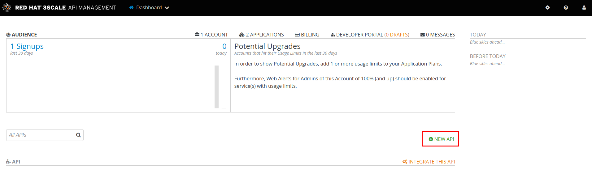
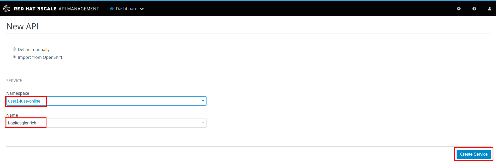
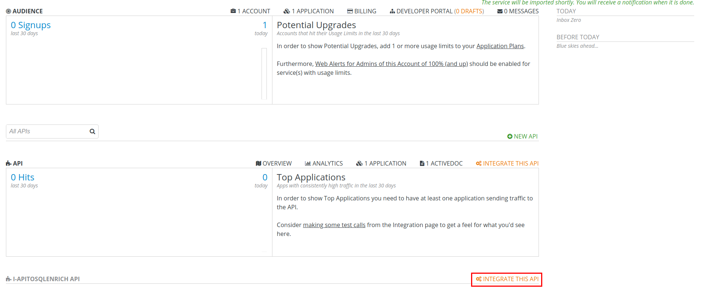
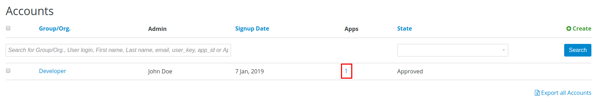
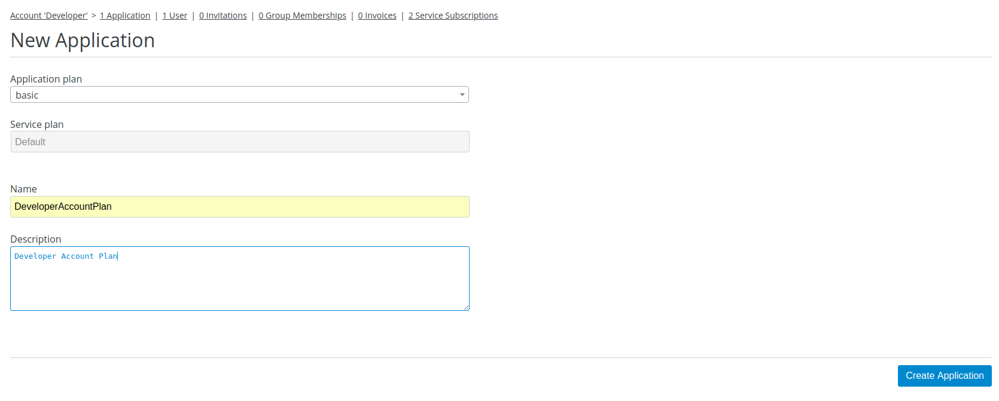
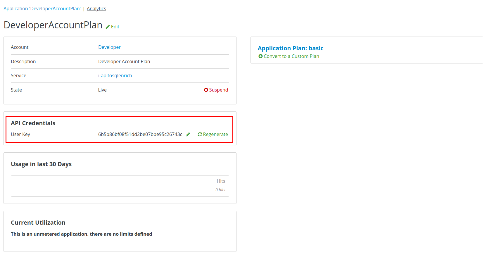

:scrollbar:
:data-uri:
:toc2:

== Discover and Manage API with Red Hat 3scale API Management

In this lab, you change the Red Hat Fuse Online integration API to make the service discoverable by 3scale API Management. You will then manage the API in 3scale API Management and ensure the requests are routed to the integration through the 3scale API Management Gateway.

.Goals
* Change the Integration Service
* Discover Integration Service in 3scale API Management
* Create Application Plan & Application in 3scale API Management
* Test the API request via 3scale API Management

:numbered:

== Develop the Solution

Develop the solution by following the steps below.

=== Service

The *i-apitosqlenrich* service created as part of the Red Hat Fuse Online lab needs to be edited to make the service discoverable by 3scale API Management. This ensures that 3scale API Management can automatically scan the services in the OpenShift cluster and ensure that the service is imported correctly.

. Edit the service *i-apitosqlenrich* in the OpenShift project *user$seq-fuse*:
+
----
oc edit svc i-apitosqlenrich
----
. Add the following line under labels:
+
----
    discovery.3scale.net: "true"
----

. Add the following lines under *annotations*:
+
----
    discovery.3scale.net/description-path: /openapi.json
    discovery.3scale.net/path: 
    discovery.3scale.net/port: "8080"
    discovery.3scale.net/scheme: http

----

. Save the changes.

=== 3scale API Management

The rest of the configuration needs to be done in the 3scale API Management Platform administration console. Please login to your 3scale API Management Platform administration console with the user ID and password details provided by the instructor.

==== Discovery

. In the home page, click on *New API*.
+

. Select the button *Import from OpenShift*. Select your Red Hat Fuse Online namespace and corresponding *i-apitosqlenrich* service.
+

. Click on *Create Service*. The service will be imported within a few minutes and appear in the list of integrations.

==== Integration

. Click on *Integrate this API* next to the API service.
+

. Provide the *Staging Public Base URL* and *Production Public Base URL* corresponding to the OpenShift route to your *apicast-staging* and *apicast-production* applications.

. Add a new mapping rule:
.. *verb*: PUT
.. *Pattern*: /
.. *+*: 1
.. *Metric or Method*: hits
+
image::images/3scale-new-api-integrate-mapping.png[]

. Leave the rest of the default values unchanged and click on *Update & test in Staging Environment*.
. Click on *Create Application Plan*
.. *Name*: basic
.. *System name*: i-apitosqlenrich/basic
+
image::images/3scale-new-api-integrate-app-plan.png[]

. Create the application plan.
. Publish the application plan.

==== Application

. Click on *Audience*.
. Click on *1* under the *Apps* for *Developer* account.
+

. Click on *Create Application*.
+
image::images/3scale-new-api-audience-app-create-new.png[]

. In the *Create Application* page:
.. *Application Plan*: basic
+
NOTE: This should be the same application plan you created in the integration.

.. *Name*: DeveloperAccountPlan
.. *Description*: Developer Account Plan
+

. Click on *Create Application*.
. Note the *API Credentials* user key. You need this to make a request to the API on 3scale API Management.
+

=== Test

. Use the following *curl* command to make a request to the 3scale API Management staging route:
+
----
curl -k <user$seq staging route>/rest/account?user_key=<user$seq application key> -X PUT  -d '{"company":{"name":"Rotobots","geo":"NA","active":true},"contact":{"firstName":"Bill","lastName":"Smith","streetAddr":"100 N Park Ave.","city":"Phoenix","state":"AZ","zip":"85017","phone":"602-555-1100"}}' -H 'content-type: application/json'

----

. If the request is successful you should receive the following response:
+
----
{"result": "Account created successfully."}	
----

. Also check the Analytics in 3scale API Management to ensure the request is recorded.
. Verify the Red Hat Fuse Online integration Activity log to monitor the request.

=== Bonus

You can promote the service to production in 3scale API Management and verify that the API request to production works successfully.

Congratulations, you have completed this lab.
