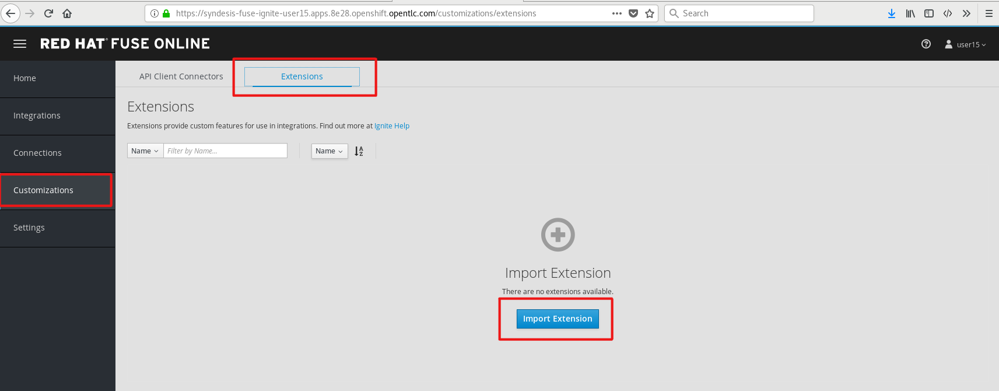
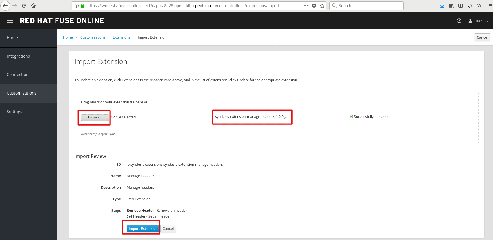
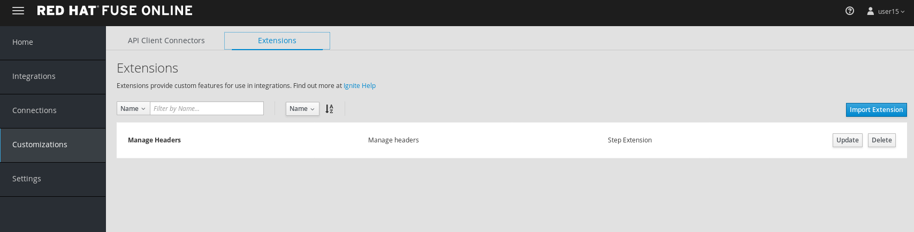
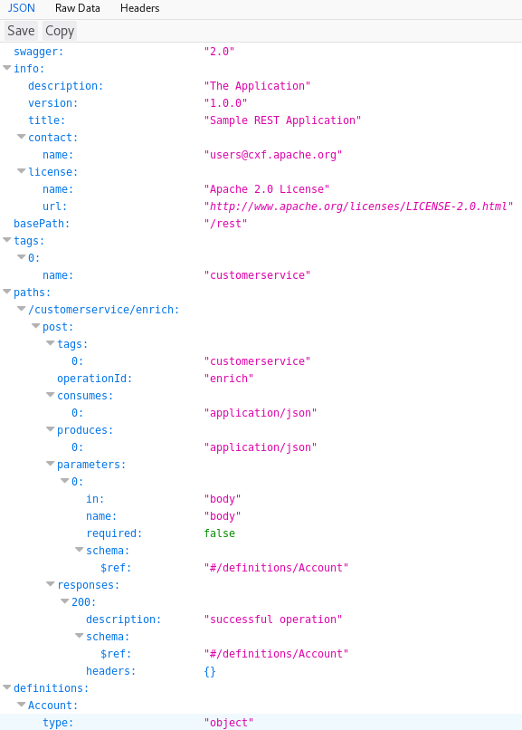
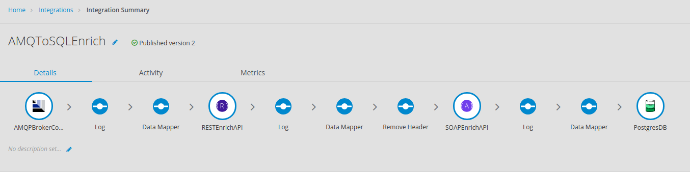
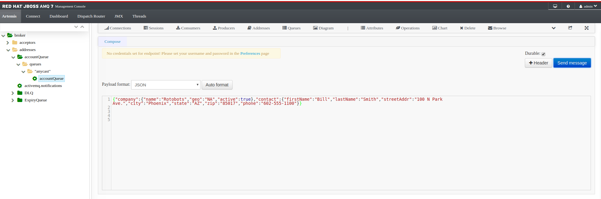
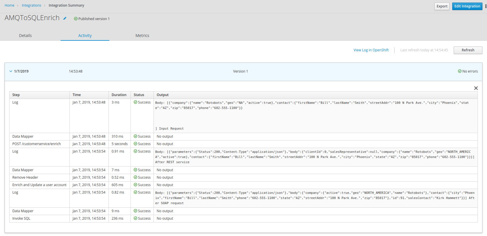

:scrollbar:
:data-uri:
:toc2:

= Enrich Content and Aggregate Data on Red Hat Fuse Online Lab

In this lab, you develop an integration in Red Hat Fuse Online that process the account records in JSON format, and through enrichment and aggregation create a more complete account record. The resulting record is stored in a database.

.Goals
* Design Red Hat Fuse Online Integration that consumes JSON records from Red Hat AMQ
* Enrich using backend REST service
* Enrich using backend SOAP service using the REST wrapper
* Map the responses from backend services to data fields
* Save the aggregated message in an SQL database
+
.Red Hat Fuse Online Enrich Integration
image::images/enrich_insert_fuse_online.png[]

:numbered:

== Develop the Solution

Develop the solution by creating a new integration in the Red Hat Fuse Online console. You will be provided a Red Hat Fuse Online console URL by your instructor. It should be of the format `https://syndesis-fuse-online.apps.$OCP_DOMAIN`.

You should be able to log in with your OpenShift Container Platform user ID and password.

=== Extensions

A custom extension is required to manage the headers for the request to backend APIs. Hence, add the following extension: link:https://github.com/syndesisio/syndesis-extensions/tree/master/syndesis-extension-manage-headers[https://github.com/syndesisio/syndesis-extensions/tree/master/syndesis-extension-manage-headers].

The extension is available in the lab assets location *$AI_EXERCISE_HOME/code/fuse_online/extensions/syndesis-extension-manage-headers-1.0.0.jar*

. Import the custom extension using the Fuse Online console.
+

+
. Click the *Import Extension* button.
+

+
. Validate that the new *Manage Headers* extension is now available in your Fuse Online instance.
+

=== API Client Connectors

Create API connectors for the backend API services.

. Launch a new web browser window, and type this URL in: `http://rest-cxfrs-service-business-services.apps.$OCP_DOMAIN/rest/swagger.json`

. Note that the Swagger document for the *REST CXFRS Service* is displayed:
+

. Using the Fuse Online console, upload the REST API spec for the *REST CXFRS Service* Swagger specification using the URL: `http://rest-cxfrs-service-business-services.apps.$OCP_DOMAIN/rest/swagger.json`.
+
* Provide the following details:
.. *Connector Name*: Rest CXFRS Service
.. *Host*: `http://cxfrs-rest-service.business-services:8080` rest-cxfrs-service-rest-service
.. *Base URL*: /rest
+
. Upload the SOAP API specification for the *Legacy SOAP REST Wrapper* API JSON from the lab asset location: *$AI_EXERCISE_HOME/code/fuse/legacy-soap-rest-wrapper/src/main/resources/swagger.json*
* Provide the following details:
.. *Connector Name*: SOAP CXFWS Service
.. *Host*: `http://legacy-soap-rest-wrapper.business-services:8080`
.. *Base URL*: /api

=== Connection

Set up the connections to following endpoints used for the integration:

==== *AMQP Message Broker* : Use the Red Hat AMQ broker deployed in the *enterprise-services* project with following details:

. *Connection URI*: amqp://broker-amq-amqp.enterprise-services:5672
. *User Name*: admin
. *Password*: password
. Retain the rest of the values as default and *validate* the connection.
. *Name*: AMQPBrokerConnection

==== *Database*: Use the PostgreSQL database deployed in the *enterprise-services* project with following details:

. *Connection URL*: jdbc:postgresql://postgresql.enterprise-services:5432/sampledb
. *Username*: postgres
. *Password*: postgres
. *Schema*: USECASE
. *Name*: UsecaseDB
+
NOTE: There is an intermittent issue in Red Hat Fuse Online which means the integration does not recognize the schema. If this issue occurs, move the T_ACCOUNT and T_ERROR tables to the `public` schema, and the integration should work. More details of the issue are available at: link:https://www.postgresql.org/docs/current/ddl-schemas.html#DDL-SCHEMAS-PUBLIC#[https://www.postgresql.org/docs/current/ddl-schemas.html#DDL-SCHEMAS-PUBLIC#].
+
IMPORTANT: The SQL commands for creating the tables in public schema are shown in the `Useful SQL scripts` section of this lab instructions.

==== *Rest CXFRS Service*: set up the connection to the API client connector.

. *Authentication Type*: No security
. *Host*: `http://rest-cxfrs-service.business-services:8080`
. *Base path*: /rest
. *Name*: RESTEnrichAPI

==== *SOAP CXFWS Service*: set up the connection to the API client connector.

. *Authentication Type*: No security
. *Host*: `http://legacy-soap-rest-wrapper.business-services:8080`
. *Base path*: /api
. *Name*: SOAPEnrichAPI

=== Develop the Integration Module

Develop the Integration as per the above route. Use the following steps:

. Name the Integration *AMQToSQLEnrich*.

. Start Integration from *AMQPBrokerConnection*:
.. Subscribe for messages
.. *Destination*: fuseOnlineAccountQueue
.. *Destination Type*: Queue

. Select Output type:
.. *Select Type*:  JSON Instance
.. *Definition*: Paste the following:
+
----
{"company":{"name":"Rotobots","geo":"NA","active":true},"contact":{"firstName":"Bill","lastName":"Smith","streetAddr":"100 N Park Ave.","city":"Phoenix","state":"AZ","zip":"85017","phone":"602-555-1100"}}
----

.. *Data Type Name*: Account

. Choose Finish Connection *UsecaseDB*.
.. *Action*: Invoke SQL
.. *SQL Statement*: Paste the following:
+
----
INSERT INTO T_ACCOUNT(CLIENT_ID,SALES_CONTACT,COMPANY_NAME,COMPANY_GEO,COMPANY_ACTIVE,CONTACT_FIRST_NAME,CONTACT_LAST_NAME,CONTACT_ADDRESS,CONTACT_CITY,CONTACT_STATE,CONTACT_ZIP,CONTACT_PHONE,CREATION_DATE,CREATION_USER)                          VALUES                          (:#CLIENT_ID,:#SALES_CONTACT,:#COMPANY_NAME,:#COMPANY_GEO,:#COMPANY_ACTIVE,:#CONTACT_FIRST_NAME,:#CONTACT_LAST_NAME,:#CONTACT_ADDRESS,:#CONTACT_CITY,:#CONTACT_STATE,:#CONTACT_ZIP,:#CONTACT_PHONE,current_timestamp,:#CREATION_USER);

----

. Add Step *Log*.
.. Check *Message Body*
.. *Custom Text*: Input Message

. Add Connection *RestEnrichService*.
.. Choose Action *POST /customerservice/enrich*.

. Add *Data Mapping* before the *RestEnrichService* connection.
.. Map corresponding fields in input with the expected JSON request.
+
image::images/rest_data_mapping.png[]

. Add Connection *SoapEnrichService*.
.. Choose Action *Enrich and Update a user account*.

. Add *Data Mapping* before the *SoapEnrichService* connection.
.. Map corresponding fields in input with the expected JSON request.

. Add a Step *Log* immediately after the *RestEnrichService*.
.. Check *Message Body*.
.. *Custom Text*: After REST Service.

. Add a Step *Remove Header* immediately after the *RestEnrichService*.
.. Enter Header *Transfer-Encoding*.
+
NOTE: The *Transfer-Encoding* header is added by Camel during the call to REST service. This header will cause errors if passed to the subsequent SOAP service. Hence, the header needs to be removed before the next API call.

. Add a Step *Log* immediately after the *SoapEnrichService*.
.. Check *Message Body*.
.. *Custom Text*: After SOAP Service.

. Add a *Data Mapping* step before the database connection.
.. Map the corresponding fields.
.. Enter a constant value *fuse_online* and map it to *CREATION_USER*.

Finally, the integration should look as follows:

=== Publish and Test the Integration Module

. Once the integration is complete, save the integration and click *Publish*.
. If the publish is successful, you should see the *i-amqtosqlenrich* pod running in the *fuse-online* project.
. To test the integration, send a sample request to the *fuseOnlineAccountQueue* specified earlier using the Red Hat AMQ Broker console. The URL for the console is `console-enterprise-services.apps.$OCP_DOMAIN/console`. Use your user name and password to login.

Select the *Artemis* tab and then expand on the *addresses* and then *fuseOnlineAccountQueue*. Expand *queues* and then *"anycast"* and finally select *fuseOnlineAccountQueue*.
+

On the top righthand side of the page, there is a down arrow which will reveal a dropdown. Select *Send* to display the _Compose_ dialog.

. Below are 3 sample requests:
+
----
{"company":{"name":"Rotobots","geo":"NA","active":true},"contact":{"firstName":"Bill","lastName":"Smith","streetAddr":"100 N Park Ave.","city":"Phoenix","state":"AZ","zip":"85017","phone":"602-555-1100"}}

{"company":{"name":"BikesBikesBikes","geo":"NA","active":true},"contact":{"firstName":"George","lastName":"Jungle","streetAddr":"1101 Smith St.","city":"Raleigh","state":"NC","zip":"27519","phone":"919-555-0800"}}

{"company":{"name":"CloudyCloud","geo":"EU","active":true},"contact":{"firstName":"Fred","lastName":"Quicksand","streetAddr":"202 Barney Blvd.","city":"Rock City","state":"MI","zip":"19728","phone":"313-555-1234"}}

----

. Check the *Activity* log in Red Hat Fuse Online console to verify that the integration has reported no errors.
+

. Query the *T_ACCOUNT* table and ensure that the records are updated in the database:
+
----
sampledb=# select * from t_account;
 id | client_id | sales_contact | company_name |     company_geo      | company_active | contact_firs
t_name | contact_last_name | contact_address | contact_city | contact_state | contact_zip | contact_e
mail | contact_phone |       creation_date        | creation_user
----+-----------+---------------+--------------+----------------------+----------------+-------------
-------+-------------------+-----------------+--------------+---------------+-------------+----------
-----+---------------+----------------------------+---------------
  1 |        91 | Kirk Hammett  | Rotobots     | NORTH_AMERICA        | t              | Bill
       | Smith             | 100 N Park Ave. | Phoenix      | AZ            | 85017       |
     | 602-555-1100  | 2019-01-07 14:53:55.059279 | fuse-online
(1 row)

----

== Useful SQL Scripts

----
CREATE TABLE T_ACCOUNT (
    id  SERIAL PRIMARY KEY,
    CLIENT_ID integer,
    SALES_CONTACT VARCHAR(30),
    COMPANY_NAME VARCHAR(50),
    COMPANY_GEO CHAR(20) ,
    COMPANY_ACTIVE BOOLEAN,
    CONTACT_FIRST_NAME VARCHAR(35),
    CONTACT_LAST_NAME VARCHAR(35),
    CONTACT_ADDRESS VARCHAR(255),
    CONTACT_CITY VARCHAR(40),
    CONTACT_STATE VARCHAR(40),
    CONTACT_ZIP VARCHAR(10),
    CONTACT_EMAIL VARCHAR(60),
    CONTACT_PHONE VARCHAR(35),
    CREATION_DATE TIMESTAMP,
    CREATION_USER VARCHAR(255)
);
CREATE TABLE T_ERROR (
    ID SERIAL PRIMARY KEY,
    ERROR_CODE VARCHAR(4) NOT NULL,
    ERROR_MESSAGE VARCHAR(255),
    MESSAGE VARCHAR(512),
    STATUS CHAR(6)
);
----

Congratulations, you have completed this lab.
