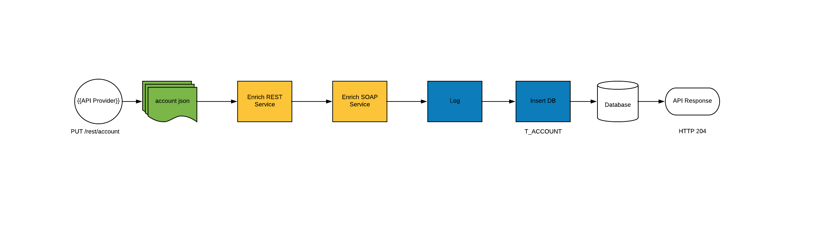
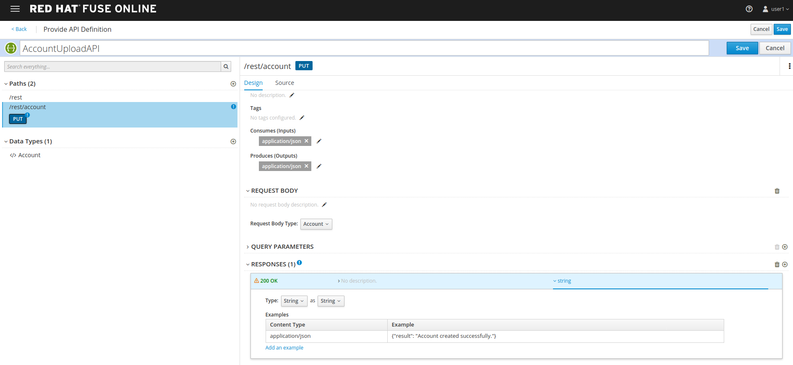
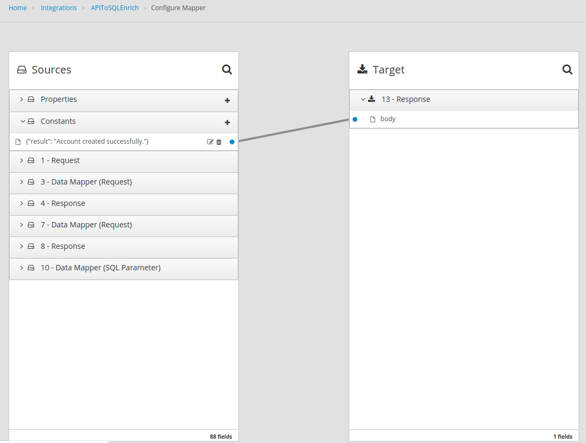
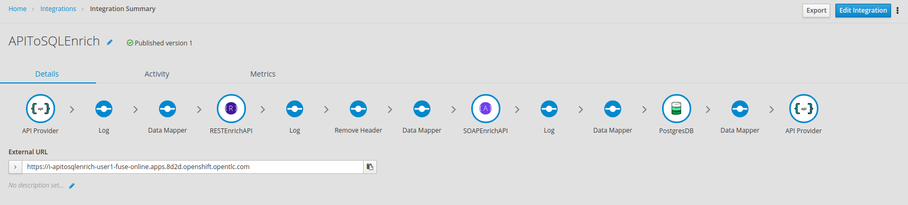

:scrollbar:
:data-uri:
:toc2:

== Enrich Content and Aggregate Data on Red Hat Fuse Online Lab

In this lab, you will extend the integration created in the previous lab in Red Hat Fuse Online, to expose it as a REST API.

.Goals
* Design Red Hat Fuse Online Integration that consumes JSON records from REST API
* Enrich using backend REST service
* Enrich using backend SOAP service using the REST wrapper
* Map the responses from backend services to data fields
* Save the aggregated message in an SQL database
* Send response to the API consumer
+
.Red Hat Fuse Online Rest Enrich Integration

:numbered:

== Develop the Solution

Develop the solution in the Red Hat Fuse Online console. You will be provided a Red Hat Fuse Online console URL by your instructor. It should be of the format `https://user$seq-fuse-online.$OCP_DOMAIN`.

You should be able to log in with your OpenShift Container Platform user ID and password.

=== Edit the Integration

We will be creating the new integration as shown in the integration flow diagram above.

. Click on *Create a New Integration*.
. Choose *API Provider* as the start connection.
. Choose to create from scratch.
. You should get an *Apicurito* design page now. Enter the following details:
.. *Name*: AccountUploadAPI
.. *Path*: /rest/account
.. *Operation*: PUT
.. *Data Type*: Account
.. *Data Type Example*: Copy the data below:
+
----
{"company":{"name":"Rotobots","geo":"NA","active":true},"contact":{"firstName":"Bill","lastName":"Smith","streetAddr":"100 N Park Ave.","city":"Phoenix","state":"AZ","zip":"85017","phone":"602-555-1100"}}
----

.. *PUT Summary*: Create Account Enrich and Upload record
.. *Consumes (inputs)*: application/json
.. *Produces (outputs)*: application/json
.. *Request Body Type*: Account
.. *Response*: 200 OK
.. *Response Type*: String
.. *Response Example*: Copy the data below:
+
----
{"result": "Account created successfully."}

----

. The API should look like this:
+

. Save the changes.
. Name the integration *APIToSQLEnrich*.
. Choose the *PUT* operation.
. Add the connections and steps as in the previous lab.
. Finally, add a Data Mapping step to respond to the API request.
+

The integration should look as follows:

=== Publish and Test the API

. Save and publish the integration.
. The URL to the API should be available from the integration page.
. You can access the REST API specification by opening the URL: <i-apitosqlenrich route>/openapi.json
. Send a *curl* request to the API:
+
----
curl -k <i-apitosqlenrich route>/rest/account -X PUT  -d '{"company":{"name":"Rotobots","geo":"NA","active":true},"contact":{"firstName":"Bill","lastName":"Smith","streetAddr":"100 N Park Ave.","city":"Phoenix","state":"AZ","zip":"85017","phone":"602-555-1100"}}' -H 'content-type: application/json'

----

. You should see a response as below:
+
----
{"result": "Account created successfully."}
----

. Also verify the *Activity Log* of the integration and the SQL table T_ACCOUNT to ensure the request is processed successfully.

Congratulations, you have completed this lab.
