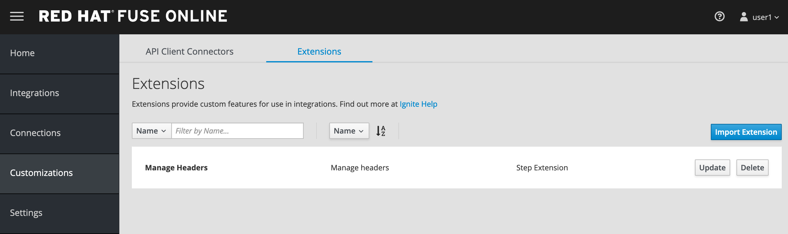
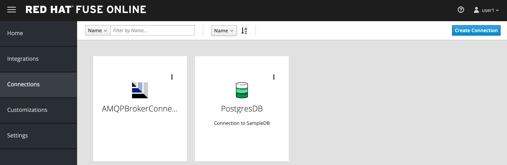
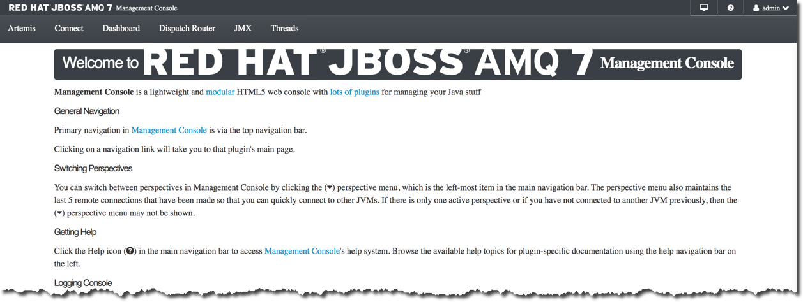

:scrollbar:
:data-uri:
:toc2:

= Lab 3 - Enrich Content and Aggregate Data on Red Hat Fuse Online Lab

While the previous lab focused on how developers can work with the application code and resources, _Coolstore Inc._ has an entire team of business users who want to be able to participate in the technologies surronding Agile Integration and offload some of the work from the development team. Fortunately, Fuse Online is an online offering that provides a easy to use interface to create integration solutions. 

In this lab, you will take on the role as a business user to develop an integration in link:https://www.redhat.com/en/technologies/jboss-middleware/fuse-online[Red Hat Fuse Online] that process the account records in JSON format from the entperise AMQ broker and integrate with the existing integration to enrich and aggregate the content to create a more complete account record. The resulting record is stored in a database.

.Goals
* Design Red Hat Fuse Online Integration that consumes JSON records from Red Hat AMQ
* Enrich using backend REST service
* Enrich using backend SOAP service using the REST wrapper
* Map the responses from backend services to data fields
* Save the aggregated message in an SQL database
+
.Red Hat Fuse Online Enrich Integration

:numbered:

== Develop the Solution

Develop the solution by creating a new integration in the Red Hat Fuse Online console. Recall that all of the resources are deployed in the `fuse-online` project in OpenShift.

. Fuse Online provides a user interface for you to develop the integration. Locate the url of the route provided for the Fuse Online console from the
+
----
$ export FUSE_ONLINE_URL=https://$(oc get route -n fuse-online syndesis -o template --template='{{.spec.host}}')
----
. Print out the URL for Fuse Online and navigate to the URL in a web browser
+
----
$ echo $FUSE_ONLINE_URL
----
. Login as `user1` using your OpenShift credentials
. Accept the self signed certificate and click `Allow` when presented to allow OpenShift and Fuse Online access to your credentials. Afterward, the Fuse Console will be displayed.
+

=== Extensions

Extensions are a mechanism to customize the functionality of Fuse Online. A custom extension is required to manage the headers for the request to backend APIs. Hence, add the following extension: link:https://github.com/syndesisio/syndesis-extensions/tree/master/syndesis-extension-manage-headers[https://github.com/syndesisio/syndesis-extensions/tree/master/syndesis-extension-manage-headers].

The extension is available in the lab assets location *$AI_EXERCISE_HOME/labs/lab03/extensions/syndesis-extension-manage-headers-1.0.0.jar*

. From the Fuse Online overview page, click *Customizatons* on the lefthand navigation bar and click *Extensions* on the top.
. Click the *Import Extension* button and navigate to the file location mentioned previously.
+

+
. Click the Import Extension button at the bottom of the page.
+

+

. Validate that the new *Manage Headers* extension is now available in your Fuse Online instance.
+

=== API Client Connectors

link:https://access.redhat.com/documentation/en-us/red_hat_fuse/7.2/html/integrating_applications_with_fuse_online/customizing_ug#developing-rest-api-client-connectors_custom[API Connectors] are a mechanism within Fuse Online to integrate with external endpoints. API Connectors can be defined within the *Customizations* page within the *API Connectors tab*

Create API connectors for the previously deployed `rest-cxfrs-service` from the `business-services` project. The API provides a link:https://swagger.io/[Swagger] resource which describes the available API.

. Retrieve the URL of the Swagger endpoint exposed by the rest-cxfrs-service application:
+
----
$ export REST_CXFRS_SWAGGER_URL=http://$(oc get route rest-cxfrs-service -n business-services -o template --template='{{.spec.host}}')/rest/swagger.json
----
+
. Print out ther URL of the rest service as it will be needed in subsequent steps.
+
----
$ echo $REST_CXFRS_SWAGGER_URL
----
+
. Click *Create API Connector* to a new API Connector
. On the _Upload OpenAPI Specification_ step, select *Use a URL* and paste in the URL previously obtained.
+

+
. Click *Next*
. Review the imported schema and click *Next*
+

+
. On the Security page, leave the default _No Security_ and click *Next*
. On the _Review/Edit Connector Details_ page, enter the following details:
.. *Connector Name*: Rest CXFRS Service
.. *Host*: `http://rest-cxfrs-service.business-services:8080`
.. *Base URL*: /rest
. Click *Create API Connector* to create the API
+

+
. Validate the new _Rest CXFRS Service_ is visible
+

+
. Create another API Connector for the _legacy-soap-rest-wrapper_ application previously deployed from the `business-services` project by first clicking the *Create API Connector* Button
. The JSON Swagger schema is available in the *Legacy SOAP REST Wrapper* project locally. Upload the SOAP API specification for the *Legacy SOAP REST Wrapper* API JSON by selecting *Browse* from the lab asset location: *$AI_EXERCISE_HOME/labs/lab02/04_legacy-soap-rest-wrapper/src/main/resources/swagger.json*
+

+
. Confirm the schema is valid and select *Next*
+

+
. Click *Next* on both of the _Review Actions_ and _Specify Security_ pages
* On the _Review/Edit Connector Details_ page, enter the following details:
.. *Connector Name*: SOAP CXFWS Service
.. *Host*: `http://legacy-soap-rest-wrapper.business-services:8080`
.. *Base URL*: /api
+

+
. Click *Next* to create the new API Connector
. Validate both connectors are present
+

=== Connection

A link:https://access.redhat.com/documentation/en-us/red_hat_fuse/7.2/html-single/connecting_fuse_online_to_applications_and_services/index#supported-connectors_connectors[Connector] is a way to integrate with an existing application. 

==== *AMQP Message Broker*

The Red Hat AMQ broker deployed in the *enterprise-services* project will once again be used as the initial entry point:

. Create a new _Connector_ by clicking on the *Connections* link on the lefthand side and then *Create Connector*
+

+
. Select *AMQP Message Broker*
+

+
. On the _AMQP Message Broker Configuration_ page, provide the following details:
.. *Connection URI*: `amqp://broker-amq-amqp.enterprise-services:5672`
.. *User Name*: `admin`
.. *Password*: `password`
. Retain the rest of the values as default and click *Validate* to verify the connection and then click *Next*.
+

+
. Set `AMQPBrokerConnection` as the *Connection Name* and click *Create*
+

==== *Database*: 

Next, create a connector to the PostgreSQL database deployed in the *enterprise-services* project.

. Click *Create Connector* to create another new connection
. Select *Database*
. Provide the following details
.. *Connection URL*: `jdbc:postgresql://postgresql.enterprise-services:5432/sampledb`
.. *Username*: `postgres`
.. *Password*: `postgres`
.. *Schema*: `USECASE`

. Click *Validate* to verify the connection and click *Next*
. Enter `UsecaseDB` as the *Connection Name* and then create *Create*

==== *Rest CXFRS Service*:

Set up the connection to the API client connector using the connector created previously.

. Select *Rest CXFRS Service*
. Confirm the following details
.. *Authentication Type*: No security
.. *Host*: `http://rest-cxfrs-service.business-services:8080`
.. *Base path*: `/rest`
. Select *Next*
. Enter `RESTEnrichAPI` as the *Name* and click *Create*

==== *SOAP CXFWS Service*:

Set up the connection to the API client connector using the connector created previously

. Click *Create Connector* to create another new connection
. Select *SOAP CXFWS Service*
. Confirm the following details
. *Authentication Type*: No security
. *Host*: `http://legacy-soap-rest-wrapper.business-services:8080`
. *Base path*: `/api`
. Select *Next*
. Enter `SOAPEnrichAPI` as the *Name* and click *Create*

You should have the following connectors now available for use.

=== Develop the Integration Module

Instead of spending time to develop Camel based routes (as was completed in lab 2), we will create an Integration within Fuse Online. As you have seen, working with Fuse Online is facilitated in a user interface and instead of developing routes manually. 

Lets create an _Integration_ to develop the route depicted previously.

. Integrations are managed by clicking on the *Integrations* tab on the lefthand selecting the *Create Integration* button.
+

+
. Select *AMQPBrokerConnection* as the starting connection
+

+
.. Select *Subscribe for messages* and click *Next*
.. *Destination*: `fuseOnlineAccountQueue`
.. *Destination Type*: `Queue`
.. Click *Next*
+

+
. Select Output type:
.. *Select Type*:  `JSON Schema`
.. *Definition*: Paste the following:
+
----
{"company":{"name":"Rotobots","geo":"NA","active":true},"contact":{"firstName":"Bill","lastName":"Smith","streetAddr":"100 N Park Ave.","city":"Phoenix","state":"AZ","zip":"85017","phone":"602-555-1100"}}
----
.. *Data Type Name*: Account
.. Select *Done*
+

+
. Choose a *Finish Connection* 
.. Select *UsecaseDB*
. Choose an Action
.. Select *Invoke SQL*
.. Paste in the following for *SQL Statement*: 
+
----
INSERT INTO T_ACCOUNT(CLIENT_ID,SALES_CONTACT,COMPANY_NAME,COMPANY_GEO,COMPANY_ACTIVE,CONTACT_FIRST_NAME,CONTACT_LAST_NAME,CONTACT_ADDRESS,CONTACT_CITY,CONTACT_STATE,CONTACT_ZIP,CONTACT_PHONE,CREATION_DATE,CREATION_USER)                          VALUES                          (:#CLIENT_ID,:#SALES_CONTACT,:#COMPANY_NAME,:#COMPANY_GEO,:#COMPANY_ACTIVE,:#CONTACT_FIRST_NAME,:#CONTACT_LAST_NAME,:#CONTACT_ADDRESS,:#CONTACT_CITY,:#CONTACT_STATE,:#CONTACT_ZIP,:#CONTACT_PHONE,current_timestamp,:#CREATION_USER);

----
.. Click *Done*
. Click *Add a Step*
.. Select *Log*
.. Check *Message Body*
.. Enter `Input Message` into *Custom Text*
.. Click *Done*
. Below the _Log_ step, click the *+* and click *Add a Connection*
+

+
. Add the *RestEnrichAPI* Connection .
.. Choose Action *POST /customerservice/enrich*.
. Add a *Step* prior to the *RestEnrichAPI*
+
image::images/lab-03/fuse-online-integration-4.png[]
+
.. Select *Data Mapper*
.. Expand the *Account* instance on the _Source_ and the *Request* instance on the _Target_. Map with their corresponding fields.
+

.. Click *Done* to complete the mapping
+
. Add a _Connection_ underneath the *RestEnrichAPI* connection
+

+
.. Select the *SoapEnrichAPI* connection.
.. In the _Choose an Action_ page, select *Enrich and Update a user account*.
. Add a *Step* before the *SoapEnrichAPI* connection.
+

+
.. Select *Data Mapper* 
.. Expand the *Response* instance on the _Source_ and the *Request* instance on the _Target_. Map with their corresponding fields.
+

+
.. Click *Done* to complete the mapping
. Add a Step immediately after the *RestEnrichService*.
+

+
.. Select *Log*
.. Check *Message Body*.
.. Enter `After REST Service` into the *Custom Text* textbox.
.. Click `Done`
. Add a Step immediately after the *RestEnrichService* and immediately before the *Log* step created in the previous action.
.. Select *Remove Header* 
.. Enter Header *Transfer-Encoding* into the textbox.
.. Click *Done*
+
NOTE: The *Transfer-Encoding* header is added by Camel during the call to REST service. This header will cause errors if passed to the subsequent SOAP service. Hence, the header needs to be removed before the next API call.
. Add a *Step* immediately after the *SoapEnrichService*.
.. Select *Log*
.. Check *Message Body*.
.. Insert `After SOAP Service` into *Custom Text*: .
.. Click Done
. Finally, add a *Step* immediately before the _Invoke SQL_ database connection.
.. Select *Data Mapper*
.. Define a new _Constant_ value by expanding *Constants* and selecting the *+* sign
.. Enter `fuse_online` into the textbox and confirm *String* as the _Value Type_
.. Click Done
.. Map the *fuse_online* Constant to the SQL Parameter *CREATION_USER*
.. Map the remaining values from the *Response* field in _Sources_ to the *SQL Parameter* on the _Target_
+

+
.. Click Done
. With all the _Steps_ and _Connections_ for the integrtation defined, select *Publish* on the top right
. Name the Integration *AMQToSQLEnrich*.
. Select *Publish* once again to complete the integration

The resulting integration should look as follows:

=== Publish and Test the Integration Module

Once an integration is published, a new image containing the integration is created. It will take a few minutes for the build to complete. Once complete, the resulting integration will appear as follows:

A new pod with the name starting with *i-amqtosqlenrich* is deployed in the `fuse-online` project and contains the integration that was created earlier.

Validate the integration by first sending a message to the `fuseOnlineAccountQueue` in the AMQ broker. 

. Retrieve the URL of the AMQ Message Broker. In a terminal window, type the following:
+
----
$ export AMQ_BROKER_URL=http://$(oc get route console -n enterprise-services -o template --template='{{.spec.host}}' -n enterprise-services)
----

. Display the URL for the AMQ Broker
+
----
$ echo $AMQ_BROKER_URL
----

. In a web browser, visit the location of `$AMQ_BROKER_URL`
* You should see the following page
+
image:images/lab-02/amq-landing-page.png[]

. Click the link for *Management Console*
* This will show the login page of the Management Console

. Enter the following credentials:
.. Username: *admin* 
.. Password: *admin*
+

. This will show the main welcome page.
+

. In the top navigation bar, click *Artemis*
+

. In the center navigation bar, click *Queues*
+

. In the list of queues, expand the *Name* column

. Select the queue named *fuseOnlineAccountQueue* and click it's *attributes* link
+
+

. In top-right, click the drop-down arrow and select *Send*
+

. This will open the screen to send a message
+
image:images/lab-02/blank-send.png[]

. Entering the following JSON data for the message:
+
. Below are 3 sample requests:
+
----
{"company":{"name":"Rotobots","geo":"NA","active":true},"contact":{"firstName":"Bill","lastName":"Smith","streetAddr":"100 N Park Ave.","city":"Phoenix","state":"AZ","zip":"85017","phone":"602-555-1100"}}

{"company":{"name":"BikesBikesBikes","geo":"NA","active":true},"contact":{"firstName":"George","lastName":"Jungle","streetAddr":"1101 Smith St.","city":"Raleigh","state":"NC","zip":"27519","phone":"919-555-0800"}}

{"company":{"name":"CloudyCloud","geo":"EU","active":true},"contact":{"firstName":"Fred","lastName":"Quicksand","streetAddr":"202 Barney Blvd.","city":"Rock City","state":"MI","zip":"19728","phone":"313-555-1234"}}

----
+
. Click *Send Message*
. Return to the Fuse Online Web Console integration page and check the *Activity* tab of the *AMQToSQLEnrich* integration.
+

Finally, validate the message was successfully persisted to the PostgreSQL database by querying the T_ACCOUNT table. 

. Access the Postgres database pod
+
----
$ oc -n enterprise-services rsh $(oc get pods -n enterprise-services -l name=postgresql -o name)
----

. Log into the database
+
----
sh-4.2$ PGPASSWORD=$POSTGRESQL_PASSWORD psql -h postgresql $POSTGRESQL_DATABASE $POSTGRESQL_USER
----

* You will see the following output
+
----
psql (10.6)
Type "help" for help.

sampledb=# 
----

. Query the database to ensure the records are populated correctly in the T_ACCOUNT table.
+
----
sampledb=# select * from t_account;
 id | client_id | sales_contact | company_name |     company_geo      | company_active | contact_firs
t_name | contact_last_name | contact_address | contact_city | contact_state | contact_zip | contact_e
mail | contact_phone |       creation_date        | creation_user
----+-----------+---------------+--------------+----------------------+----------------+-------------
-------+-------------------+-----------------+--------------+---------------+-------------+----------
-----+---------------+----------------------------+---------------
  1 |        91 | Kirk Hammett  | Rotobots     | NORTH_AMERICA        | t              | Bill
       | Smith             | 100 N Park Ave. | Phoenix      | AZ            | 85017       |
     | 602-555-1100  | 2019-01-07 14:53:55.059279 | fuse-online
(1 row)
----
+
. Exit out of the postgres datbase pod
+
----
sampledb-# \q
sh-4.2$ exit
----

*Congratulations, you have completed this lab.*

[.text-center]
image:images/icons/icon-previous.png[align=left, width=128, link=2d_Legacy_Application.adoc] image:images/icons/icon-home.png[align="center",width=128, link=README.adoc] image:images/icons/icon-next.png[align="right"width=128, link=4_OpenShift_Service_Mesh.adoc]
