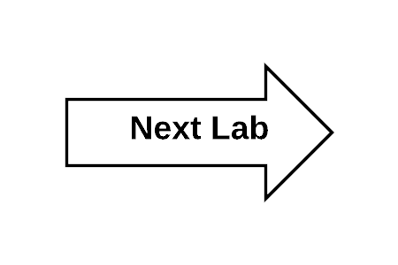

:scrollbar:
:data-uri:
:toc2:
:linkattrs:

== Lab 4 - OpenShift Service Mesh

== Goals

In this lab, you will:

* Deploy microservice applications to OpenShift Service Mesh
* Visualize your OpenShift Service Mesh with Kiali
* Leverage Grafana to monitor your OpenShift Service Mesh
* Fault tolerance ...

== What is a Service Mesh?

As microservices-based applications become more prevalent, both the number of
and complexity of their interactions increases. Up until now much of the burden
of managing these complex microservices interactions has been placed on the
application developer, with different or non-existent support for microservice
concepts depending on language and framework.

The service mesh concept pushes this responsibility to the infrastructure, with
features for traffic management, distributed tracing and observability, policy
enforcement, and service/identity security, freeing the developer to focus on
business value. In this hands-on session you will learn how to apply some of
these features to a simple polyglot microservices application running on top of
OpenShift using Istio, an open platform to connect, manage, and secure
microservices.

== What is Istio?

https://istio.io/[Istio] is an open platform to connect, manage, and secure microservices. Istio
provides an easy way to create a network of deployed services with load
balancing, service-to-service authentication, monitoring, and more, without
requiring any changes in application code. OpenShift can automatically inject a
special sidecar proxy throughout your environment to enable Istio management for
your application. This proxy intercepts all network communication between your
microservices microservices, and is configured and managed using Istio’s control
plane functionality -- not your application code!

image::images/lab-04/service_mesh_architecture.png[Service Mesh Architecture]

== Kiali: Visualize the Service Mesh

At some point when you are developing your microservices architecture, you may want to visualize what is happening in your service mesh. You may have questions like “Which service is connected to which other service?” and “How much traffic goes to each microservice?” But because of the loosely tied nature of microservices architectures, these questions can be difficult to answer.

Those are the kinds of question that Kiali has the ability to answer—​by giving you a big picture of the mesh and showing the whole flow of your requests and data.

=== Explore Kiali

Kiali taps into the data provided by Istio and OpenShift Container Platform to generate its
visualizations. It fetches ingress data (such as request tracing with Jaeger),
the listing and data of the services, health indexes, and so on.

Kiali runs as a service together with Istio, and does not require any changes
to Istio or OpenShift Container Platform configuration (besides the ones required to install
Istio).

. View the routes for the project:
+
----
$ oc get routes -n istio-system
----
+
.Sample Output
[source,texinfo,options=nowrap]
----
NAME                   HOST/PORT                                                                         PATH   SERVICES               PORT              TERMINATION   WILDCARD
grafana                grafana-istio-system.apps.cluster-5227.5227.sandbox183.opentlc.com                       grafana                http                            None
istio-ingressgateway   istio-ingressgateway-istio-system.apps.cluster-5227.5227.sandbox183.opentlc.com          istio-ingressgateway   http2                           None
jaeger-query           jaeger-query-istio-system.apps.cluster-5227.5227.sandbox183.opentlc.com                  jaeger-query           jaeger-query      edge          None
kiali                  kiali-istio-system.apps.cluster-5227.5227.sandbox183.opentlc.com                         kiali                  http-kiali        reencrypt     None
prometheus             prometheus-istio-system.apps.cluster-5227.5227.sandbox183.opentlc.com                    prometheus             http-prometheus                 None
tracing                tracing-istio-system.apps.cluster-5227.5227.sandbox183.opentlc.com                       tracing                tracing           edge          None
----
* Make note of the entry for `kiali`.

. Get the URL of the Kiali web console:
+
----
$ export KIALI_URL=https://$(oc get route kiali -n istio-system -o template --template='{{.spec.host}}')
----

. Display the `KIALI_URL` URL:
+
----
$ echo $KIALI_URL
----

. Start a web browser on your computer and go to the URL for `$KIALI_URL`:
+

. At the login screen, enter the default credentials:
* *Username*: `admin`
* *Password*: `redhat`

. For a successful login, you will see the main Kiali screen.
+

. At the moment, there none of the services have an istio sidecar associated with them. As a result, the services are not available in the service mesh. We'll cover that in a later section.

=== Update Security Context Constraints

. Update the Security Context Constraints (SCCs) by adding the service account to the `anyuid` and `privileged` SCCs in the `business_services` namespace:
+
----
$ export BUSINESS_SERVICES=business-services

$ oc adm policy add-scc-to-user anyuid -z default -n $BUSINESS_SERVICES --as=system:admin

$ oc adm policy add-scc-to-user privileged -z default -n $BUSINESS_SERVICES --as=system:admin
----

=== Deploy Services into Service Mesh

. Edit the deployment config for the `rest-cxfrs-service`. 
+
----
$ oc edit deploymentconfig/rest-cxfrs-service
----

. Move to the line 46, you should see the following text
+
----
        fabric8.io/git-url: https://gitlab.com/redhatsummitlabs/agile-integration-for-the-enterprise.git
----

. Just after this line, add the following line
+
----
        sidecar.istio.io/inject: "true"
----

* When deploying an application into the Red Hat OpenShift Service Mesh you must opt in to injection by specifying the `sidecar.istio.io/inject` annotation with a value of true. Service Mesh relies on the existence of a proxy sidecar within the application’s pod to provide service mesh capabilities to the application.  Sidecar injection occurs at pod creation time.

. Save the deployment config file and exit the editor.

* By updating the deployment config, the old version of the pod is killed and a new one is created based on the updated deployment config. This new deployment config will inject the sidecar. As a result, we'll see two containers in the pods (1 for the application and 1 for the sidecar).

. Monitor the deployment of the pods:
+
----
$ oc get pods -w
----

. Wait until the Ready column displays `2/2` pods and the Status column displays `Running`:
+
.Sample Output
[source,texinfo]
----
NAME                          READY     STATUS    RESTARTS   AGE
rest-cxfrs-service-6b576ffcf8-g6b48   2/2       Running   0          1m
----

. Press *Ctrl+C* to exit.

=== Generate Sample Data

To show the capabilities of Kiali, you need to generate some sample data. 

. Move back to your terminal window:
+
----
$ cd $AI_EXERCISE_HOME/labs/lab04
----

. Retrieve the URL of the rest-cxfrs-service application:
+
----
$ export REST_CXFRS_URL=http://$(oc get route rest-cxfrs-service -o template --template='{{.spec.host}}')
----

. Generate data:
+
----
$ scripts/run-all.sh
----

* Let this script continue to run.

=== View Service Graph

. Move back to the Kiali web console.

. In the left-hand panel, click *Graph*.

. From the *Namespace* list, select `business-services`.
+

NOTE: It may take up to 3 minutes before the Kiali graph displays data.

* This page shows a graph with all of the microservices, connected by the requests going
through them. On this page you can see how the services interact with each
other, and you can zoom in or out.

=== View Animations in Service Graph

. On the *Graph* screen, click the *Display* list and check the *Traffic Animation* option:
+

* Expect to see traffic animation on the graph based on traffic that is generated by the `script/run-all.sh` script you started earlier:
+

=== Explore Service Listing

. In the left-hand panel, click *Services*.

* On the Services page you can view a listing of all the services that are running in the cluster, and
additional information about them such as health status.

. Observe that the *Namespace* list is set to `business-services`. This filters the list of services to just those for this tutorial namespace.
+

. Click the service to see its details:
+

* At the bottom, you can see the service's workloads, which display the pod(s).

== Grafana 

Out of the box, you also get additional monitoring with Grafana. 

https://grafana.com/[Grafana] is an open platform for data analysis and visualization. Grafana lets you create graphs and dashboards based on data from various monitoring systems, and it specializes in the display and analysis of this data. It is lightweight, easy to install, and it looks beautiful. In particular, Grafana supports querying Prometheus.

A simple dashboard, built using Grafana, is included with your Istio installation.

. Open a new terminal window

. Login to your OpenShift server:
+
----
$ oc login -u user1
----

* When prompted for password, enter: `r3dh4t1!`

. Set the Grafana URL using the the following command
+
----
$ export GRAFANA_URL=http://$(oc get route grafana -n istio-system -o template --template='{{.spec.host}}')
----

. View the GRAFANA_URL
+
----
$ echo $GRAFANA_URL
----

. Start a web browser on your computer and vist the URL for `GRAFANA_URL`
+

** The Grafana Istio dashboard gives you quick insight into how your system is doing. 

. On far left panel, select: *Dashboards > Manage*
+
image::images/lab-04/dashboards-manage.png[]

** You should see a list of dashboard folders.
+

. Navigate to: *istio > Istio Mesh Dashboard*
+

** The information available on the Grafana dashboard includes a Dashboard Row with high-level metrics (e.g. Global Request Volume, success rates, 4xx errors), a Server Mesh view with charts for each service, and a Services row with details about each container for each service.

. From the list of services, select the `rest-cxfrs-service` service.
* This will show the detailed metrics for the `rest-cxfrs-service` service.

. Scroll down to the section labeled: *SERVICE WORKLOADS*
+

* This shows the number of incoming requests and related data. All of the incoming requests are generated by the script you ran earlier.

== Resiliency

In this section you will learn how to inject faults and test the resiliency of your application. Istio provides a set of failure recovery features that can be taken advantage of by the services in an application. Features include:

* Timeouts
* Bounded retries with timeout budgets and variable jitter between retries
* Limits on number of concurrent connections and requests to upstream services
* Active (periodic) health checks on each member of the load balancing pool
* Fine-grained circuit breakers (passive health checks) – applied per instance in the load balancing pool

Together, these features enable the service mesh to tolerate failing nodes and prevent localized failures from cascading instability to other nodes. 

=== Create an HTTP abort fault

One way to test microservice resiliency is to introduce an HTTP abort fault. In this section, you will introduce an HTTP abort based on HTTP request headers. If the header to the service includes the magic-word of "breakit", then will generate an HTTP abort.

. In your terminal window, stop the previous script: run-all.sh

. @TODO: route traffic to HTTP gateway

. Create a fault injection rule to send an HTTP abort for magic-word breakit:
+
----
$ oc apply -f istiofiles/virtual-service-cxfrs-test-abort.yaml
----

. Confirm the rule was created in the Kiali web console
.. Move to the Kiali web console. 
.. On the left hand side, select *Configuration*

** You should see the following screenshot: @TODO - add screenshot

. The file
+
----
apiVersion: networking.istio.io/v1alpha3
kind: VirtualService
metadata:
  name: cxfrs-service
  ...
spec:
  hosts:
  - cxfrs-service
  http:
  - fault:
      abort:
        httpStatus: 500
        percent: 100
    match:
    - headers:
        magic-word:
          exact: breakit
    route:
    - destination:
        host: cxfrs-service
        subset: v1
  - route:
    - destination:
        host: cxfrs-service
        subset: v1
----

=== Testing the HTTP abort fault

. Use the following curl command to test the HTTP abort fault. The command will send a request to the rest-cxfrs-service. Notice that it is sending an HTTP request header: `magic-word` `breakit`
+
----
curl -k ${REST_CXFRS_URL}/enrich -X POST  -d '{"company":{"name":"Rotobots","geo":"NA","active":true},"contact":{"firstName":"Bill","lastName":"Smith","streetAddr":"100 N Park Ave.","city":"Phoenix","state":"AZ","zip":"85017","phone":"602-555-1100"}}' -H 'content-type: application/json' -H 'magic-word: breakit'
----

* The response should be as follows:
+
----
@TODO
----
+
NOTE: Notice that the call to the cxfrs-service was aborted. The cxfrs-service was never executed, as a result no data is returned.

. Call the cxfrs-service without passing in the `magic-word` header, the service will execute.
+
----
curl -k ${REST_CXFRS_URL}/enrich -X POST  -d '{"company":{"name":"Rotobots","geo":"NA","active":true},"contact":{"firstName":"Bill","lastName":"Smith","streetAddr":"100 N Park Ave.","city":"Phoenix","state":"AZ","zip":"85017","phone":"602-555-1100"}}' -H 'content-type: application/json' 
----

* The cxfrs-service is executed as desired. As a result, the content is enriched, and the GEO is replaced by the correct location. We passed in `"geo":"NA"` and the response correctly is enriched with `"geo":"NORTH_AMERICA"`

*You have successfully deployed and tested the REST web service in the OpenShift Service Mesh and have completed all lab exercises!*

[.text-center]
image:images/icons/icon-previous.png[align=left, width=128, link=3_Fuse_Online_Enrich_Lab.adoc] image:images/icons/icon-home.png[align="center",width=128, link=README.adoc] 
