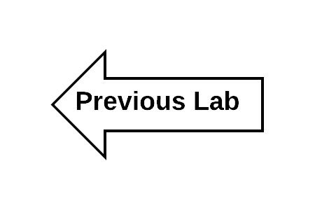

:scrollbar:
:data-uri:
:toc2:
:linkattrs:

= Lab 5 - Conclusion

Congratulations, you have completed all of the lab exercises! As a result of your hard work, _Coolstore Inc._ is now better positioned to not only scale effectively, but do so using an architecture built on Agile Integration.

Do not let the innovation stop here. Use the following resources to continue your knowledge using these principles in order to build and deploy next generation applications.

* link:https://www.redhat.com/en/explore/agile-integration[Red Hat's Agile Integration Story]
* link:https://www.redhat.com/en/technologies/jboss-middleware/fuse[Red Hat Fuse]
* link:https://www.redhat.com/en/technologies/jboss-middleware/amq[Red Hat AMQ]
* link:https://www.redhat.com/en/technologies/jboss-middleware/3scale[Red Hat 3scale API Management]

[.text-center]
 image:images/icons/icon-home.png[align="center",width=128, link=README.adoc]
