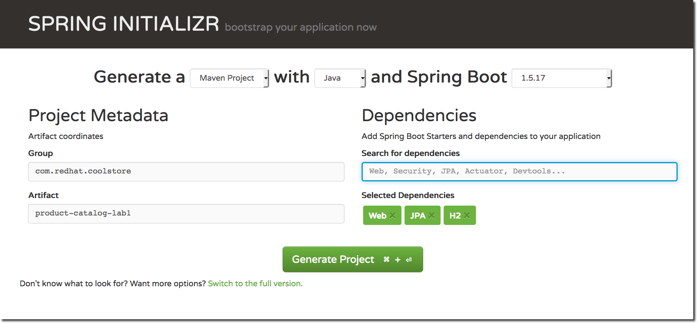
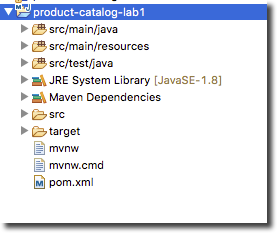

:scrollbar:
:data-uri:
:toc2:
:linkattrs:

== Spring and Spring Boot Lab

In this lab, you explore the basics of Spring development and how to get started with a Spring Boot project.

.Background

In the past, Spring Framework was criticized for being difficult to get started with. More recently, the Spring community addressed this concern with the addition of the Spring Boot project and the Spring Initalizr service hosted at link:http://start.spring.io["start.spring.io^"]. Both Spring Boot and Spring Initializr favor specific frameworks and third-party libraries. Red Hat provides a similar service at link:https://launch.openshift.io[*Red Hat Developer Launcher*] that also favors specific frameworks and a target platform (OpenShift).

Because the purpose of this lab is to teach you to work with an existing Spring application and run it on Red Hat OpenShift Application Runtimes, you use Spring Initalizr. While you could also use link:https://launch.openshift.io["launch.openshift.io^"] or JBoss Forge to initiate the project, both skip steps that are crucial to your understanding of how to run Spring on Red Hat OpenShift Application Runtimes.

:numbered:
== Generate Project Using Spring Initializr

In this section, you generate a project using Spring Initializr.

. Open a browser to link:http://start.spring.io["start.spring.io^"], and select or enter the following values:

* *Generate a*: `Maven Project`
* *with*: `Java`
* *and Spring Boot*: `1.5.XX` (As Example: `1.5.18`)
+
NOTE: The version numbers may be slightly different, so select the latest 1.x release.
* *Group*: `com.redhat.coolstore`
* *Artifact*: `product-catalog-lab1`

. In the *Search for dependencies* field, enter:
* `web`
* `jpa`
* `h2`
+

. Click *Generate Project*.
* The generated application uses the Spring Web stack with JPA and H2 support. The appropriate dependencies are included in the Maven POM file.

. Open a terminal shell and unzip the downloaded project:
+
[source,sh]
----
mkdir -p ~/appmod_foundations_spring_demo/spring

cd ~/appmod_foundations_spring_demo/spring

unzip ~/Downloads/product-catalog-lab1.zip

mv product-catalog-lab1 lab1
----

. Build the project:
+
[source,sh]
----
cd lab1

mvn clean package
----

== Import Project into Red Hat CodeReady Studio

In this section, you import the project into Red Hat CodeReady Studio.

. Launch Red Hat CodeReady Studio.
. Select *File -> Import*.
. In the *Import* dialog box, select *Maven -> Existing Maven Projects* and click *Next*.
. Click *Browse* and navigate to `~/appmod_foundations_spring_demo/spring/lab1`.
* This is the directory where you unzipped the code in the previous section.
. Make sure the `/pom.xml` box is checked for the project and click *Finish*.

. Once imported, verify that you see the `product-catalog-lab1` project:
+

== Create Component

In this section, you create a component in your project.

. In Red Hat CodeReady Studio, navigate to your project directory and select `src/main/java`.

. Create a new package named `com.redhat.coolstore.productcataloglab1.service`.

. Create a Java class named `ProductCatalogService` in the package.

. Annotate the class with `@Component` and add the following import statement:
+
[source,java]
----
import org.springframework.stereotype.Component;
----

. Add a `public` method called `sayHello` that returns the string `"Hello World!"`:
+
[source,java]
----
    public String sayHello() {
        return "Hello World!";
    }
----

== Create Unit Test for `ProductCatalogService`

In this section, you create a unit test for `ProductCatalogService`.

. In Red Hat CodeReady Studio, navigate to your project directory and select `src/test/java`.

. Expand the `com.redhat.coolstore.productcataloglab1` package.

. Open the `ProductCatalogLab1ApplicationTests` class.

. Add the following code to `ProductCatalogLab1ApplicationTests`:
+
[source,java]
----
    @Autowired
    private ProductCatalogService productCatalogService;
----

. Add the required import statements for the `Autowired` annotation and `ProductCatalogService`:
+
[source,java]
----
import org.springframework.beans.factory.annotation.Autowired;
import com.redhat.coolstore.productcataloglab1.service.ProductCatalogService;
----

. Add a test method called `testDefaultProductList`:
+
[source,java]
----
    @Test
    public void testDefaultProductList() {
        String message = productCatalogService.sayHello();
        assertTrue(message!=null);
        assertEquals(message,"Hello World!");
    }
----
. Add the required import statements:
+
[source,java]
----
import static org.junit.Assert.assertEquals;
import static org.junit.Assert.assertTrue;
----

. Run the tests either in your IDE or from the command line:
+
[source,sh]
----
mvn verify
----
* You can now inject a component with the `@Autowired` annotation--this is similar to how CDI works in Java EE.

== Use Environment-Specific Application Properties

Spring supports reading environment values from a properties file. You can also read different values based on the environment (`dev`, `qa`, `prod`). This is known as a _profile_ in Spring.

In this section, you add basic support for reading properties files.

. Change the `ProductCatalogService` class and add the following class variable:
+
[source,java]
----
    @Value("${coolstore.message:Hello World!}")
    private String message;
----

* This code attempts to set the variable `message` to the value from the `coolstore.message` property in the `application.properties` properties file. If this property is not defined, then it defaults to `Hello World!`.

. Add the required import statement:
+
[source,java]
----
import org.springframework.beans.factory.annotation.Value;
----

. Update the `sayHello` method of `ProductCatalogService` to return the `message` member variable:
+
[source,java]
----
    public String sayHello() {
        return message;
    }
----

. Test the change and verify that the test still passes:
+
[source,sh]
----
mvn verify
----

== Add Profile-Specific Message

In this section, you update the test class to use a profile called `dev` that produces `Hey Developer!` as the message.

. Add an annotation to `@ActiveProfiles("dev")` to the `ProductCatalogLab1ApplicationTests` class.
* This annotation needs to appear at the class level.

. Add the required import statement:
+
[source,java]
----
import org.springframework.test.context.ActiveProfiles;
----

. Change the `assertEquals` test string to `Hey Developer!`.

. Make sure the updated unit test code looks like this:
+
[source,java]
----
    @Test
    public void testDefaultProductList() {
        String message = productCatalogService.sayHello();
        assertTrue(message!=null);
        assertEquals(message,"Hey Developer!");
    }
----

. Run the test:
+
[source,sh]
----
mvn verify
----

* Because you have not yet updated the implementation, expect the test to fail.

. Add a new properties file called `src/main/resources/application-dev.properties`.

. Add the following entry to the file:
+
[source,texinfo]
----
coolstore.message=Hey Developer!
----

. Run the test:
+
[source,sh]
----
mvn verify
----

* Expect the the test to execute successfully this time.

== Add REST Capabilities Using Spring REST

At this stage, the product catalog service can only say hello; it does not expose any external endpoints. In this section, you add REST support and provide a list of product names.

. Open the `ProductCatalogService` class.

. Delete the `@Component` annotation.

. Add the `@RestController` annotation as a class-level annotation.

. Add the required import statement:
+
[source,java]
----
import org.springframework.web.bind.annotation.RestController;
----

. Add the following annotations to the `sayHello()` method:
+
[source,java]
----
    @GetMapping("/products")
----

. Confirm that your method looks like this:
+
[source,java]
----
    @GetMapping("/products")
    public String sayHello() {
        return message;
    }
----

. Add the required import statement:
+
[source,java]
----
import org.springframework.web.bind.annotation.GetMapping;
----

. Build and run the application:
+
[source,sh]
----
mvn spring-boot:run
----
+
.Sample Output
[source,sh]
----
... Tomcat started on port(s): 8080 (http)

... Started ProductCatalogLab1Application in 4.752 seconds ...
----

. Test the endpoint in another terminal shell using `curl`:
+
[source,sh]
----
curl http://localhost:8080/products
----
+
.Sample Output
[source,sh]
----
Hello World!
----

. Stop the Spring Boot application.

. Run the application, but this time activate the `dev` profile:
+
[source,sh]
----
mvn spring-boot:run -Dspring.profiles.active=dev
----

. Test the endpoint in another terminal shell using `curl`:
+
[source,sh]
----
curl http://localhost:8080/products
----
+
.Sample Output
[source,sh]
----
Hey Developer!
----

. Return to the original terminal shell and press *Ctrl+C* to stop the application.

. Stop the Spring Boot application.

== Summary

In this lab, you created a component and configured that component for different environments using the configuration API. Then you explored exposing the component as a REST service that can be called using standard HTTP protocol.
