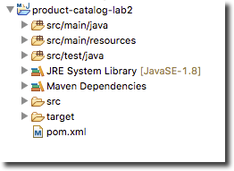

:scrollbar:
:data-uri:
:toc2:
:linkattrs:

== Spring Data and JPA Lab

In this lab, you learn how to use Spring Data together with JPA to retrieve and persist data to a datastore.

:numbered:

== Clone Source Code

In this section, you clone the lab source code.

. Open a terminal shell and run the following command:
+
[source,sh]
----
git clone https://github.com/gpe-mw-training/appmod_foundations.git ~/appmod_foundations_training
----
* The Spring lab materials are in the `spring` subdirectory.

. List the contents of the `spring` subdirectory to verify that the lab materials are present:
+
[source,sh]
----
cd ~/appmod_foundations_training/spring

ls
----
+
.Sample Output
[source,texinfo]
----
lab2 lab3
----
+
[NOTE]
====
Each lab is contained in its own subdirectory.
====

== Open Lab Starter Project

To provide you with a checkpoint, this lab starts with the solution code from the previous lab. This ensures that you start at the correct point. Also, it is useful in case you did not successfully complete the previous lab.

. Launch Red Hat CodeReady Studio.
. Select *File -> Import*.
. In the *Import* dialog box, select *Maven -> Existing Maven Projects* and click *Next*.
. Click *Browse* and navigate to `~/appmod_foundations_training/spring/lab2`.
* This is the directory where you unzipped the code for this lab.
. Make sure the `/pom.xml` box is checked for the project and click *Finish*.

. Once imported, verify that you see the `product-catalog-lab2` project:
+

== Bootstrap JPA and H2 Database for Testing

. Open the Maven `pom.xml` file.

. Scroll down in the file and make note of the dependencies for Spring Boot Data JPA Starter and the H2 database engine:
+
[source,xml]
----

		<!-- Spring Data and JPA support -->
		<dependency>
			<groupId>org.springframework.boot</groupId>
			<artifactId>spring-boot-starter-data-jpa</artifactId>
		</dependency>

		<!-- H2 database support -->
		<dependency>
			<groupId>com.h2database</groupId>
			<artifactId>h2</artifactId>
			<scope>runtime</scope>
		</dependency>
----

. Open the `src/main/resources/application.properties` file.

. Add the following entries to this file:
+
[source,texinfo]
----
# H2 Database settings
spring.datasource.url=jdbc:h2:mem:products;DB_CLOSE_ON_EXIT=FALSE
spring.datasource.username=sa
spring.datasource.password=
spring.datasource.driver-class-name=org.h2.Driver
----

== Create Unit Test

In this section, you create a unit test for `ProductCatalogService`.

. In Red Hat CodeReady Studio, navigate to your project directory and select `src/test/java`.

. Expand the `com.redhat.coolstore.productcatalog` package.

. Create a JPA Test class named `ProductCatalogJPATests`.

. Add the following code:
+
[source,java]
----
package com.redhat.coolstore.productcatalog;

import static org.junit.Assert.*;

import org.junit.Test;
import org.junit.runner.RunWith;
import org.springframework.boot.test.autoconfigure.orm.jpa.DataJpaTest;
import org.springframework.boot.test.context.SpringBootTest;
import org.springframework.test.context.junit4.SpringRunner;

@RunWith(SpringRunner.class)
@SpringBootTest
@DataJpaTest
public class ProductCatalogJPATests {

	@Test
	public void testFindAll() {
		assertTrue(true);
	}

}
----

* While this test does not test for anything itself, `@DataJpaTest` bootstraps the JPA environment so that if the test runs successfully you know the JPA environment is configured properly and working.

. Test that JPA bootstraps successfully:
+
[source,sh]
----
cd ~/appmod_foundations_training/spring/lab2

mvn clean verify
----
* Expect all tests to pass.

== Add Product Entity and Sample Data

In this section, you create a product entity and add sample data.

. In Red Hat CodeReady Studio, navigate to your project directory and select `src/main/java`.

. Expand the `com.redhat.coolstore.productcatalog` package.

. Add a new class called `Product`.

. Add the following code:
+
[source,java]
----
package com.redhat.coolstore.productcatalog;

import javax.persistence.Column;
import javax.persistence.Entity;
import javax.persistence.GeneratedValue;
import javax.persistence.GenerationType;
import javax.persistence.Id;

@Entity
public class Product {

	@Id
	@GeneratedValue(strategy=GenerationType.AUTO)
	private Long itemId;

	private String name;

	@Column(length=2000)
	private String description;

	private double price;

	public Product() {}

	public Long getItemId() {
		return itemId;
	}

	public void setItemId(Long itemId) {
		this.itemId = itemId;
	}

	public String getName() {
		return name;
	}

	public void setName(String name) {
		this.name = name;
	}

	public String getDescription() {
		return description;
	}

	public void setDescription(String description) {
		this.description = description;
	}

	public double getPrice() {
	return price;
	}

	public void setPrice(double price) {
		this.price = price;
	}
}
----

. Add a new file, `src/main/resources/import.sql`, with the following content:
+
[source,texinfo]
----
insert into PRODUCT (item_id, name, description, price) values (329299, 'Red Fedora', 'Official Red Hat Fedora', 34.99);
insert into PRODUCT (item_id, name, description, price) values (329199, 'Forge Laptop Sticker', 'JBoss Community Forge Project Sticker', 8.50);
insert into PRODUCT (item_id, name, description, price) values (165613, 'Solid Performance Polo', 'Moisture-wicking, antimicrobial 100% polyester design wicks for life of garment. No-curl, rib-knit collar; special collar band maintains crisp fold; three-button placket with dyed-to-match buttons; hemmed sleeves; even bottom with side vents; Import. Embroidery. Red Pepper.',17.80);
insert into PRODUCT (item_id, name, description, price) values (165614, 'Ogio Caliber Polo', 'Moisture-wicking 100% polyester. Rib-knit collar and cuffs; Ogio jacquard tape inside neck; bar-tacked three-button placket with Ogio dyed-to-match buttons; side vents; tagless; Ogio badge on left sleeve. Import. Embroidery. Black.', 28.75);
insert into PRODUCT (item_id, name, description, price) values (165954, '16 oz. Vortex Tumbler', 'Double-wall insulated, BPA-free, acrylic cup. Push-on lid with thumb-slide closure; for hot and cold beverages. Holds 16 oz. Hand wash only. Imprint. Clear.', 6.00);
insert into PRODUCT (item_id, name, description, price) values (444434, 'Pebble Smart Watch', 'Smart glasses and smart watches are perhaps two of the most exciting developments in recent years.', 24.00);
insert into PRODUCT (item_id, name, description, price) values (444435, 'Oculus Rift', 'The world of gaming has also undergone some very unique and compelling tech advances in recent years. Virtual reality, the concept of complete immersion into a digital universe through a special headset, has been the white whale of gaming and digital technology ever since Geekstakes Oculus Rift GiveawayNintendo marketed its Virtual Boy gaming system in 1995.Lytro',106.00 );
insert into PRODUCT (item_id, name, description, price) values (444436, 'Lytro Camera', 'Consumers who want to up their photography game are looking at newfangled cameras like the Lytro Field camera, designed to take photos with infinite focus, so you can decide later exactly where you want the focus of each image to be.', 44.30);
----

. Run the test:
+
[source,sh]
----
mvn clean verify
----

. Examine the console output and verify that you see lines similar to these, indicating that the data is loaded:
+
.Sample Output
[source,sh]
----
o.hibernate.jpa.internal.util.LogHelper  : HHH000204: Processing PersistenceUnitInfo [
	name: default
	...]
org.hibernate.dialect.Dialect            : HHH000400: Using dialect: org.hibernate.dialect.H2Dialect

org.hibernate.tool.hbm2ddl.SchemaExport  : HHH000227: Running hbm2ddl schema export

Hibernate: drop table product if exists
Hibernate: create table product (item_id bigint generated by default as identity, description varchar(2000), name varchar(255), price double not null, primary key (item_id))

org.hibernate.tool.hbm2ddl.SchemaExport  : HHH000476: Executing import script '/import.sql'
org.hibernate.tool.hbm2ddl.SchemaExport  : HHH000230: Schema export complete
----

== Create Database Repository Interface and Implement `testFindAll`

. In Red Hat CodeReady Studio, navigate to your project directory and select `src/main/java`.

. Expand the `com.redhat.coolstore.productcatalog` package.

. Add a new interface called `ProductRepository`.

. Add the following code:
+
[source,java]
----
package com.redhat.coolstore.productcatalog;

import org.springframework.data.jpa.repository.JpaRepository;

public interface ProductRepository extends JpaRepository<Product, Long>{

}
----

. In Red Hat CodeReady Studio, navigate to your project directory and select `src/test/java`.

. Open `ProductCatalogJPATests` and inject `ProductRepository` as a class variable:
+
[source,java]
----
	@Autowired
	private ProductRepository productRepository;
----
* Remember to add an import statement for `org.springframework.beans.factory.annotation.Autowired`.

. In the `ProductCatalogJPATests` class, change the `testFindAll` method to look like this:
+
[source,java]
----
	@Test
	public void testFindAll() {
		List<Product> productList = productRepository.findAll();
		assertEquals(productList.size(), 0);
	}
----
* Remember to add import statements for `import java.util.List;` and `import static org.junit.Assert.assertEquals;`

. Run the test:
+
[source,sh]
----
mvn clean verify
----
* Expect the test to fail because the test case is checking for zero products, but the database has eight products.

. Update the test case to check for eight products:
+
[source,java]
----
		assertEquals(productList.size(), 8);
----

. Run the test again and verify that eight products are returned:
+
[source,sh]
----
mvn clean verify
----
* Expect the test to pass.

== Add Custom Method to Product Repository

In this section, you add a custom `findByName` method to `ProductRepository` that returns a product by name.

. Open the `ProductRepository` class and add the following interface method:
+
[source,java]
----
	public Product findByName(String name);
----

. Open `ProductCatalogJPATests.java` and add the following test:
+
[source,java]
----
	@Test
	public void testFindByName() {
		Product product = productRepository.findByName("Oculus Rift");
		assertTrue(444435L == product.getItemId());
	}
----
* Remember to add an import statement for `import static org.junit.Assert.assertTrue;`.

. Test and verify:
+
[source,sh]
----
mvn verify
----
* Expect the test to pass.

== Add Test Case

In this section, you add a test case that creates and deletes an entry.

. Open `ProductCatalogJPATests.java` and add the following test:
+
[source,java]
----
	@Test
	public void testSaveAndDeleteProduct() {

		Product newProduct = new Product();
		newProduct.setName("Test Prod");
		newProduct.setDescription("This is a description");
		newProduct.setPrice(10.00d);

		Product product = productRepository.save(newProduct);
		long id = product.getItemId();

		assertNotNull(productRepository.findOne(id));

		productRepository.delete(product);

		assertNull(productRepository.findOne(id));
	}
----
* Remember to add import statements for `import static org.junit.Assert.assertNull;` and `import static org.junit.Assert.assertNotNull;`

. Test and verify:
+
[source,sh]
----
mvn verify
----
* Expect the test to pass.

== Change REST Service to Use Product Repository

In this section, you change the REST service to use `ProductRepository` and return the product list.

. Open `ProductCatalogService` and inject `ProductRepository` as a class variable:
+
[source,java]
----
	@Autowired
	private ProductRepository productRepository;
----

* Remember to add an import statement for `org.springframework.beans.factory.annotation.Autowired`.

. Delete the `sayHello` method.

. Add a new `list` method to return the outcome of `productRepository.findAll()`:
+
[source,java]
----
    @GetMapping("/products")
    public List<Product> list() {
        return productRepository.findAll();
    }
----

* Remember to add an import statement for `java.util.List`.

. Open `ProductCatalogApplicationTests` and delete the `testDefaultProductList` test method.

. Run the application:
+
[source,sh]
----
mvn spring-boot:run
----

. In another terminal shell, run `curl` to test the endpoint:
+
[source,sh]
----
curl http://localhost:8080/products
----
+
.Sample Output
[source,sh]
----
[{"itemId":165613,"name":"Solid Performance Polo","description":"Moisture-wicking, antimicrobial 100% polyester design wicks for life of garment. No-curl, rib-knit collar; special collar band maintains crisp fold; three-button placket with dyed-to-match buttons; hemmed sleeves; even bottom with side vents; Import. Embroidery. Red Pepper.","price":17.8},{"itemId":165614,"name":"Ogio Caliber Polo","description":"Moisture-wicking 100% polyester. Rib-knit collar and cuffs;
...
----
* This returns a JSON string with the products in the database.

== Summary

In this lab, you used JPA together with Spring Data to extend the REST service to return data from a database.
