:scrollbar:
:toc2:
:linkattrs:
:coursevm:

== Fuse Online Environment Setup Lab

NOTE: This course includes at least one lab per module. Each lab is hands-on and typically takes about an hour to complete. Completing the labs prepares you to correctly answer many of the final assessment questions.

.Goal
* Provision a Fuse Online lab environment

.Requirements
* Red Hat OPENTLC credentials
* Either one of these web browsers installed on your workstation: Google Chrome, Mozilla Firefox or Microsoft Edge
* Broadband Internet connection

.Lab Conventions
The following environment variable is used in this lab to reference an installation directory:

* `${lab_code}` refers to the lab assets directory, which contains a `pom.xml` file
** Its directory path contains `../ipaas-<version_number>/code`

.Remote Environment

This course provides an OpenShift Container Platform environment in the cloud. This environment is provisioned with the following:

* Fuse Online (release tag *fuse-ignite-1.5.2*)
* A _product catalog_ service that exposes a RESTful API with Swagger documentation
** This product catalog service supports several labs in this course.

Red Hat strongly recommends that you use this remote OpenShift Container Platform environment for the remainder of the labs in this course.

:numbered:

== Provision Lab Environment

If you are attending an instructor-led training, skip this section and proceed to the <<CrossRefAnchor>> section.

. Go to the link:https://labs.opentlc.com/[OPENTLC lab portal] and use your OPENTLC credentials to log in.
+
[TIP]
If you do not remember your password, go to the link:https://www.opentlc.com/pwm/private/Login[OPENTLC Account Management page] to reset your password. If you continue to have problems, email `open-program@redhat.com`.
+
image::images/cf_login.png[]

. Navigate to *Services -> My Services*.
. Delete all previous services that are still active.
* This allows you to order a service for this course.

. Navigate to *Services -> Catalogs -> All Services -> OPENTLC Middleware Solutions Labs*.
. On the left, select *Fuse Foundations Part 1 - Fuse Online*.
+
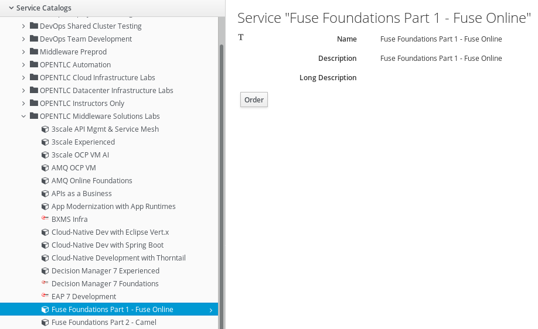

. On the right, click *Order*.
. On the form that appears, ensure the following:
.. [red]#Check the box next to *Check this box to confirm that you understand and know your runtime and expiration dates.*#
.. That you have thoroughly read the *Warning*.
+
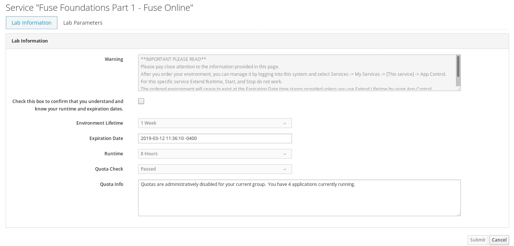

. Click *Submit*.

=== Review Confirmation Emails

After ordering your VM, you will receive several email messages confirming your order.
These messages are sent to the email address associated with your OPENTLC account.

The most important message is the last one, which indicates completion of the provisioning of your lab environment. This message should arrive about 30 minutes after the lab was ordered.
[blue]#Please save this email#.

The confirmation email will specify a unique GUID. Please make note of the value of this GUID:

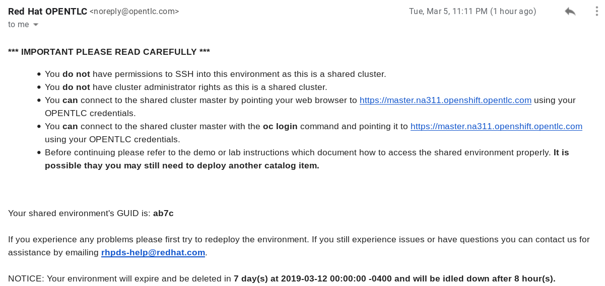

[[CrossRefAnchor]]
== Access Lab Resources

=== Access OpenShift Container Platform Web Console

. Launch a new tab in your web browser and navigate to the OpenShift Container Platform web console URL:
+
----
https://master.na311.openshift.opentlc.com
----
+
. Make note of the OpenShift Container Platform web console URL.
. Log in to the console using your OPENTLC ID as *Username*.  Use the password that set for your OPENTLC ID.
+
[TIP] *Should you require a password reset, do so through the link:https://www.opentlc.com/account[OPENTLC Account Management webpage]*
+
. Locate and navigate the project for Fuse Online. The project name will contain the GUID documented in the earlier email.
. Navigate through the console, making notes about pods, routes, and persistent volumes used by Fuse Online.
+
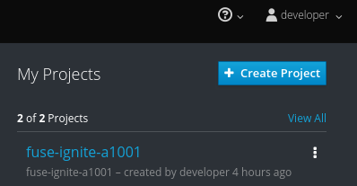
+
* *QUESTION:* Do the pod names resemble what you have learned from the slides? Can you visualize the interaction between the various pods, based on the architecture in the slides?

=== Access Fuse Online Web Console

. From your *fuse-ignite* project in the OpenShift Container Platform web console, navigate to *Applications -> Routes*.
+
. Click the *Hostname* URL for the *syndesis* route:
+
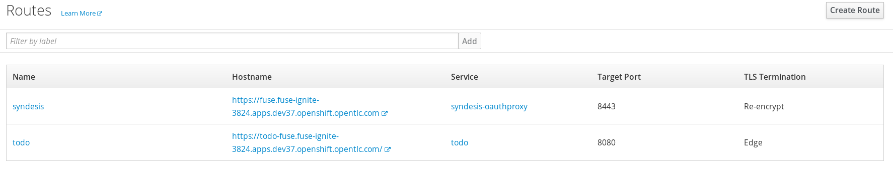
+
. Accept the self-signed certificates used to secure the Fuse Online web console.
. Log in using a *Username* of `user1`.  The password can be anything you want.
+
image::images/ocp_login.png[]

* A web page launches, prompting you to authorize the Fuse Online application access to your OPENTLC account credentials.
. Select both check boxes and click *Allow selected permissions*:
+
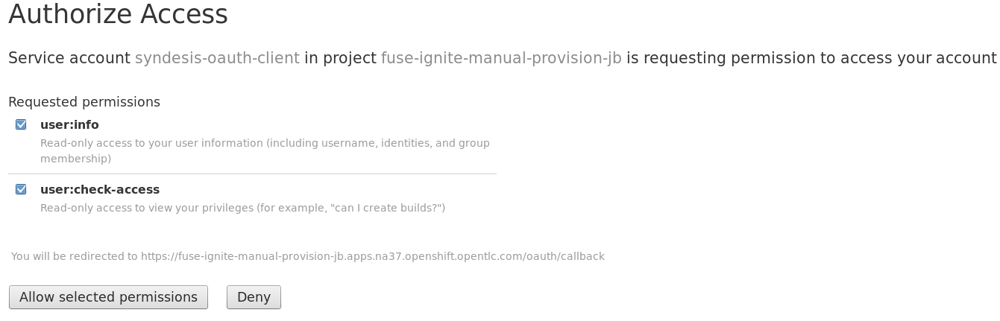
+
NOTE: The authorization page appears only once--the next time you log in, the Fuse Online console appears instead.

* The Fuse Online console opens:
+
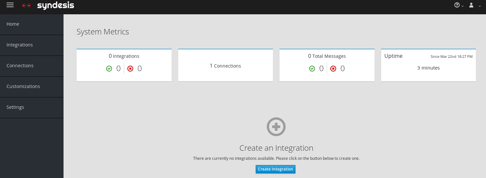

. Review the *Home* page of the Fuse Online console, which displays the following system metrics:
* The number of integrations in use
* The number of connections available
* The total number of messages serviced by integrations
* The uptime for Fuse Online
+
. Click  (*Account*) at the top right.
* Note the *Logout* option, which ends your session with the Fuse Online console and logs you out.
. Click  (*Help*).
* Options for a tutorial, a user guide, and support information appear. Use these resources if you need help with Fuse Online.
. Click  (*Menu*) at the top left.
* Note that the left-hand panel containing options like *Integrations* and *Customizations* disappears.
. Click  *Menu* again to display the panel.
. Navigate through the other aspects of the left-hand panel on your own.
* Detailed explanations on the use of these features are provided in subsequent labs.

=== Access the GPTE Coolstore Catalog Microservice and the TODO app

. From your *fuse-ignite* project in the OpenShift Container Platform web console, navigate to *Applications -> Routes*.
. Click the *Hostname* URL for the *catalog-service* route:
+
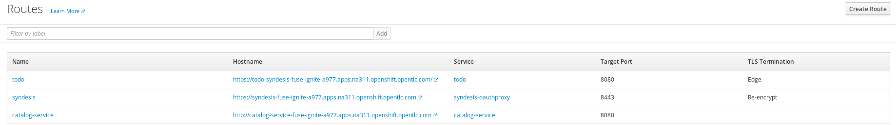
+
. In the newly launched web browser window, test out the various REST operations of the GPTE Coolstore Catalog microservice.
* The JSON output from the microservice is displayed in the web browser window.
+
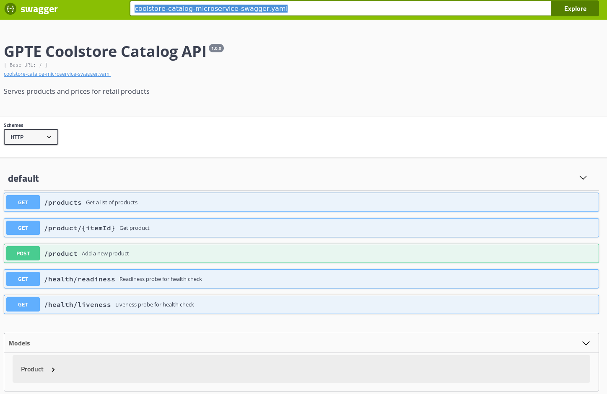
+
. Navigate back to the *fuse-ignite* project in the OpenShift Container Platform web console.
. Navigate to *Applications -> Routes*.
. Click the *Hostname* URL for the *todo* route:
+
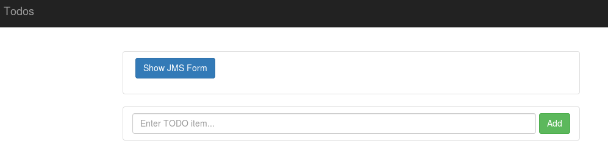
+
. In the newly launched web browser window, add a few TODO items to validate the TODO app is functional. Next delete all the items you created.
* The TODO app serves an online notepad.

* Both the TODO app and the GPTE Coolstore Catalog microservice will be used as part of the lab exercises.
* In addition those apps, you also have a functional Fuse Online lab environment from which to conduct lab exercises.
+
[NOTE]
====
There are two software applications hosted on the OPENTLC OpenShift Container Platform lab environment:

* Fuse Online for integration tooling
* Coolstore product catalog microservice for specific integration lab use
* TODO app
====

== Register Cloud Services Accounts

The course involves the use of cloud services, so you need to register accounts for the following cloud services before continuing with the remaining labs in this course.

. link:https://aws.amazon.com/free/start-your-free-trial/[Register] for a trial Amazon Web Services (AWS) account.
. link:https://developer.salesforce.com/signup/[Register] for a Salesforce Developer Edition account.
. link:https://help.twitter.com/en/create-twitter-account[Register] for a Twitter account. Ensure that both your first name and your last name are registered with the Twitter account.
+
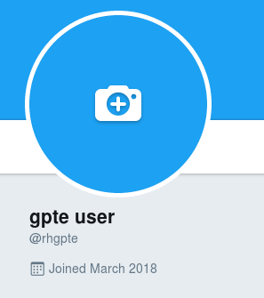
+
[NOTE]
====
The Twitter account shown above is registered with a first name *gpte* and last name *user*.
====

You are now ready to proceed with enterprise integration work using Fuse Online.

:numbered!:

ifdef::showscript[]

=== Log In to OpenShift Container Platform Web Console

. If you have not done so yet, launch a web browser on your host machine and navigate to the URL for Fuse Online.
* Click through the warnings from your browser indicating that it has no knowledge of the Certificate Authority associated to your OpenShift Container Platform web console--it is secured using a self-signed certificate.

. Log in using your OPENTLC credentials:
+
image::images/ocp_login.png[]

. Once authenticated into the web console, navigate to the *My Projects* panel on the right.
* Expect to see a project whose name has the following convention: *fuse-ignite-$GUID* (where `$GUID` is the unique four-character identifier assigned to your project):
+

+
[TIP]
The URL for your Fuse Online application is structured like this: `https://fuse.fuse-ignite-<$GUID>.apps.<$Environment_ID>.openshift.opentlc.com`. One example of the URL to a particular Fuse Online application would be `https://fuse.fuse-ignite-3824.apps.ap2.openshift.opentlc.com/` where `3824` is the `$GUID` and `ap2` is the `$Environment_ID`.

. Click the project to open it.
. Validate that no hour glass symbol appears at the tail end of the *syndesis* route URL.
+

+
[TIP]
If the hour glass symbol appears, wait for it to disappear, which may take up to several minutes.

=== Access Your VM via SSH

The confirmation email will describe how to access your remote lab environment via SSH.

Complete the steps in the email to gain access to your lab environment.

endif::showscript[]
