:scrollbar:
:toc2:
:linkattrs:
:coursevm:

== Webhook Connector Lab

.Goals
* Create an API provider integration in Fuse Online
* Integrate with an external REST service using an API client connector
* Expose the Fuse Online integration to a REST client using a webhook connector

.Overview of API Integration

_API provider integrations_ start with a REST API service defined by an OpenAPI 2.0 schema that the developer provides through the Fuse Online console. Invocation calls sent from the REST API clients trigger the execution of an API provider integration, making it unique from other integrations.

A traditional integration periodically monitors an application or service for a new event, which triggers the integration. An example of such an integration is a Twitter connection locating appropriate tweets and triggering an integration as a result.

An integration can have a REST API client connection as the *Finish* or *Intermediary* connection, but never as the *Start* connection. The reason is that a REST API client connection establishes communications with an external API only _after_ the integration starts.

An API provider integration differs from traditional integrations in that a REST client request is received by the *Start* connection of the API provider integration. The arrival of the REST client's request triggers the start of the integration.

In this exercise, the webhook connection is used as the *Start* connection of the integration that listens for incoming REST client requests in order to trigger the execution of the integration.

.Business Scenario

CoolStore is an online retailer, with product information made available through a REST service interface. This online service is currently accessible by invoking a REST API, which is defined by a Swagger document. In an earlier lab exercise, you developed an integration that populates the contents of a flat file using the product catalog information from Coolstore.

Whenever new inventory items arrive, the staff at CoolStore manually updates the product catalog. The company now intends to develop a new integration that is triggered by catalog update requests sent by a REST client. The integration then populates the product catalog database with the product update requests. This is made possible through a link:https://en.wikipedia.org/wiki/Webhook[webhook] connector, which listens for the requests from the REST client.

.Solution Design

//*The Architecture Diagram is COMING SOON*

* Create an integration in Fuse Online that meets the business requirements of the Coolstore product catalog update project. Use only the following in the design:
** Log connector
** Datashape connector
** Webhook connector

* Publish and test the integration, as a back-end service, using a REST client such as `curl`.

:numbered:
== Create Integration

In the sections that follow you create a Fuse Online integration consisting of the following artifacts:

* *Webhook connector*: Starting point of the integration to expose an HTTP POST endpoint. Receives a _Quote Request_ JSON object.
* *Log connector*: Responsible for logging messages to the output stream of the OpenShift pod (belonging to the integration).
* *DataShape connector*: Finish connector for returning the _Quote Response_ JSON object data shape.

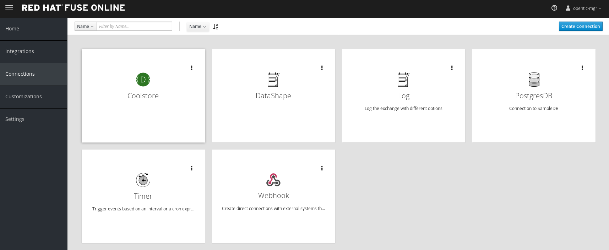

=== Set Up Webhook Connection

. In the left-hand panel, click *Integrations*.
. Click *Create Integration*.
. On the *Choose a Start Connection* screen, select the *Webhook* connection.
+
image::images/ignite-IntegrationWebhook.png[]
+
. Select the only available action.
. Change the default value in the *Webhook Token* field to `CoolstoreCat`.
. Click *Next*.
. For *Type*, select *JSON Instance*.
. Copy and paste the following contents into the *Definition* field:
+
[source,texinfo]
-----
{
  "item":"Item Name"
}
-----
+
. For *Data Type Name*, enter `Request`.
. Click *Done*.

=== Set Up Database Connection

. On the *Choose a Finish Connection* screen, select the *PostgresDB* connection.
. Click *Done*.
. On the *PostgresDB - Choose an Action* screen, select *Invoke SQL*:
+
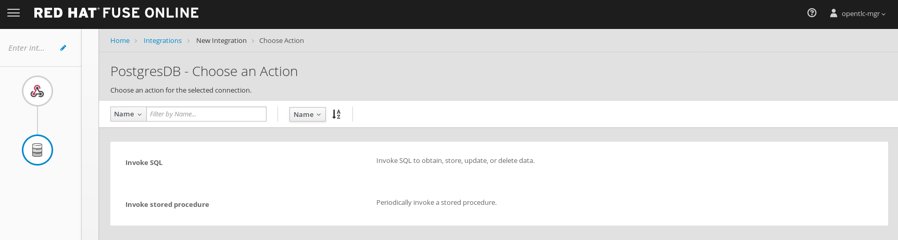

. In the *SQL Statement* field, enter `INSERT INTO TODO ( task ) VALUES ( :#task )`:
+
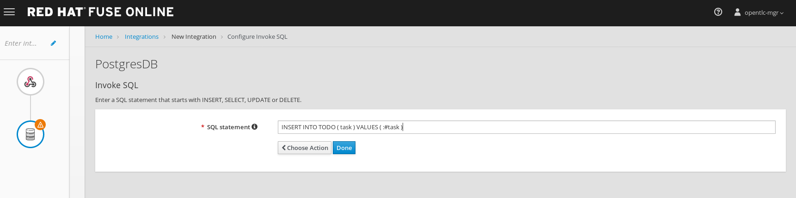

. Click *Done*.

=== Set Up Data Mapping

To complete the integration, fields in the incoming update request have to be mapped to respective PostgresDB fields through a data-mapping step.

. In the left-hand panel below the start connection, hover over the image:images/add_filter_icon.png[] icon and select *Add a step*:
+
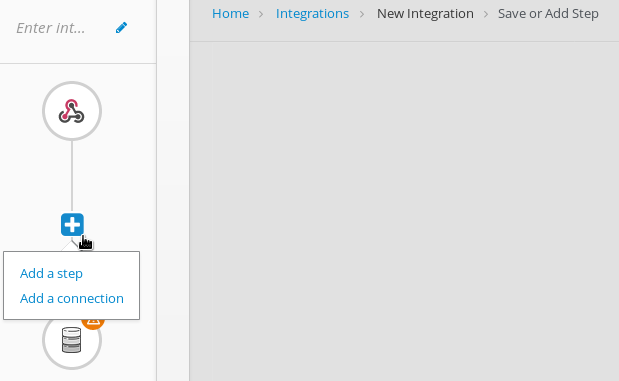

. Select *Data Mapper*:
+
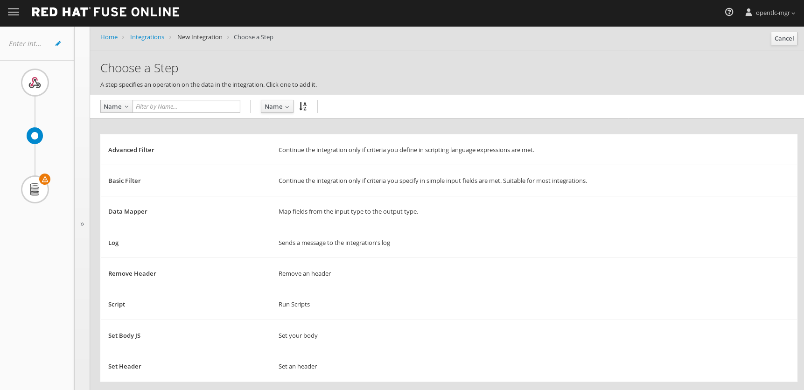
* The available data fields appear.
+
[TIP]
====
If you make a mistake while creating a data mapping, it is easy to delete it. Simply click the garbage bin icon at the top of the *Mapping Details* panel:

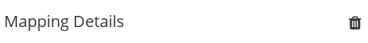
====
. Create a mapping between the update request data schema's *item* field in the *Sources* panel to the PostgresDB data schema's *task* field in the *Target* panel:
+
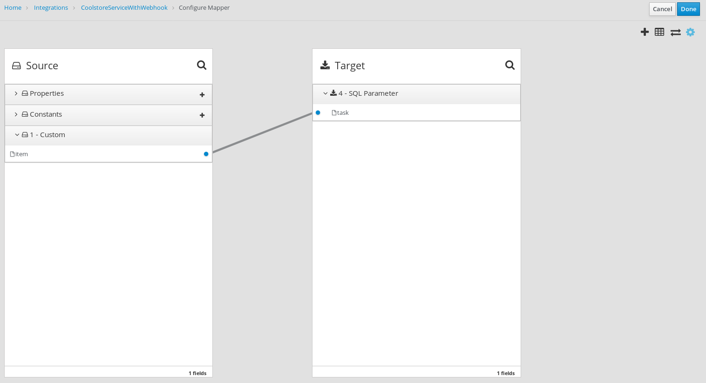
* A line from the *item* field to the *task* field is established by the data mapper.

. Click *Done* at the top right-hand corner of the Fuse Online console.

=== Set Up Log Connection

. Hover over the image:images/add_filter_icon.png[] icon that connects the Data Mapper and PostgresDB connections and select *Add a step*:
+
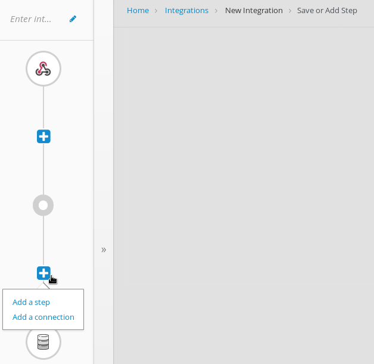

. Select *Log*.
. Check both the *Message Content* and *Message Body* boxes.
. In the *Custom Text* field, enter `Inventory Updated`.
. Click *Done*:
+
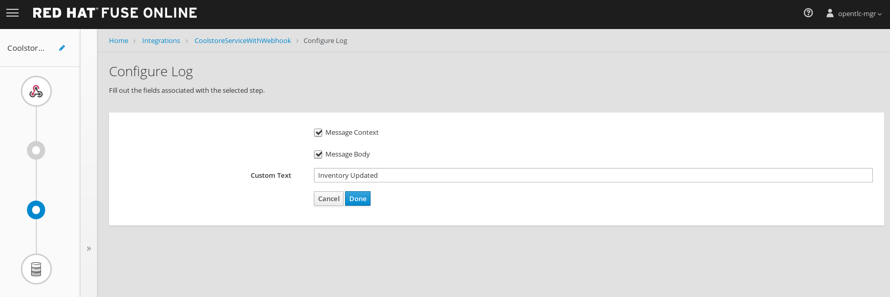

. Type `CoolstoreServiceWithWebhook` in the *Enter integration name* field at the top of the left-hand panel in the Fuse Online console.
. Click *Publish*.

== Test Integration

Testing of the integration requires use of the `curl` and `oc` utilities.

. Wait for the integration deployment to complete (about five minutes):
+
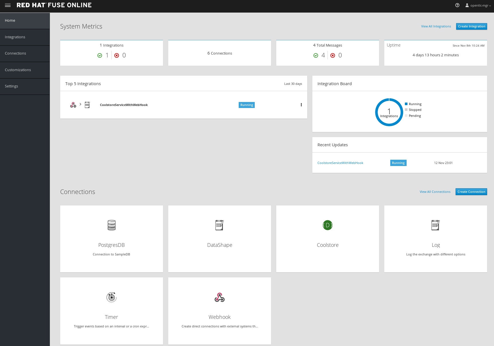
+
. In the Fuse Online console, click the integration that you just created.
. Click *Copy* to the right of the *External URL* field:
+
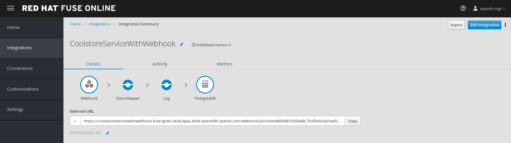
+
****
*Question:* Does your integration flow, shown on the *Details* tab, resemble the one shown above?
****

. In a command-line terminal, log in to your OpenShift environment.
. Using the command line, access the OpenShift project for Fuse Online.
. Execute the following command to list the services:
+
[source,sh]
-----
oc get pods
-----
+
****
*Question:* How can you determine which pod contains the correct log information regarding your newly created integration?
****
. Execute the following command to access the log:
+
[source,sh]
-----
oc log -f i-coolstoreservicewithwebhook-<Unique-ID-of-pod>
-----
* Expect the beginning of the log to resemble this:
+
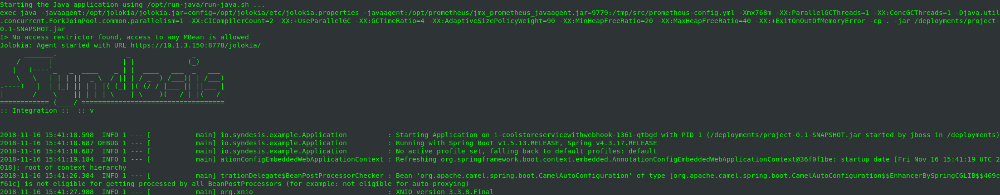
+
. Identify the definition of the Camel route listed in the log:
+
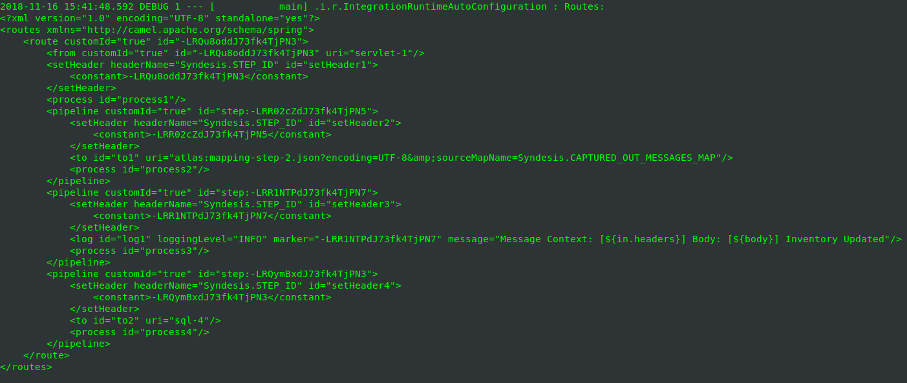
+
[NOTE]
====
Once the Apache Camel route becomes fully active, the startup process of the integration is deemed complete. Alternatively, you can access the log for this integration via the Fuse Online console by clicking *View Log in OpenShift*:

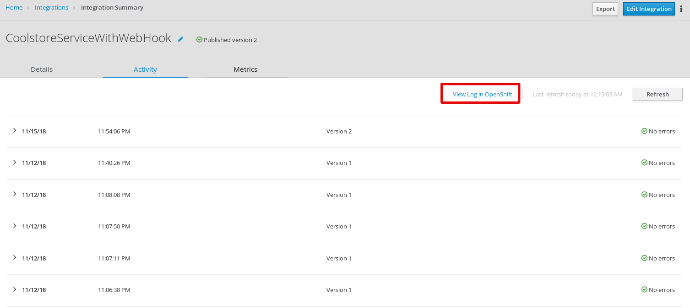
====
. In a separate command-line terminal, execute the following command, replacing `<external_url>` with the external URL of the integration service that you copied earlier:
+
[source,sh]
----
export externalurl = <external_url>
----
+
[NOTE]
====
The external URL format resembles this: `https://i-coolstoreservicewithwebhook-fuse-ignite-$GUID.apps.$GUID.openshift.opentlc.com/webhook/CoolstoreCat`
====

. Still in the same terminal window, execute the following commands in succession:
+
[source,sh]
----
curl -k --header "Content-Type: application/json" --request POST --data '{ "item":"Feather in the Fedora"}' $externalurl
curl -k --header "Content-Type: application/json" --request POST --data '{ "item":"Red Hat Water Bottle"}' $externalurl
curl -k --header "Content-Type: application/json" --request POST --data '{ "item":"Red Hat Bow Tie"}' $externalurl
----

* The purpose of these commands is to populate the product catalog database with new items.
* These `curl` commands invoke the webhook connection through an HTTP POST operation, triggering the integration service that you just deployed.

. Optionally, repeat the `curl` command using various item names for the HTTP POST data.

. From the Fuse Online console, select the *Metrics* tab on the *Integration Summary* page and observe the number of messages that were processed:
+
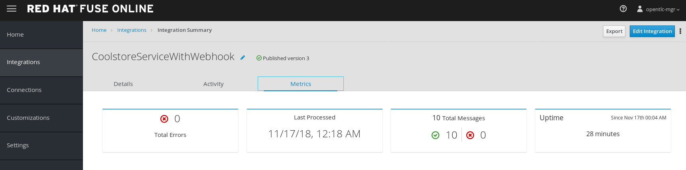

. In one of the terminal windows, observe that new log entries have appeared:
+
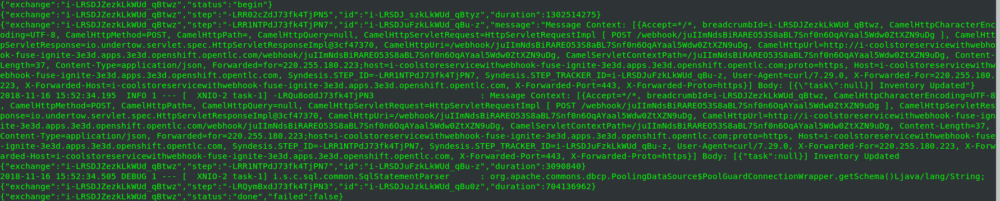
+
****
*Questions:*

* Can you correlate the latest log entries with the `curl` commands that you issued?
* Can you identify the inventory items from the log entries?
****
. In the left-hand panel of the Fuse Online console, click *Home* and copy the console's URL.
. Open another browser window, paste the URL into the URL field, and append `todo-` as shown:
+
.Sample URL
[source,texinfo]
----
https://todo-fuse.fuse-ignite-<GUID>.apps.<$Environment_ID>.openshift.opentlc.com
----
. Press *Enter* to access the To Do application, count the number of items created, and take note of their names:
+
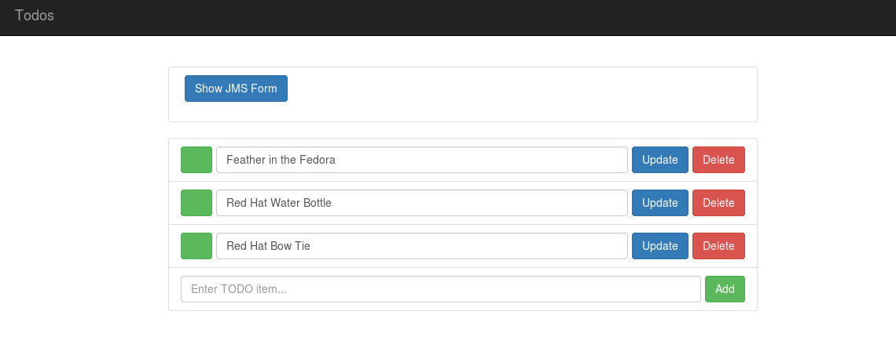
+
[TIP]
Alternatively, you can retrieve the route address for the To Do Application by accessing the OpenShift Container Platform Application Console:
. Following the links, *Applications* -> *Routes*
+
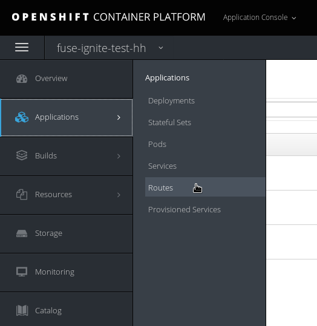
+
. Click on the link to the To Do application, located below the *Hostname* category.
+
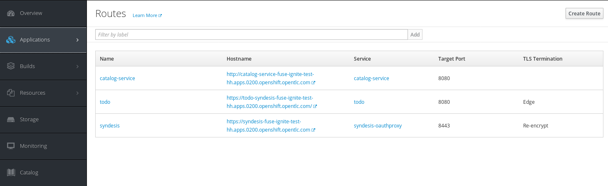
+
* The To Do App appears in your web browser.

****
*Question:* Do they correlate to the item names--HTTP POST data--sent by the `curl` utility to the integration service?
****

You have completed the exercise and learned how to build an integration that listens for REST client requests.
