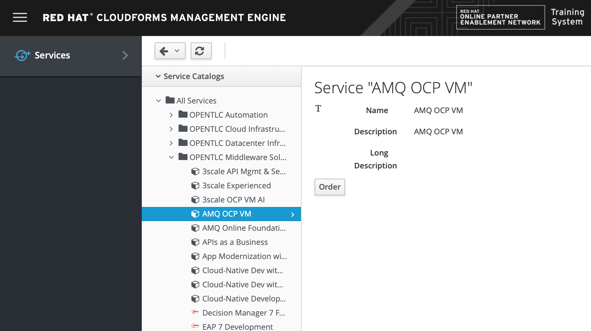
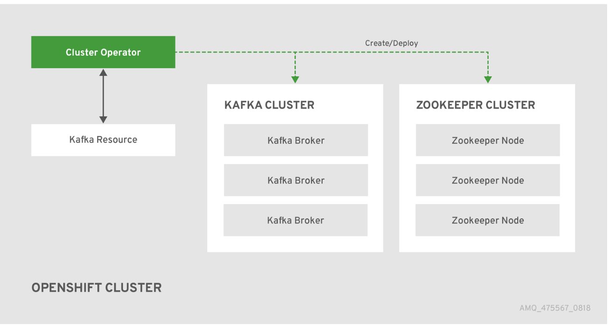
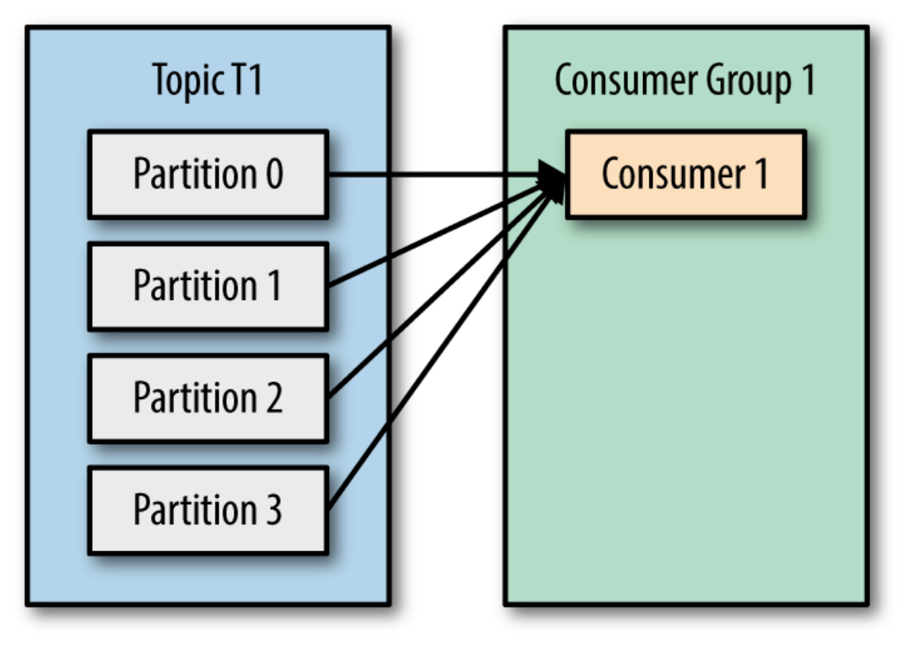
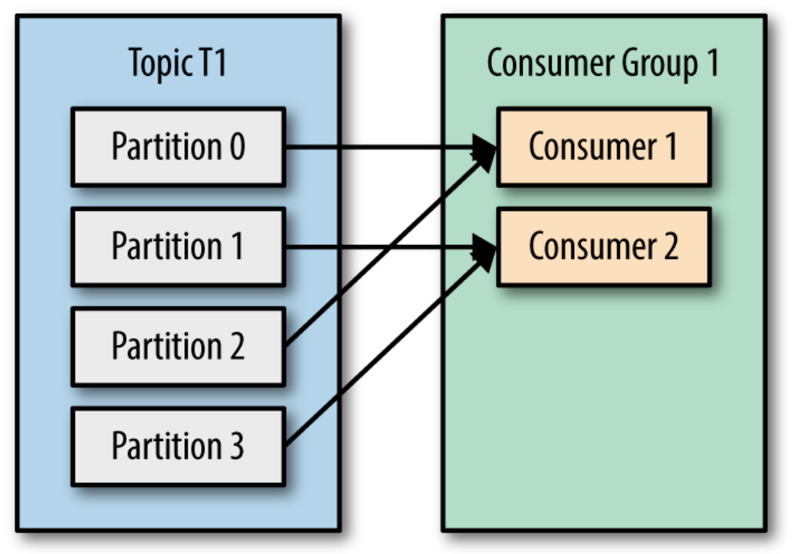

:noaudio:
:scrollbar:
:data-uri:
:toc2:
:linkattrs:

== AMQ Streams Deployment Lab

.Goals
* Create an Kafka deployment using the cluster operator
* Create an Kafka publisher and consumer to test the deployment
* Create an Kafka Connect deployment
* Create a File connector and verify that Apache Kafka Connect publishes the records in it

.Prerequisites
* Tools
** `curl` utility
** `oc` version 3.9 utility

:numbered:

== Overview

This lab implements the Kafka producer and consumer scenario.

=== Reference

Kafka on Red Hat OpenShift Container Platform functionality is provided by the link:https://strimzi.io[Strimzi Project].

== Lab Environment

Your lab environment consists of a remote virtual machine (VM) that is accessible using the SSH protocol.

This virtual machine comes pre-installed with OpenShift Container Platform v3.10.

=== Order VM

. In your browser, navigate to the link:https://labs.opentlc.com[OPENTLC lab portal].
. Authenticate using your OPENTLC credentials (for example: jdoe-redhat.com).
. Navigate to *Services -> Service Catalogs -> OPENTLC Middleware Solutions Labs*.
. Select the *AMQ Streams Foundations* catalog item.
+

. Click *Order*.
. Click *Submit*.

=== Order e-mails

Upon ordering an all-in-one OCP VM, you will receive the following two emails

. *VM is building*
.. Includes details of the three VMs similar to the following:
+
image::images/aio_first_email.png[]
.. Make note of the 4 digit GUID (aka: REGION CODE)
.. Make note of the URL of the `workstation` VM.
+
You will use this when ssh'ing to your application.

.. Make note of the URL of the `master` VM.
+
You will use this when accessing the OCP Web Console as well as the OCP Admin Console.

. *VM ready for authentication*
+
Once you receive this second email, you can then ssh into the `workstation` VM of your Ravello application.

=== SSH Access and `oc` utility

. ssh access to the Ravello application is provided using the following convention:
+
-----
$ ssh <opentlc-userId>@<workstation URL as listed in 1st confirmation email>
-----

. OCP cluster admin access
+
-----
$ sudo -i
# oc whoami

system:admin
-----

. Additional `admin` user
+
There is an OCP user with the following credentials:

.. Username:   admin
.. Password:   r3dh4t1!

. Set this user as a cluster-admin so as to have full access to the OCP Admin Console
+
-----
# oc adm policy add-cluster-role-to-user cluster-admin admin 

...

cluster role "cluster-admin" added: "admin"
-----

. List persistent volumes:
+
-----
# oc get pv
-----

. List default image streams and templates in _openshift_ namespace:
+
-----
# oc get imagestream -n openshift

# oc get templates -n openshift
-----

=== OCP Web Console

. Point your browser to the following URL:
+
-----
$ https://<master node URL as listed in 1st confirmation email>
-----

. Authenticate using any of the following user credentials
.. Username:    user[1-100]
.. Password:    r3dh4t1!

=== Kafka Cluster

Before deploying Kafka you will deploy the cluster operator. The `strimzi-cluster-operator` is the first entity that is created (see the detailed description that follows). The Cluster Operator is also able to deploy a Kafka Connect cluster which connects to an existing Kafka cluster.

. Install Red Hat AMQ Streams.
.. Download and extract the `install_and_examples.zip` file from the download site [https://access.redhat.com/node/3596931/423/1].
.. Set the environment variable AMQ_STREAMS_HOME to this directory.

. Modify the kafka-persistent.yaml file to add requests and limits as well a higher than default value for the initialDelaySeconds. After modifications, the file should resemble the following output.

+
-----
apiVersion: kafka.strimzi.io/v1alpha1
kind: Kafka
metadata:
  name: my-cluster
  labels:
    app: my-cluster
spec:
  kafka:
    replicas: 3
    listeners:
      plain: {}
    configuration:
      auto.create.topics.enable: false
    storage:
      type: ephemeral
    resources:
      requests:
        memory: 512Mi
        cpu: 500m
      limits:
        memory: 2Gi
        cpu: 700m
    readinessProbe:
      initialDelaySeconds: 60
      timeoutSeconds: 5
    livenessProbe:
      initialDelaySeconds: 60
      timeoutSeconds: 5
  zookeeper:
    replicas: 3
    storage:
      type: ephemeral
    resources:
      requests:
        memory: 512Mi
        cpu: 200m
      limits:
        memory: 2Gi
        cpu: 500m
  entityOperator:
    topicOperator:
      resources:
        requests:
          memory: 512Mi
          cpu: 200m
        limits:
          memory: 2Gi
          cpu: 500m
    userOperator:
      resources:
        requests:
          memory: 512Mi
          cpu: 200m
        limits:
          memory: 2Gi
          cpu: 500m
-----

. Deploy Kafka.
+
Create a new project and follow the commands below to deploy the cluster operator, create the templates and create the Kafka deployment.
+
-----
$ oc new-project kafkaproject
$ cd $AMQ_STREAMS_HOME
$ sed -i 's/namespace: .*/namespace: kafkaproject/' install/cluster-operator/*RoleBinding*.yaml
$ oc apply -f install/cluster-operator -n kafkaproject
$ oc get pods -w
$ oc apply -f examples/templates/cluster-operator/ -n kafkaproject
$ oc apply -f examples/kafka/kafka-persistent.yaml
$ oc get po
-----

. Switch to your OpenShift Container Platform project:
+
-----
$ oc project $OCP_PROJECT
-----

. View the various deployments:
+
-----
$ oc get deploy

NAME                         DESIRED   CURRENT   UP-TO-DATE   AVAILABLE   AGE
strimzi-cluster-operator     1         1         1            1           1h
-----
+
* my-connect-cluster-connect
+
The Kafka Connect cluster allows for connecting Kafka brokers to different sources and sinks. In the case of this lab, the Kafka Connect deployment is preconfigured for reading files.
+
* strimzi-cluster-operator
+
Before deploying a Kafka cluster, the Cluster Operator must be deployed. The Strimzi cluster operator is responsible for deploying a Kafka cluster alongside an Apache ZooKeeper ensemble. As mentioned above, the operator is also used to deploy Kafka Connect.
+

. View the corresponding pods:
+
-----
$ oc get pods

NAME                                          READY     STATUS    RESTARTS   AGE
my-cluster-kafka-0                            2/2       Running   0          1h
my-cluster-kafka-1                            2/2       Running   0          1h
my-cluster-kafka-2                            2/2       Running   0          1h
my-cluster-zookeeper-0                        2/2       Running   0          1h
my-cluster-zookeeper-1                        2/2       Running   0          1h
my-cluster-zookeeper-2                        2/2       Running   0          1h
strimzi-cluster-operator-7fbd7f6fcc-9nt9h     1/1       Running   0          1h
-----
+
* my-cluster-kafka-
+
This is the set of Kafka brokers deployed using the Strimzi cluster operator. The deployment is described in a YAML file that pulls the `amqstreams` image from the RHT registry. Red Hat AMQ Streams provides two options for Kafka cluster deployment: ephemeral and persistent. Persistent is the correct option to select for production environments and is used in this deployment.
+
* my-cluster-zookeeper-
+
When installing Kafka, Red Hat AMQ Streams also installs a ZooKeeper cluster and adds the necessary configuration to connect Kafka with ZooKeeper.

== Lab Asset Overview

The purpose of this lab section is to demonstrate topic publishing and subscribing using pre-deployed Kafka producers and consumers. When the producer in the example boots up, it publishes a specific number of messages. Similarly, when the consumer is created, it waits to receive the specified number of messages. The Kafka producer and consumer deployment YAML files use the client code defined in the following Git repository:

-----
https://github.com/gpe-mw-training/amq-streams-foundations-labs
-----

This lab provides a set of assets to assist with the utilization of Strimzi. Clone these lab assets to your lab environment so that you can review them.

. Make a new directory where all lab assets will reside:
+
-----
$ mkdir -p $HOME/lab
-----

. At the terminal of your lab environment, clone the lab assets:
+
-----
$ git clone https://github.com/gpe-mw-training/amq-streams-foundations-labs $HOME/lab/amq-streams-foundations-labs
-----

. Change directories to the `01_deploy_and_connect` directory of the newly cloned project:
+
-----
$ cd $HOME/lab/amq-streams-foundations-labs/01_deploy_and_connect

./
├── kafka-connect.yaml
├── strimzi-consumer.yaml
└── strimzi-producer.yaml
-----

. Review the details of the lab assets found in this directory:
* `Kafka-connect.yaml`
+
Strimzi uses the Cluster Operator to deploy and manage Kafka (including ZooKeeper) and Kafka Connect clusters. The Cluster Operator is deployed inside the OpenShift Container Platform cluster. To deploy a Kafka cluster, an Kafka resource with the cluster configuration has to be created within the Kubernetes or OpenShift Container Platform cluster. Based on what is declared inside the Kafka resource, the Cluster Operator deploys a corresponding Kafka cluster.

* `strimzi-consumer.yaml`
+
It is important to pay attention to the following attributes in the YAML file:
+
** image: code image that gets pulled
** resources: limits and requests. When allocating compute resources, each container may specify a request and a limit value each for CPU and memory. If the quota has a value specified for `requests.cpu` or `requests.memory`, then it requires that every incoming container make an explicit request for those resources. If the quota has a value specified for `limits.cpu` or `limits.memory`, then it requires that every incoming container specify an explicit limit for those resources.
** TOPIC, MESSAGE_COUNT: topic that the subscriber listens on and the number of messages it listens for.

* strimzi-producer.yaml
+
The same set of attributes that are important for the consumer are also important for the producer.

== Kafka Producer and Consumer

Using the deployment YAML files provided earlier, you will provision a Strimzi producer and consumer. These resources will send to and receive from the previously created Strimzi topics.

. Create the Strimzi producer.
.. Execute the following command:
+
-----
$ oc create -f $HOME/lab/amq-streams-foundations-labs/01_deploy_and_connect/strimzi-producer.yaml
-----
.. View the Strimzi producer logs:
+
-----
$ oc logs $(oc get pod -l app=kafka-producer -o=jsonpath='{.items[0].metadata.name}') -f
...
2018-09-11 02:33:18 INFO  KafkaProducerExample:18 - Sending messages "Hello world - 357"
2018-09-11 02:34:19 INFO  KafkaProducerExample:18 - Sending messages "Hello world - 358"
2018-09-11 02:35:20 INFO  KafkaProducerExample:18 - Sending messages "Hello world - 359"
2018-09-11 02:36:21 INFO  KafkaProducerExample:18 - Sending messages "Hello world - 360"
2018-09-11 02:37:22 INFO  KafkaProducerExample:18 - Sending messages "Hello world - 361"
-----
+
If you have a lot of extraneous messages filter the messages for the text "Sending messages".

. Create the Strimzi consumer.
.. Execute the following command:
+
-----
$ oc create -f $HOME/lab/amq-streams-foundations-labs/01_deploy_and_connect/strimzi-consumer.yaml
-----
.. Wait for a minute while the deployment initializes, then view the Strimzi consumer logs:
+
-----
$ oc logs $(oc get pod -l app=kafka-consumer -o=jsonpath='{.items[0].metadata.name}') -f
...
ConsumerConfig values:
auto.commit.interval.ms = 5000
auto.offset.reset = earliest
bootstrap.servers = [my-cluster-kafka-bootstrap:9092]
.....
.....
2018-08-30 18:32:00 INFO  KafkaConsumerExample:24 - Received message:
2018-08-30 18:32:00 INFO  KafkaConsumerExample:25 - 	     partition: 1
2018-08-30 18:32:00 INFO  KafkaConsumerExample:26 - 	     offset: 137766
2018-08-30 18:32:00 INFO  KafkaConsumerExample:27 - 	     value: Hello world - 105
-----
+
The output should be similar to these examples. Notice that since you created only one consumer on the topic, messages on all partitions are delivered to that consumer. Later, you will create another consumer and observe that each partition is uniquely mapped to a consumer.

=== Additional Strimzi Consumer

This section of the lab demonstrates how adding a consumer causes different partitions to get mapped to the different consumers. The following diagrams illustrate how the redistribution of partitions occurs when adding new consumers.

. Add a consumer by creating a deployment YAML file which is similar to the existing `strimzi-consumer.yaml` in the `01_deploy_and_connect/` directory. The initial section of it should look similar to the following example:
+
----
apiVersion: extensions/v1beta1
kind: Deployment
metadata:
  labels:
    app: kafka-consumer-2
  name: kafka-consumer-2
spec:
  replicas: 1
  template:
    metadata:
      labels:
        app: kafka-consumer-2
    spec:
      containers:
      - name: kafka-consumer-2
        image: strimzi/hello-world-consumer:latest
        resources:
          limits:
            cpu: "2"
            memory: 2Gi
          requests:
            cpu: "1"
            memory: 1Gi
        env:
          - name: BOOTSTRAP_SERVERS
            value: my-cluster-kafka-bootstrap:9092
          - name: TOPIC
            value: my-topic
          - name: GROUP_ID
            value: my-hello-world-consumer
          - name: LOG_LEVEL
            value: "INFO"
          - name: MESSAGE_COUNT
            value: "1000"
----
+
. Deploy the new consumer:
+
----
$ oc apply -f <your-new-deployment-filename>.yaml
----
+
. Note that the new consumer now receives from one or more partitions that are distinct from the `kafka-consumer`. The output in their respective logs will look similar to the following example:
+
----
2018-08-30 18:31:58 INFO  KafkaConsumerExample:24 - Received message:
2018-08-30 18:31:58 INFO  KafkaConsumerExample:25 - 	     partition: 0
2018-08-30 18:31:58 INFO  KafkaConsumerExample:26 - 	     offset: 137772
2018-08-30 18:31:58 INFO  KafkaConsumerExample:27 - 	     value: Hello world - 103
2018-08-30 18:32:00 INFO  KafkaConsumerExample:24 - Received message:
2018-08-30 18:32:00 INFO  KafkaConsumerExample:25 - 	     partition: 1
2018-08-30 18:32:00 INFO  KafkaConsumerExample:26 - 	     offset: 137766
2018-08-30 18:32:00 INFO  KafkaConsumerExample:27 - 	     value: Hello world - 105
2018-08-30 18:32:01 INFO  KafkaConsumerExample:24 - Received message:
2018-08-30 18:32:01 INFO  KafkaConsumerExample:25 - 	     partition: 0
2018-08-30 18:32:01 INFO  KafkaConsumerExample:26 - 	     offset: 137773
2018-08-30 18:32:01 INFO  KafkaConsumerExample:27 - 	     value: Hello world - 106
2018-08-30 18:32:03 INFO  KafkaConsumerExample:24 - Received message:
2018-08-30 18:32:03 INFO  KafkaConsumerExample:25 - 	     partition: 1
2018-08-30 18:32:03 INFO  KafkaConsumerExample:26 - 	     offset: 137767
2018-08-30 18:32:03 INFO  KafkaConsumerExample:27 - 	     value: Hello world - 108
----
+
*and*
+
----
2018-08-30 18:24:42 INFO  KafkaConsumerExample:24 - Received message:
2018-08-30 18:24:42 INFO  KafkaConsumerExample:25 - 	     partition: 2
2018-08-30 18:24:42 INFO  KafkaConsumerExample:26 - 	     offset: 137630
2018-08-30 18:24:42 INFO  KafkaConsumerExample:27 - 	     value: Hello world - 674
2018-08-30 18:24:45 INFO  KafkaConsumerExample:24 - Received message:
2018-08-30 18:24:45 INFO  KafkaConsumerExample:25 - 	     partition: 2
2018-08-30 18:24:45 INFO  KafkaConsumerExample:26 - 	     offset: 137631
2018-08-30 18:24:45 INFO  KafkaConsumerExample:27 - 	     value: Hello world - 677
----

=== Configure Kafka Connect

In this section we will review the Kafka Connect deployment.

. Navigate to the following directory:
+
-----
$ cd ~/lab/amq-streams-foundations-labs/01_deploy_and_connect
-----

. In the `kafka-connect.yaml` file, under the spec object, review the configuration:
+
----
[johndoe@redhat.com@clientvm 0 ~/lab/amq-streams-foundations-labs/01_deploy_and_connect]$ ls

kafka-connect.yaml  strimzi-consumer.yaml  strimzi-producer.yaml

  config:
    key.converter: org.apache.kafka.connect.storage.StringConverter
    value.converter: org.apache.kafka.connect.storage.StringConverter
    key.converter.schemas.enable: false
    value.converter.schemas.enable: false
----

. Navigate to where you have cloned the lab assets. Under the directory `../amq-streams-foundations-labs/01_deploy_and_connect`, review the input data file (uber.csv). Copy this file to the `/tmp` directory on the connect container. The contents of this directory will be streamed by Kafka Connect to the Kafka broker.
+
Create the Kafka Connect deployment and check if it comes up correctly:
+
-----
$ oc apply -f kafka-connect.yaml
$ oc get pods

NAME
.
					        READY     STATUS             RESTARTS   AGE
my-connect-cluster-connect-64dd9b5cc5-mlz26   0/1       Running            1          9d
.
-----

. Note the name of the connect pod (*my-connect-cluster-connect-64dd9b5cc5-mlz26*) and use that in the `oc rsync` command. Open a remote shell to the container and check that the file has been transferred.
The name of the connect pod will have the format *my-connect-cluster-connect-XXXXXX*, based on your VM in which you are querying for *oc get pods*.
+
-----
$ oc rsync <your-local-dir> my-connect-cluster-connect-64dd9b5cc5-mlz26:/tmp/
$ oc rsh my-connect-cluster-connect-64dd9b5cc5-mlz26
$ ls /tmp
$ exit
-----
+
. Create the topic `my-topic-2` that Kafka Connect uses to publish to the Kafka broker. Create a `my-topic2.yaml` file that looks similar to the following example:
+
-----
apiVersion: kafka.strimzi.io/v1alpha1
kind: KafkaTopic
metadata:
  name: my-topic2
  labels:
    strimzi.io/cluster: my-cluster
spec:
  partitions: 3
  replicas: 2
  config:
    retention.ms: 7200000
    segment.bytes: 1073741824
-----
+
-----
$ oc apply -f my-topic2.yaml
-----

. Make a copy of the `strimzi-consumer.yaml` file:
+
-----
$ cp strimzi-consumer.yaml connector-consumer.yaml
-----

. Confirm the `connector-consumer.yaml` file looks similar to the following example:
+
-----
apiVersion: extensions/v1beta1
kind: Deployment
metadata:
  labels:
    app: connector-consumer
  name: connector-consumer
spec:
  replicas: 1
  template:
    metadata:
      labels:
        app: connector-consumer
    spec:
      containers:
      - name: connector-consumer
        image: strimzi/hello-world-consumer:latest
        resources:
          limits:
            cpu: "2"
            memory: 2Gi
          requests:
            cpu: "1"
            memory: 1Gi
        env:
          - name: BOOTSTRAP_SERVERS
            value: my-cluster-kafka-bootstrap:9092
          - name: TOPIC
            value: my-topic-2
          - name: GROUP_ID
            value: my-hello-world-consumer
          - name: LOG_LEVEL
            value: "INFO"
          - name: MESSAGE_COUNT
            value: "1000"
-----

. Exit the connector pod and create the new consumer:
+
-----
$ oc apply -f connector-consumer.yaml
-----

. Open a remote shell to the connector pod and create the configuration for the file source:
+
----
% oc rsh my-connect-cluster-connect-64dd9b5cc5-mlz26 
% cat <<EOF >> /tmp/source-plugin.json
{
  "name": "source-test",
  "config": {
    "connector.class": "FileStreamSource",
    "tasks.max": "3",
    "topic": "my-topic-2",
    "file": "/tmp/uber.csv"
  } 
}
EOF
----

. Create a connector that will read the data file and push its content into the Kafka broker:
+
----
% curl -X POST -H "Content-Type: application/json" --data @/tmp/source-plugin.json http://localhost:8083/connectors
----

. Exit the connector pod and verify the contents are being published to the message consumer configured:
+
-----
$ exit
$ oc logs $(oc get pod -l app=connector-consumer -o=jsonpath='{.items[0].metadata.name}') -f
....
2018-08-21 22:08:26 INFO  KafkaConsumerExample:27 -	value: {"schema":{"type":"string","optional":false},"payload":"{1, 100, \"nandan\", \"uber data\", 15}"}
-----

== Conclusions

== Questions

* What is the purpose of the *source-plugin.json* plugin?
* Do you have customer cases where Kakfa would be useful?

== Appendix
ifdef::showscript[]

endif::showscript[]
